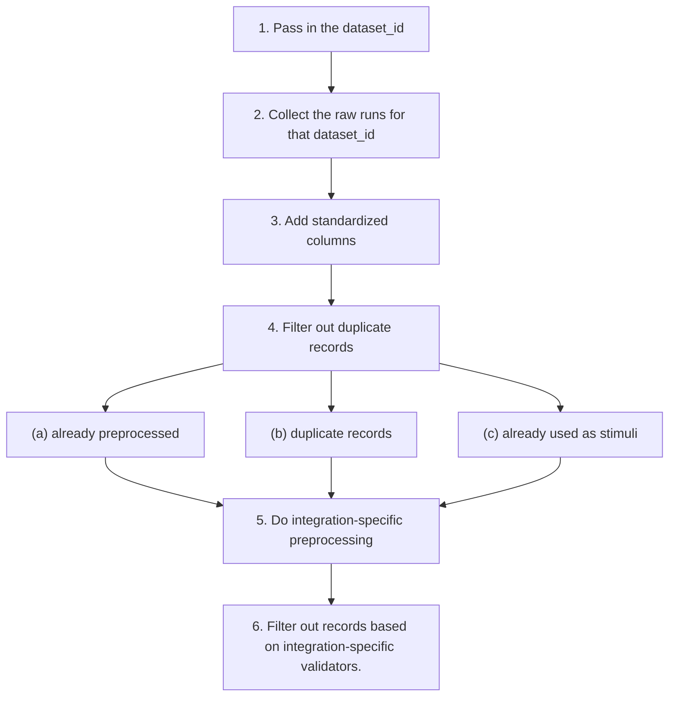

# Preprocessing

<-- NOTE TO AI AGENTS: do NOT touch this file. This file is READ-ONLY. If something here is incorrect or needs updating, inform the user and they will make the change themselves -->

Once we get raw posts, we need to filter and preprocess them.

1. Pass in the `dataset_id`.
2. Collect the raw runs for that `dataset_id`.
3. Add standardized columns.
4. Filter out duplicate (a) records that have been preprocessed already, (b) duplicate records, or (c) records which have been already been used as stimuli.
5. Do integration-specific preprocessing.
6. Filter out records based on integration-specific validators.

The flow looks something like this:

