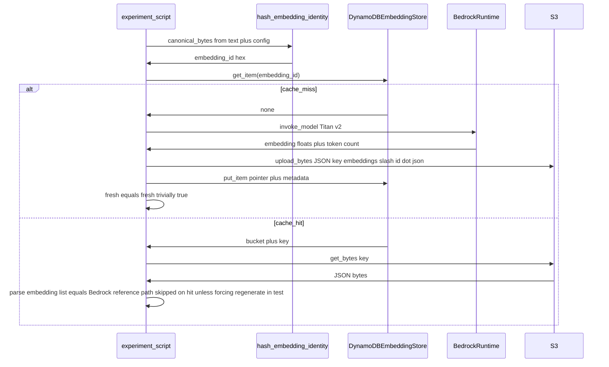

---

# Embedding cache: DynamoDB + S3 (exact dedupe)

## Remember
- Exact file paths always
- Exact commands with expected output
- DRY, YAGNI, TDD, frequent commits
- UI changes: agent captures before/after screenshots itself (not applicable — no `ui/` work)

## Plan asset storage

After approval, save the canonical plan copy and any follow-up notes under:

`docs/plans/2026-05-13_embedding_dedupe_dynamo_s3_482913/`

(No browser screenshots — not a UI task.)

---

## Overview

You need **exact input dedupe** and **cheap durability**: a **content key** (hash) points to an **S3 object** holding the embedding JSON, and **DynamoDB** is the authoritative small row for existence and pointer resolution. Bedrock generates on miss; on hit you skip inference and load from S3. This mirrors common AWS patterns without S3 Vectors or an ANN engine.

**Key design detail (recommended):** partition key = `SHA-256` hex of a **stable UTF-8 payload** that includes **both** the canonical text **and** embedding parameters that affect the vector (`model_id`, `dimensions`, `normalize`). That prevents silent collisions if you later change Titan settings but keep “same string.” If you truly fix all of those as global constants forever, text-only hashing is equivalent; the composite hash is safer for `lib/aws` reuse.

---

## Alternative approaches (and why not)

- **S3 Vectors / ANN:** Overkill for exact-string dedupe; you only need object + KV index.
- **DynamoDB-only (embeddings inline):** Works for 256-dim floats (~1–2 KB), but JSON in S3 is simpler to audit, download, and keeps item size smaller if you add large metadata later.
- **S3-only (no DDB):** `HeadObject`/`GetObject` on deterministic keys works; DynamoDB adds fast metadata queries, timestamps, and optional conditional logic without listing buckets.

**Chosen:** DynamoDB pointer + S3 JSON body — matches your earlier Option 1 and “cheap durability.”

---

## Data model

**DynamoDB table** (single-table, one item type for this feature):

| Attribute | Type | Role |
|-----------|------|------|
| `embedding_id` (PK) | String | SHA-256 hex (64 chars) |
| `s3_bucket` | String | Bucket name |
| `s3_key` | String | Object key (e.g. `embeddings/<embedding_id>.json`) |
| `text_sha256` | String | Same as PK if composite hash encodes full identity; optional duplicate for clarity |
| `created_at` | String | ISO-8601 UTC |
| `model_id` | String | Bedrock model id |
| `dimensions` | Number | e.g. 256 |
| `normalize` | Bool | Titan normalize flag |

**S3 object body (JSON):** mirror what you already return from Bedrock parsing — at minimum `embedding` (list of floats), plus `text`, `model_id`, `dimensions`, `normalize`, `input_text_token_count` for debugging.

---

## Happy flow (end-to-end)



For the **experiment’s verification requirement** (“exact match to Bedrock”), the script should:

1. Call Bedrock and keep `fresh_embedding` in memory.
2. Write to S3 + DynamoDB using the hash.
3. Load from S3 using the pointer from DynamoDB (`s3_bucket`, `s3_key`).
4. Parse JSON and compare `loaded_embedding == fresh_embedding` (Python list equality). If JSON serialization ever introduces float quirks, fall back to element-wise `math.isclose` with a documented tiny `rel_tol`/`abs_tol` — prefer strict `==` first since the same list is serialized.

Optional small function `get_or_create_embedding(...)` encapsulating miss/hit.

---

## Implementation steps (files and behavior)

### 1. Add [lib/aws/dynamodb.py](lib/aws/dynamodb.py) (mirror [lib/aws/s3.py](lib/aws/s3.py))

- **Class `DynamoDBTable` (or `DynamoDBEmbeddingIndex`)** with `__init__(self, table_name: str, *, region_name: str | None = None)` and a private `boto3.client("dynamodb", ...)` (or `resource` — prefer **client** + `decimal` handling off for floats if you avoid Decimal; for pointer rows, all attribute values are strings/numbers/bool — use DynamoDB TypeSerializer or low-level `put_item` with typed dicts manually for YAGNI).
- **Methods (minimal set):**
  - `get_item(key: str) -> dict[str, Any] | None` — `GetItem` on PK; return deserialized plain dict or `None` if missing.
  - `put_item(item: dict[str, Any]) -> None` — `PutItem`. Optional `ConditionExpression="attribute_not_exists(embedding_id)"` for idempotent create (catch `ConditionalCheckFailedException` and then `GetItem` + verify S3 key matches — advanced; can be phase-2).
- **Resource helper (your “manage resources” ask):**
  - `ensure_table_exists(*, billing_mode: str = "PAY_PER_REQUEST") -> None` — `describe_table`; on `ResourceNotFoundException`, `create_table` with:
    - KeySchema: `HASH` `embedding_id` (String).
    - No sort key.
    - `AttributeDefinitions` for `embedding_id` (S).
  - Use `waiter` for `table_exists` after create.
  - Document IAM: one-time `dynamodb:CreateTable`, `DescribeTable`, `PutItem`, `GetItem` for the role used in dev.

Keep **region** consistent with [lib/aws/s3.py](lib/aws/s3.py)’s pattern (it defaults `DEFAULT_REGION_NAME = "us-east-2"` but your Bedrock experiment uses `us-east-1` — the experiment script should pass an explicit **shared** region into both `S3` and `DynamoDB` clients to avoid cross-region Footguns; consider a tiny shared constant or constructor args only in the experiment).

### 2. Hash helper (experiment-local or `lib/aws` if reused)

- Function `embedding_identity_sha256(text: str, *, model_id: str, dimensions: int, normalize: bool) -> str`:
  - Normalize text once (e.g. `strip()`, or NFC if you care — document choice).
  - Serialize as UTF-8 JSON or `b"\\n".join(...)` with a version prefix byte to allow future migrations, e.g. `b"v1\\n" + json.dumps({...}, sort_keys=True).encode()`.
  - Return `hashlib.sha256(...).hexdigest()`.

### 3. Wire S3 writes

- Reuse [lib/aws/s3.py](lib/aws/s3.py) `S3.upload_bytes(..., content_type="application/json")` and `get_bytes`.

### 4. Add [experiments/simplified_predict_remove_2026_05_13/experiment_create_embedding_and_upload.py](experiments/simplified_predict_remove_2026_05_13/experiment_create_embedding_and_upload.py)

- **Constants at top:** `AWS_REGION`, `BEDROCK_MODEL_ID`, `EMBEDDING_DIMENSIONS`, `S3_BUCKET`, `DYNAMODB_TABLE_NAME`, `S3_PREFIX` (e.g. `embeddings/`).
- **Steps:**
  1. Instantiate `S3`, Dynamo wrapper; optionally call `ensure_table_exists()` once (dev convenience).
  2. Pick sample string(s); compute `embedding_id`.
  3. **Miss path:** Bedrock invoke (reuse logic from [experiments/simplified_predict_remove_2026_05_13/experiment_bedrock_embeddings.py](experiments/simplified_predict_remove_2026_05_13/experiment_bedrock_embeddings.py) — extract shared `create_embedding` into a tiny imported helper **only if** duplication exceeds ~15 lines; otherwise duplicate minimally to avoid scope creep).
  4. `upload_bytes` JSON to `f"{prefix}{embedding_id}.json"`.
  5. `put_item` with pointer fields.
  6. **Retrieve:** `get_item` → `get_bytes(s3_key)` from returned bucket/key (assert bucket matches configured bucket).
  7. Parse JSON; **assert** loaded embedding equals Bedrock output (strict list equality).
  8. Print concise success line + dimensions + key.

- **Docstring run instructions:** Same style as [experiments/simplified_predict_remove_2026_05_13/dataloader.py](experiments/simplified_predict_remove_2026_05_13/dataloader.py): `PYTHONPATH=. uv run --group dev python ...`

### 5. Dependencies / IAM checklist (documentation in script docstring)

- **Python:** `boto3` already in dev group ([pyproject.toml](pyproject.toml)).
- **IAM:** `bedrock:InvokeModel`, `s3:PutObject`/`GetObject` on bucket ARN prefix, DynamoDB permissions above.

---

## Manual verification

Prerequisites: AWS credentials in environment; Bedrock model access; S3 bucket exists (bucket creation can stay manual — table creation optional via `ensure_table_exists`).

1. Sync deps:

   ```bash
   cd /Users/mark/Documents/work/mirrorView-task && uv sync --group dev
   ```

   Expected: lock resolves; boto3 available.

2. First run (cold — creates row + object):

   ```bash
   cd /Users/mark/Documents/work/mirrorView-task && PYTHONPATH=. uv run --group dev python experiments/simplified_predict_remove_2026_05_13/experiment_create_embedding_and_upload.py
   ```

   Expected: stdout reports success; strict equality assertion passes; no traceback.

3. **AWS console sanity (optional):** DynamoDB table shows item with PK = hash; S3 shows JSON under prefix.

4. Second run with **same text + config:** extend script optionally to demonstrate hit path (`get_item` present → skip Bedrock — **not required for MVP** if you want minimal script; if added, expected second run prints “cache hit” and still validates S3 load matches stored JSON).

5. Negative check: temporarily change `model_id` constant in script only — hash changes; new object created; confirms no collision.

---

## Specificity checklist

| Item | Value |
|------|--------|
| New module | [lib/aws/dynamodb.py](lib/aws/dynamodb.py) |
| Pattern reference | [lib/aws/s3.py](lib/aws/s3.py) class + optional `region_name` |
| Experiment | [experiments/simplified_predict_remove_2026_05_13/experiment_create_embedding_and_upload.py](experiments/simplified_predict_remove_2026_05_13/experiment_create_embedding_and_upload.py) |
| PK | `embedding_id` — SHA-256 hex of versioned identity blob |
| S3 key | `{S3_PREFIX}{embedding_id}.json` |
| Plan copy folder | `docs/plans/2026-05-13_embedding_dedupe_dynamo_s3_482913/` |
