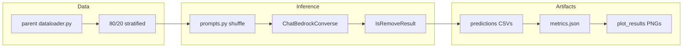

# Experiment 3 Step 1 — Bedrock Zero-Shot Baselines

## Remember
- Exact file paths always
- Exact commands with expected output
- DRY, YAGNI, frequent commits
- Maximum safely delegable parallelism
- Delegated tasks must be impossible to misread
- **No unit tests / pytest** — basic smoke tests only (`--help`, `--limit N`, one-liner imports)
- Operational docs in [`api_baselines/README.md`](experiments/predict_keep_remove_2026_07_01/models/llm_finetuning/api_baselines/README.md) only
- UI changes: N/A (no `ui/` work)

**Plan asset path:** [`docs/plans/2026-07-06_exp3_bedrock_zero_shot_baselines_628401/`](docs/plans/2026-07-06_exp3_bedrock_zero_shot_baselines_628401/) — store approved plan as `IMPLEMENTATION_PLAN.md` on execution.

**Phase 0 paths:** ai_tools = `/Users/mark/Documents/projects/ai_tools/`; skill refs = `~/.codex/skills/create-implementation-plan/`; design source = [`experiments/predict_keep_remove_2026_07_01/HOW_TO_TRAIN_LANGUAGE_MODELS.md`](experiments/predict_keep_remove_2026_07_01/HOW_TO_TRAIN_LANGUAGE_MODELS.md) § Experiment 3 Step 1; reference implementations = [`models/llm_api/`](experiments/predict_keep_remove_2026_07_01/models/llm_api/) and [`models/modernbert/`](experiments/predict_keep_remove_2026_07_01/models/modernbert/).

**Phase 4:** Skipped — no frontend changes.

---

## Overview

Build the zero-shot baseline harness for Experiment 3 under [`experiments/predict_keep_remove_2026_07_01/models/llm_finetuning/api_baselines/`](experiments/predict_keep_remove_2026_07_01/models/llm_finetuning/api_baselines/). Each of four Bedrock-hosted models (`mistral.ministral-3-8b-instruct`, `mistral.ministral-3-14b-instruct`, `qwen.qwen3-32b-v1:0`, `qwen.qwen3-next-80b-a3b`) receives the study-linked-fate prompt with **randomized Post 1/Post 2 order** (original vs mirror blinded), returns a structured [`IsRemoveResult`](experiments/predict_keep_remove_2026_07_01/models/llm_finetuning/api_baselines/schemas.py) (`is_remove: bool`), and is scored on train/test **accuracy, precision, recall, F1** (hard labels only — no probability column). A single shared [`prompts.py`](experiments/predict_keep_remove_2026_07_01/models/llm_finetuning/api_baselines/prompts.py) holds the study prompt for all models. Data comes from [`experiments/predict_keep_remove_2026_07_01/dataloader.py`](experiments/predict_keep_remove_2026_07_01/dataloader.py) via an 80/20 stratified split (`seed=42`, matching Experiment 1). Shared [`runner.py`](experiments/predict_keep_remove_2026_07_01/models/llm_finetuning/api_baselines/runner.py) owns concurrency, resume-safe CSV writes, and `metrics.json`; [`plot_results.py`](experiments/predict_keep_remove_2026_07_01/models/llm_finetuning/api_baselines/plot_results.py) and [`summarize_results.py`](experiments/predict_keep_remove_2026_07_01/models/llm_finetuning/api_baselines/summarize_results.py) aggregate cross-model comparison artifacts. Operator docs live in [`api_baselines/README.md`](experiments/predict_keep_remove_2026_07_01/models/llm_finetuning/api_baselines/README.md).

---

## Happy Flow

1. Operator has AWS credentials with Bedrock access in `us-east-2` ([`lib/constants.py`](lib/constants.py) `BEDROCK_REGION`) and the four model IDs enabled in the Bedrock console.
2. [`api_baselines/dataset.py`](experiments/predict_keep_remove_2026_07_01/models/llm_finetuning/api_baselines/dataset.py) calls `Dataloader().load_training_dataframe()` and `make_train_test_split(..., train_split=0.8, seed=42)`.
3. For each model variant, operator runs e.g.  
   `PYTHONPATH=. uv run python experiments/predict_keep_remove_2026_07_01/models/llm_finetuning/api_baselines/ministral-3-8b-instruct/train.py`  
   (optional `--limit 32` smoke, `--max-concurrency 2`, `--resume <run_dir>`).
4. [`train.py`](experiments/predict_keep_remove_2026_07_01/models/llm_finetuning/api_baselines/ministral-3-8b-instruct/train.py) delegates to `run_bedrock_baseline_variant(...)` with that variant's Bedrock model ID; prompt rendering comes from shared [`prompts.py`](experiments/predict_keep_remove_2026_07_01/models/llm_finetuning/api_baselines/prompts.py).
5. [`runner.py`](experiments/predict_keep_remove_2026_07_01/models/llm_finetuning/api_baselines/runner.py):
   - builds `ChatBedrockConverse` via [`client.py`](experiments/predict_keep_remove_2026_07_01/models/llm_finetuning/api_baselines/client.py) (`method="json_schema"` structured output, per [`regenerate_sample_flips.py`](experiments/truncate_posts_2026_06_19/regenerate_sample_flips.py))
   - for each row, `prompts.render_user_prompt(...)` shuffles `(original_text, mirror_text)` into Post 1/Post 2 deterministically from `(message_id, seed)`
   - maps `is_remove` → `predicted_label` (`1`/`0`)
   - appends incrementally to `train_predictions.csv` / `test_predictions.csv`; writes `metadata.json`, `metrics.json`, `prompt_template.txt`, `run_command.txt` under `outputs/<timestamp>/`
6. [`plot_results.py`](experiments/predict_keep_remove_2026_07_01/models/llm_finetuning/api_baselines/plot_results.py) scans completed runs, writes `outputs/plot_results/<timestamp>/summary.json` plus `accuracy.png`, `precision.png`, `recall.png`, `f1.png` (grouped bars: model × split).
7. [`summarize_results.py`](experiments/predict_keep_remove_2026_07_01/models/llm_finetuning/api_baselines/summarize_results.py) emits aggregate CSV/Markdown and updates `HOW_TO_TRAIN_LANGUAGE_MODELS.md` between `<!-- BEGIN LLM_FINETUNING_BASELINE_RESULTS_TABLE -->` markers.



---

## Manual Verification

- [ ] **Import smoke:**  
  `PYTHONPATH=. uv run python -c "from langchain_aws import ChatBedrockConverse; from experiments.predict_keep_remove_2026_07_01.models.llm_finetuning.api_baselines.schemas import IsRemoveResult; from experiments.predict_keep_remove_2026_07_01.models.llm_finetuning.api_baselines import prompts; print(prompts.render_user_prompt(original_text='a', mirror_text='b', message_id='x', seed=42)[:80]); print('ok')"`  
  **Expect:** prints prompt prefix and `ok`.
- [ ] **AWS / Bedrock access:**  
  `aws bedrock list-foundation-models --region us-east-2 --query "modelSummaries[?contains(modelId, 'ministral')].modelId" --output table`  
  **Expect:** includes at least `mistral.ministral-3-8b-instruct` (enable all four in console if missing).
- [ ] **CLI help (each variant):**  
  `PYTHONPATH=. uv run python experiments/predict_keep_remove_2026_07_01/models/llm_finetuning/api_baselines/ministral-3-8b-instruct/train.py --help`  
  **Expect:** documents `--train-split`, `--seed`, `--limit`, `--max-concurrency`, `--temperature`, `--resume`.
- [ ] **Single-model smoke run:**  
  `PYTHONPATH=. uv run python experiments/predict_keep_remove_2026_07_01/models/llm_finetuning/api_baselines/ministral-3-8b-instruct/train.py --limit 8 --max-concurrency 2`  
  **Expect:** exit `0`; run dir contains `metrics.json` with `train_metrics` and `test_metrics` keys each having `accuracy`, `precision`, `recall`, `f1` (no `roc_auc` / `pr_auc`); CSV columns exactly `message_id`, `keep_remove_label`, `predicted_label`; `metadata.json` records `bedrock_model_id`, `post_shuffle_seed`, `n_train`, `n_test`.
- [ ] **Resume:** Re-run same command with `--resume <smoke_run_dir>` after killing mid-run (or on already-complete dir). **Expect:** no duplicate API calls for completed `message_id`s; `metadata.json` status `complete`.
- [ ] **Plot aggregation:**  
  `PYTHONPATH=. uv run python experiments/predict_keep_remove_2026_07_01/models/llm_finetuning/api_baselines/plot_results.py`  
  **Expect:** creates `outputs/plot_results/<timestamp>/` with `summary.json` and four PNGs.
- [ ] **Doc table update:**  
  `PYTHONPATH=. uv run python experiments/predict_keep_remove_2026_07_01/models/llm_finetuning/api_baselines/summarize_results.py`  
  **Expect:** updates marked table in `HOW_TO_TRAIN_LANGUAGE_MODELS.md`.
- [ ] **Full runs (operator, post-merge):** Run all four variants without `--limit` (~8,791 Bedrock requests each). Record cost/latency in run `metadata.json`. Compare test F1 against ModernBERT (0.555) and one-shot prompting (0.497).

---

## Alternative Approaches

- **Reuse `llm_api/runner.py` directly:** Rejected — Experiment 3 needs Bedrock (`ChatBedrockConverse` + `json_schema`), study prompt with blinded shuffle, and `IsRemoveResult` (boolean only), not OpenAI `KeepRemoveDecision` with probability.
- **Per-model `prompt.py` files:** Rejected — prompts are identical across all four models; single shared `prompts.py` avoids duplication.
- **Single `train.py --model` CLI instead of four folders:** Rejected — HOW_TO specifies per-model folders with `train.py`; only `train.py` is leaf-specific.
- **80/10/10 split (ModernBERT):** Rejected for Step 1 — 80/20 matches Experiment 1 `llm_api` baselines and keeps API cost at 8,791 requests/model vs 9,680.
- **pytest for shuffle logic:** Rejected — basic smoke via `--limit` and one-liner `render_user_prompt` import is sufficient for Step 1.

---

## Serial Coordination Spine

| Step | Owner | Deliverable |
|------|-------|-------------|
| S0 | Coordinator | Create plan asset dir `docs/plans/2026-07-06_exp3_bedrock_zero_shot_baselines_628401/` |
| S1 | Coordinator | Shared modules: `schemas.py`, `constants.py`, `client.py`, `dataset.py`, `prompts.py`, `runner.py` |
| S2 | Coordinator | Smoke-run `ministral-3-8b-instruct/train.py` end-to-end; fix contract drift before parallel leaf work |
| S3 | Coordinator | Land parallel leaf `train.py` files + `plot_results.py` + `summarize_results.py` + `README.md` |
| S4 | Coordinator | Full four-model runs, `plot_results.py`, `summarize_results.py`, HOW_TO results paragraph |

---

## Interface or Contract Freeze

Freeze before parallel leaf implementation:

**Directory layout:**
```text
experiments/predict_keep_remove_2026_07_01/models/llm_finetuning/api_baselines/
  README.md
  schemas.py
  constants.py
  client.py
  dataset.py
  prompts.py
  runner.py
  plot_results.py
  summarize_results.py
  ministral-3-8b-instruct/{train.py,outputs/}
  ministral-3-14b-instruct/{train.py,outputs/}
  qwen3-32b/{train.py,outputs/}
  qwen3-next-80b-a3b/{train.py,outputs/}
  outputs/plot_results/
```

**`constants.py` variant registry (exact):**

| `variant_slug` | folder | `bedrock_model_id` |
|---|---|---|
| `ministral_3_8b_instruct` | `ministral-3-8b-instruct` | `mistral.ministral-3-8b-instruct` |
| `ministral_3_14b_instruct` | `ministral-3-14b-instruct` | `mistral.ministral-3-14b-instruct` |
| `qwen3_32b` | `qwen3-32b` | `qwen.qwen3-32b-v1:0` |
| `qwen3_next_80b_a3b` | `qwen3-next-80b-a3b` | `qwen.qwen3-next-80b-a3b` |

**`schemas.py`:**
```python
class IsRemoveResult(BaseModel):
    is_remove: bool = Field(description="True if both posts in the pair should be removed.")
```

**`prompts.py` contract:**
- `STUDY_PROMPT_TEMPLATE: str` — exact text from HOW_TO § Experiment 3 Design (lines 213–237), with `{post_1_text}` and `{post_2_text}` placeholders
- `render_user_prompt(*, original_text: str, mirror_text: str, message_id: str, seed: int) -> str`

**Shuffle rule:** `swap = (hash((message_id, seed)) % 2) == 1`; if `swap`, Post 1 = mirror, Post 2 = original; else Post 1 = original, Post 2 = mirror.

**Prediction CSV columns:**
`message_id`, `keep_remove_label`, `predicted_label`

**Label mapping:** `keep_remove_label`: 0=keep, 1=remove (positive class). `predicted_label = int(is_remove)`.

**`metrics.json`:** `{"train_metrics": {...}, "test_metrics": {...}}` with keys `accuracy`, `precision`, `recall`, `f1` only. Compute via `sklearn.metrics` directly on hard labels (do not call `classification_metrics_summary` with synthetic probabilities; omit `roc_auc` / `pr_auc`).

**`run_bedrock_baseline_variant` signature** (in `runner.py`):
```python
def run_bedrock_baseline_variant(
    *,
    variant_slug: str,
    bedrock_model_id: str,
    outputs_dir: Path,
    train_split: float = 0.8,
    seed: int = 42,
    limit: int | None = None,
    max_concurrency: int = 2,
    temperature: float = 0.0,
    resume: Path | None = None,
) -> Path: ...
```

No `leaf_module` parameter — runner imports `prompts` directly.

**Bedrock client:** `ChatBedrockConverse(model=bedrock_model_id, region_name=BEDROCK_REGION, temperature=temperature)`; chain = `ChatPromptTemplate.from_messages([("human", "{user_prompt}")]) | llm.with_structured_output(IsRemoveResult, method="json_schema")`.

**Doc table marker:** `LLM_FINETUNING_BASELINE_RESULTS_TABLE` in `HOW_TO_TRAIN_LANGUAGE_MODELS.md`.

---

## Parallel Task Packets

### P-LEAF-8B

- **Objective:** Add `ministral-3-8b-instruct/train.py` wired to frozen runner contract.
- **Parallelizable:** Only touches `ministral-3-8b-instruct/` after S1 freeze.
- **Inspect:** [`llm_api/one_shot/original/small/train.py`](experiments/predict_keep_remove_2026_07_01/models/llm_api/one_shot/original/small/train.py), frozen `runner.py`, `constants.py`.
- **Allowed to change:** `api_baselines/ministral-3-8b-instruct/train.py`, `outputs/.gitkeep` (if needed).
- **Forbidden:** `runner.py`, `prompts.py`, other model folders, `HOW_TO_TRAIN_LANGUAGE_MODELS.md`.
- **Preconditions:** S1 merged; `run_bedrock_baseline_variant` exists and passes coordinator smoke.
- **Dependencies:** S1.
- **Steps:** (1) `train.py` typer CLI calls `run_bedrock_baseline_variant(variant_slug="ministral_3_8b_instruct", bedrock_model_id="mistral.ministral-3-8b-instruct", outputs_dir=Path(__file__).parent/"outputs")`. (2) Add module docstring with run command.
- **Verify:** `PYTHONPATH=. uv run python .../ministral-3-8b-instruct/train.py --help`; `--limit 4` smoke if Bedrock enabled.
- **Expected:** Help text; smoke creates `outputs/<ts>/metrics.json`.
- **Done when:** Leaf file exists; smoke exit 0 or Bedrock auth failure documented in PR (not code bug).
- **Coordinator review:** Correct `bedrock_model_id`; no duplicate runner or prompt logic in leaf.

### P-LEAF-14B

- **Objective:** Add `ministral-3-14b-instruct/train.py` for `mistral.ministral-3-14b-instruct`.
- **Parallelizable:** Independent folder.
- **Allowed:** `ministral-3-14b-instruct/train.py` only.
- **Forbidden:** shared modules, other leaves.
- **Preconditions:** S1 freeze.
- **Dependencies:** S1.
- **Steps:** Mirror P-LEAF-8B with `variant_slug="ministral_3_14b_instruct"`.
- **Verify:** `--help`; optional `--limit 4`.
- **Done when:** Leaf wired; coordinator spot-check.

### P-LEAF-32B

- **Objective:** Add `qwen3-32b/train.py` for `qwen.qwen3-32b-v1:0`.
- **Parallelizable:** Independent folder.
- **Allowed:** `qwen3-32b/train.py` only.
- **Preconditions:** S1.
- **Verify:** `--help`.
- **Done when:** Leaf complete.

### P-LEAF-80B

- **Objective:** Add `qwen3-next-80b-a3b/train.py` for `qwen.qwen3-next-80b-a3b`.
- **Parallelizable:** Independent folder.
- **Allowed:** `qwen3-next-80b-a3b/train.py` only.
- **Preconditions:** S1.
- **Verify:** `--help`.
- **Done when:** Leaf complete.

### P-PLOT

- **Objective:** Implement `plot_results.py` cross-model metric bar charts.
- **Parallelizable:** No shared files with leaf tasks; reads only completed `outputs/*/metrics.json`.
- **Inspect:** [`modernbert/threshold_analysis.py`](experiments/predict_keep_remove_2026_07_01/models/modernbert/threshold_analysis.py) (`_plot_metric`, timestamped output dir).
- **Allowed:** `api_baselines/plot_results.py`, `api_baselines/outputs/plot_results/.gitkeep`.
- **Forbidden:** `runner.py`, leaf folders, HOW_TO.
- **Preconditions:** Frozen `metrics.json` schema from S1.
- **Dependencies:** S1 (not full model runs).
- **Steps:** (1) Glob `api_baselines/*/outputs/*/metrics.json`. (2) Build DataFrame: `model`, `split`, `accuracy`, `precision`, `recall`, `f1`. (3) Write `summary.json`. (4) For each metric, matplotlib grouped bar chart (x=models, hue=train/test) → `{metric}.png`.
- **Verify:** `PYTHONPATH=. uv run python .../plot_results.py` after at least one smoke run.
- **Expected:** PNGs under `outputs/plot_results/<timestamp>/`.
- **Done when:** Script runs without error on smoke data.
- **Coordinator review:** Plot style matches ModernBERT (ylim 0–1, labeled axes).

### P-SUMMARIZE

- **Objective:** Implement `summarize_results.py` aggregate table + HOW_TO marker update.
- **Parallelizable:** Independent file; mirrors [`llm_api/summarize_results.py`](experiments/predict_keep_remove_2026_07_01/models/llm_api/summarize_results.py).
- **Allowed:** `api_baselines/summarize_results.py`, `api_baselines/aggregate_outputs/` (created at runtime).
- **Forbidden:** `runner.py`, HOW_TO (script writes HOW_TO at runtime only when executed).
- **Preconditions:** Frozen metrics schema.
- **Dependencies:** S1.
- **Steps:** Scan `*/outputs/*/metadata.json` + `metrics.json`; emit CSV/MD; update `LLM_FINETUNING_BASELINE_RESULTS_TABLE` marker.
- **Verify:** Run after smoke; grep marker in HOW_TO.
- **Done when:** Table columns: `model`, `bedrock_model_id`, `split`, `accuracy`, `precision`, `recall`, `f1`.
- **Coordinator review:** Marker names match contract freeze.

### P-README

- **Objective:** `api_baselines/README.md` with run commands, Bedrock prerequisites, cost warning (~8.8k requests/model), resume semantics, smoke-test instructions.
- **Parallelizable:** Own file only.
- **Allowed:** `api_baselines/README.md`.
- **Forbidden:** all `.py` files.
- **Preconditions:** Contract freeze (know exact paths/commands).
- **Dependencies:** S1.
- **Verify:** Manual read — every variant has copy-paste command from repo root; smoke section documents `--limit 8`.
- **Done when:** README matches implemented CLIs.

---

## Integration Order

1. **S0** — plan asset dir
2. **S1** — shared spine (`schemas`, `constants`, `client`, `dataset`, `prompts`, `runner`)
3. **S2** — coordinator smoke on `ministral-3-8b-instruct` (implement P-LEAF-8B first or as part of S2)
4. **Parallel batch** — P-LEAF-14B, P-LEAF-32B, P-LEAF-80B, P-PLOT, P-SUMMARIZE, P-README (no file conflicts)
5. **S4** — operator full runs → `plot_results.py` → `summarize_results.py` → HOW_TO narrative paragraph comparing to ModernBERT / Experiment 1

---

## Final Verification

- All four variants produce `status: complete` in `metadata.json`.
- `summarize_results.py` table populated with 8 rows (4 models × train/test).
- `plot_results.py` PNGs show all completed models.
- Test metrics recorded in HOW_TO § Experiment 3 Step 1 (new subsection + table).
- No edits under `models/llm_api/` or `models/modernbert/`.
- `git status` shows only `models/llm_finetuning/` + plan asset + HOW_TO marker updates from summarize script.
- No `tests/` directory under `api_baselines/`.
- Prediction CSVs have exactly three columns (no `predicted_remove_probability`).
