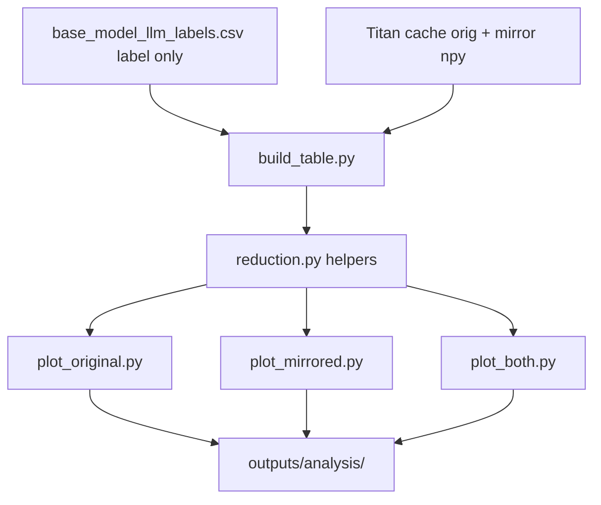

# PCA/LDA on Human Keep/Remove Labels

## Remember
- Exact file paths always
- Exact commands with expected output
- DRY, YAGNI, frequent commits
- Maximum safely delegable parallelism
- Delegated tasks must be impossible to misread
- Operational changes: inventory `docs/runbooks/`; list updates and new runbooks from the runbook template
- UI changes: agent captures before/after screenshots itself (no README or instructions for the user)
- **No tests by design** — exploratory viz only; user waived automated tests
- **No Manual Verification checklist by design** — user waived Manual Verification for this experiment

**Plan asset path:** [`docs/plans/2026-07-22_dimensionality_reduction_labels_7bf11f/`](docs/plans/2026-07-22_dimensionality_reduction_labels_7bf11f/)

**Phase 0 paths:**
- ai_tools root = `/Users/mark/Documents/projects/ai_tools/` (`PLANNING_RULES.md` loaded)
- Skill refs = `/Users/mark/.codex/skills/create-implementation-plan/`
- Target workspace = `/Users/mark/.cursor/worktrees/mirrorView-task/47kw`
- Reference experiment = [`experiments/model_errors_analysis_2026_07_15/`](experiments/model_errors_analysis_2026_07_15/)
- Output experiment = `experiments/dimensionality_reduction_labels_2026_07_22/`

**Phase 4:** Skipped — no `ui/` or frontend changes (experiment scripts + static PNG plots only).

---

## Overview

Build a self-contained experiment under `experiments/dimensionality_reduction_labels_2026_07_22/` that reuses the Titan embedding cache and PCA/LDA plotting patterns from `experiments/model_errors_analysis_2026_07_15/analyze/`, but **colors and supervises on human keep/remove labels** (`label`: `0=keep`, `1=remove`) instead of Qwen right/wrong (`is_correct` / `is_error`). Produce six primary plots (PCA + LDA × three views): original-post embeddings only, mirrored-post embeddings only, and both roles stacked in one scatter (darker = original, lighter = mirrored; red = remove, green = keep).

**Exploratory full-data fit:** Fit `StandardScaler` / PCA / LDA on the **full dataset** (fit-transform on all points), then plot a **single scatter** of all points per PCA/LDA figure — not train|test panels. This is exploratory visualization only, not leakage-sensitive model evaluation; there is **no train/test split**.

Do **not** call Bedrock for embeddings or LLM inference; load cached Titan vectors only. Do **not** modify the prior model-errors experiment. Do **not** add pytest modules or a Manual Verification checklist (user waived both).

---

## Happy Flow

1. Operator starts from repo root. Human labels and texts already exist in [`experiments/model_errors_analysis_2026_07_15/outputs/base_model_llm_labels.csv`](experiments/model_errors_analysis_2026_07_15/outputs/base_model_llm_labels.csv) (`post_id`, `original_text`, `mirrored_text`, `label`; ~8,791 rows; `label` distribution keep=5978 / remove=2813).
2. [`analyze/build_table.py`](experiments/dimensionality_reduction_labels_2026_07_22/analyze/build_table.py) loads that CSV (read-only), resolves the Titan embedding cache the same way as [`model_errors_analysis_2026_07_15/analyze/build_table.py`](experiments/model_errors_analysis_2026_07_15/analyze/build_table.py) (`WORKTREE_EMBEDDING_CACHE` then `MAIN_REPO_EMBEDDING_CACHE` at `/Users/mark/Documents/work/mirrorView-task/experiments/predict_keep_remove_2026_07_01/embedding_cache`), and loads **both** `TEXT_ROLE_ORIGINAL` and `TEXT_ROLE_MIRROR` vectors via `embedding_identity_sha256` on `original_text` / `mirrored_text` (local `.npy` only; no AWS). Writes:
   - `outputs/analysis/analysis_meta.csv` — `post_id`, `label`
   - `outputs/analysis/X_original.npy` — shape `(8791, 256)`
   - `outputs/analysis/X_mirrored.npy` — shape `(8791, 256)`
   - `outputs/analysis/analysis_table_meta.json` — cache stats, dims, row count
3. Shared helpers in [`analyze/reduction.py`](experiments/dimensionality_reduction_labels_2026_07_22/analyze/reduction.py) implement full-data `StandardScaler` → `PCA(2)` and binary `LDA(1)` + residual `PCA(1)` (adapt from [`embed_2d.py`](experiments/model_errors_analysis_2026_07_15/analyze/embed_2d.py) `fit_reductions` / `transform_all`, dropping train-mask / split logic), plus the frozen color palette and **single-scatter** plot primitives (one axes per figure, all points).
4. Three view scripts (parallel-safe; own output subdirs) fit reductions on their **full** feature matrices, then write plots + coords:
   - Original: `outputs/analysis/original/pca_remove_vs_keep.png`, `lda_remove_vs_keep.png`, `embeddings_2d.csv`
   - Mirrored: `outputs/analysis/mirrored/...` (same filenames)
   - Both: `outputs/analysis/both/...` with darker/lighter red/green encoding
5. Operator reads `README.md` + `RESULTS.md` for commands, color legend, and brief separability notes (PCA variance; optional full-data Cohen-d on LD1 for remove vs keep — descriptive only, not a holdout metric).



---

## Manual Verification

**N/A — user waived Manual Verification for this exploratory viz experiment.**

No checklist. Operator may optionally run the Happy Flow / Final Verification commands to produce plots; that is not a required gate for this plan.

**Tests:** None by design — no `tests/` package, no pytest, no P-TESTS packet.

---

## Alternative approaches

| Option | Pros | Cons | Decision |
|--------|------|------|----------|
| **A. New experiment dir adapting prior `analyze/` scripts** (chosen) | Clear provenance; no risk to prior RESULTS; mirrors established layout | Some duplicated plotting/boilerplate | **Choose A** — matches repo experiment pattern and user output path |
| B. Extend `model_errors_analysis_2026_07_15` with new label-colored plots | Less new scaffolding | Mixes model-error and human-label questions; pollutes prior RESULTS/spec | Reject |
| C. Reuse prior `X_only_original.npy` + prior `split_ids.json` as-is | Faster for original-only | Prior split stratifies on `is_error`, not `label`; no mirror matrix; couples experiments; **this plan has no split** | Reject; rebuild both matrices in new dir for self-containment |
| D. Single `embed_2d.py` producing all 6 plots | One entrypoint | Harder to parallelize / review; large file | Reject for implementation; README may still document a one-liner that runs all three scripts |
| E. LDA with 4 classes (orig-keep, orig-remove, mirror-keep, mirror-remove) for both-view | Encodes role in LDA | User asked binary remove/keep; darker/lighter is visual encoding only; 4-class LDA changes the scientific question | Reject; keep binary LDA on `label`; encode role via color lightness |
| F. Train/test split + two-column panels (prior experiment style) | Leakage-aware Cohen-d | User requested no split — exploratory viz only | **Reject** — full-data fit + single scatter |

---

## Specificity

### Locked scientific contracts

| Field | Value |
|-------|-------|
| Target / color class | Human `label`: `0=keep`, `1=remove` |
| Not used for color/LDA target | `is_correct`, `is_error`, model predictions |
| Label source CSV | `experiments/model_errors_analysis_2026_07_15/outputs/base_model_llm_labels.csv` (read-only) |
| Embedding model | Titan `amazon.titan-embed-text-v2:0`, dim=256, `normalize=True` (same as prior) |
| Cache resolution order | Worktree `experiments/predict_keep_remove_2026_07_01/embedding_cache` if populated; else main checkout `/Users/mark/Documents/work/mirrorView-task/experiments/predict_keep_remove_2026_07_01/embedding_cache` (~17,370 `.npy` files = orig+mirror) |
| AWS / Bedrock | **Forbidden** for this experiment |
| Split | **None** — no `split.py`, no `split_ids.json`, no train/test masks |
| Fit regime | **Exploratory full-data fit** — scaler / PCA / LDA fit on all rows used for that view, then transform all rows; not leakage-sensitive evaluation |
| Plot layout | **Single scatter** of all points per PCA/LDA PNG (not train\|test two-column panels) |
| Linked-fate label semantics | One `label` per `post_id` applies to **both** original and mirrored texts when stacking |

### Color palette (frozen)

| Role | Keep (`label=0`) | Remove (`label=1`) |
|------|------------------|--------------------|
| Single-view (original-only or mirrored-only) | `#2E7D32` (green) | `#C62828` (red) |
| Both-view, original (darker) | `#1B5E20` | `#B71C1C` |
| Both-view, mirrored (lighter) | `#81C784` | `#EF9A9A` |

Markers: keep=`o`, remove=`x` (parity with prior right/wrong marker convention).

### LDA design (binary remove/keep)

- Fit `LinearDiscriminantAnalysis(n_components=1)` on **all** features for the view with `y=label`.
- Y-axis for scatter = first PC of residuals orthogonal to LD1 (same trick as prior experiment — binary LDA cannot produce 2 discriminants).
- **Both-posts view:** stack all original + all mirrored rows (2N points) for fit and plot. One `label` per `post_id` applies to both roles.
- Do **not** treat text_role as an LDA class. Lightness is plot-only.

### PCA design

- `PCA(n_components=2, random_state=42)` after full-data-fit `StandardScaler`.
- Optional viz-only 2D logistic boundary on PC1/PC2 predicting `label` (same pattern as prior `plot_pca`, but target=`label` not `is_error`). Document as overlay only.

### File layout (create)

```text
experiments/dimensionality_reduction_labels_2026_07_22/
  README.md
  RESULTS.md                          # after plots exist
  analyze/
    __init__.py
    paths.py
    build_table.py
    reduction.py                      # shared fit/transform + colors + single-scatter helpers
    plot_original.py
    plot_mirrored.py
    plot_both.py
  outputs/
    analysis/
      analysis_meta.csv
      analysis_table_meta.json
      X_original.npy
      X_mirrored.npy
      original/   # pca/lda pngs, embeddings_2d.csv, reduction_summary.json
      mirrored/
      both/
```

No `split.py`, no `split_ids.json`, no `tests/`.

### Reuse map (read / adapt; do not edit prior experiment)

| Prior file | Reuse how |
|------------|-----------|
| `analyze/paths.py` | Template for new `paths.py` constants (omit split constants) |
| `analyze/build_table.py` | Cache resolve + local `.npy` load; **extend** to mirror role (`TEXT_ROLE_MIRROR`, `mirrored_text`) |
| `analyze/split.py` | **Do not port** — no split in this experiment |
| `analyze/embed_2d.py` | Port `fit_reductions` / `transform_all` adapted to full-data fit (no `train_mask`); replace train/test panel layout with **single scatter**; retarget colors/titles to keep/remove |
| `embeddings/features/only_original.py` | Optional for original matrix; mirrored matrix can be plain `np.vstack` of mirror join column (no new shared feature builder required unless DRY wants a tiny `OnlyMirror` — YAGNI: stack in `build_table.py`) |
| `simplified_predict_remove_2026_05_13/features.py` | `JOIN_COL_*`, `join_embeddings` patterns / constants |
| `lib/aws/embedding_identity.py` | `embedding_identity_sha256` for cache keys |

---

## Serial Coordination Spine

| Step | ID | Owner work | Unblocks |
|------|-----|------------|----------|
| 1 | **S1** | Create experiment tree + `paths.py` + empty `__init__.py` + README stub documenting commands and color legend; freeze contracts below in `paths.py` constants | All |
| 2 | **S2** | Implement `build_table.py`; produce `X_original.npy`, `X_mirrored.npy`, `analysis_meta.csv`, `analysis_table_meta.json` | Parallel plots (after S3) |
| 3 | **S3** | Implement `reduction.py` (full-data fit/transform, palette, shared **single-scatter** plot primitives) | Parallel plots |
| 4 | **S4** | After parallel plots land: write `RESULTS.md`, finalize `README.md`, confirm six PNGs + summaries | Done |

Parallel work starts only after **S3** completes (plots need helpers + data). S1–S3 are intentionally serial because they define paths, matrices, and shared APIs.

---

## Interface or Contract Freeze

Freeze before parallel plot tasks:

### `paths.py` constants (exact names)

```python
EXPERIMENT_ROOT = Path(__file__).resolve().parents[1]
REPO_ROOT = EXPERIMENT_ROOT.parents[1]
OUTPUTS_DIR = EXPERIMENT_ROOT / "outputs"
ANALYSIS_DIR = OUTPUTS_DIR / "analysis"
LABELS_CSV_PATH = (
    REPO_ROOT
    / "experiments/model_errors_analysis_2026_07_15/outputs/base_model_llm_labels.csv"
)
ANALYSIS_META_PATH = ANALYSIS_DIR / "analysis_meta.csv"
ANALYSIS_TABLE_META_PATH = ANALYSIS_DIR / "analysis_table_meta.json"
X_ORIGINAL_PATH = ANALYSIS_DIR / "X_original.npy"
X_MIRRORED_PATH = ANALYSIS_DIR / "X_mirrored.npy"
ORIGINAL_DIR = ANALYSIS_DIR / "original"
MIRRORED_DIR = ANALYSIS_DIR / "mirrored"
BOTH_DIR = ANALYSIS_DIR / "both"
EMBEDDING_DIM = 256
FEATURE_SET_ORIGINAL = "only_original"
FEATURE_SET_MIRRORED = "only_mirrored"
FEATURE_SET_BOTH = "original_and_mirrored_stacked"
FIT_REGIME = "full_data_exploratory"  # not train-only; viz only
```

### `reduction.py` public API (exact signatures)

```python
COLORS = {
    "keep": "#2E7D32",
    "remove": "#C62828",
    "keep_original": "#1B5E20",
    "remove_original": "#B71C1C",
    "keep_mirrored": "#81C784",
    "remove_mirrored": "#EF9A9A",
}

def fit_reductions(X, y_label) -> tuple[StandardScaler, PCA, LinearDiscriminantAnalysis, PCA, dict]: ...
def transform_all(X, scaler, pca, lda, pca_orth) -> tuple[np.ndarray, np.ndarray, np.ndarray]: ...
def load_meta() -> pd.DataFrame:  # analysis_meta.csv aligned to X row order
```

`fit_reductions` fits scaler / PCA / LDA / residual PCA on **all** rows of `X` (exploratory full-data fit). No `train_mask` argument.

`y_label` is always `meta["label"].to_numpy()` (0/1). LDA classes must be `{0, 1}`.

### Per-view `embeddings_2d.csv` columns

**original / mirrored:**

`post_id,pc1,pc2,ld1,lda_orth_pc1,label`

**both:**

`post_id,text_role,pc1,pc2,ld1,lda_orth_pc1,label`  
where `text_role ∈ {"original","mirrored"}`.

No `split` column.

### Plot titles (exact substrings)

- Original PCA: `PCA (2D) of original Titan — human remove vs keep`
- Mirrored PCA: `PCA (2D) of mirrored Titan — human remove vs keep`
- Both PCA: `PCA (2D) of original+mirrored Titan — human remove vs keep (dark=original, light=mirrored)`
- LDA titles analogous with `LDA view of ...`

### Plot layout contract

Each PNG is a **single axes** scatter of all points (one figure per method). Do **not** create train|test two-column subplots.

### Forbidden edits

- Do not modify any file under `experiments/model_errors_analysis_2026_07_15/`
- Do not call Bedrock embed / Converse / `api_baselines/*/train.py`
- Do not introduce `split.py`, `split_ids.json`, or train/test masks
- Do not add a `tests/` package or pytest for this experiment

---

## Parallel Task Packets

### P-VIZ-ORIG

- **Task ID:** P-VIZ-ORIG
- **One-sentence objective:** Implement `plot_original.py` to fit full-data PCA/LDA on `X_original.npy` and write a single-scatter remove-vs-keep plot pair + coords under `outputs/analysis/original/`.
- **Why this task is parallelizable:** Exclusive ownership of `plot_original.py` and `outputs/analysis/original/`; consumes frozen helpers/data only.
- **Exact files to inspect:**
  - `experiments/dimensionality_reduction_labels_2026_07_22/analyze/paths.py`
  - `experiments/dimensionality_reduction_labels_2026_07_22/analyze/reduction.py`
  - `experiments/model_errors_analysis_2026_07_15/analyze/embed_2d.py` (reference for fit/transform; **not** for train/test panels)
- **Exact files allowed to change:**
  - `experiments/dimensionality_reduction_labels_2026_07_22/analyze/plot_original.py` (create)
  - files under `experiments/dimensionality_reduction_labels_2026_07_22/outputs/analysis/original/` (runtime artifacts)
- **Exact files forbidden to change:**
  - `experiments/model_errors_analysis_2026_07_15/**`
  - `experiments/dimensionality_reduction_labels_2026_07_22/analyze/{build_table,reduction,plot_mirrored,plot_both,paths}.py`
  - `experiments/dimensionality_reduction_labels_2026_07_22/outputs/analysis/{mirrored,both}/**`
- **Preconditions:** S1–S3 complete; `X_original.npy`, `analysis_meta.csv`, `reduction.py` exist.
- **Dependency tasks:** S1, S2, S3
- **Required contracts and invariants:** Use `COLORS["keep"]` / `COLORS["remove"]` only (no light variants). Fit on **all** rows. Target `y=label`. Write `pca_remove_vs_keep.png`, `lda_remove_vs_keep.png`, `embeddings_2d.csv`, `reduction_summary.json`. Single scatter only.
- **Step-by-step implementation instructions:**
  1. Create `plot_original.py` with docstring: `Run from root: PYTHONPATH=. uv run python experiments/dimensionality_reduction_labels_2026_07_22/analyze/plot_original.py`.
  2. `np.load(X_ORIGINAL_PATH)`; `meta = load_meta()`; assert `len(meta)==X.shape[0]`.
  3. `fit_reductions(X, meta["label"].to_numpy())` → `transform_all`.
  4. Plot **one** scatter colored by label (green keep / red remove); save under `ORIGINAL_DIR`.
  5. Write `embeddings_2d.csv` and `reduction_summary.json` including PCA variance ratios and optional full-data LD1 Cohen-d (remove−keep), with `fit_regime: full_data_exploratory`.
- **Exact verification commands:**
  ```bash
  PYTHONPATH=. uv run python experiments/dimensionality_reduction_labels_2026_07_22/analyze/plot_original.py
  test -f experiments/dimensionality_reduction_labels_2026_07_22/outputs/analysis/original/pca_remove_vs_keep.png
  test -f experiments/dimensionality_reduction_labels_2026_07_22/outputs/analysis/original/lda_remove_vs_keep.png
  test -f experiments/dimensionality_reduction_labels_2026_07_22/outputs/analysis/original/embeddings_2d.csv
  ```
- **Expected outputs from verification:** Exit 0; three artifacts present; CSV has 8791 rows and columns `post_id,pc1,pc2,ld1,lda_orth_pc1,label`.
- **Done-when checklist:**
  - [ ] Script runs from repo root with `PYTHONPATH=.`
  - [ ] Artifacts under `outputs/analysis/original/` only
  - [ ] No Bedrock calls; no split; single scatter
- **Coordinator review checklist:**
  - [ ] Titles mention human remove vs keep and original Titan
  - [ ] Colors match frozen single-view palette
  - [ ] `reduction_summary.json` records `feature_set: only_original` and `fit_regime: full_data_exploratory`

---

### P-VIZ-MIRROR

- **Task ID:** P-VIZ-MIRROR
- **One-sentence objective:** Implement `plot_mirrored.py` analogous to original but using `X_mirrored.npy` and writing under `outputs/analysis/mirrored/`.
- **Why this task is parallelizable:** Exclusive files `plot_mirrored.py` + `outputs/analysis/mirrored/`; no overlap with P-VIZ-ORIG / P-VIZ-BOTH.
- **Exact files to inspect:** Same as P-VIZ-ORIG plus `X_mirrored.npy` path in `paths.py`.
- **Exact files allowed to change:**
  - `experiments/dimensionality_reduction_labels_2026_07_22/analyze/plot_mirrored.py`
  - `experiments/dimensionality_reduction_labels_2026_07_22/outputs/analysis/mirrored/**`
- **Exact files forbidden to change:**
  - `experiments/model_errors_analysis_2026_07_15/**`
  - `experiments/dimensionality_reduction_labels_2026_07_22/analyze/{build_table,reduction,plot_original,plot_both,paths}.py`
  - `experiments/dimensionality_reduction_labels_2026_07_22/outputs/analysis/{original,both}/**`
- **Preconditions:** S1–S3 complete.
- **Dependency tasks:** S1, S2, S3
- **Required contracts and invariants:** Identical to P-VIZ-ORIG except matrix=`X_MIRRORED_PATH`, out dir=`MIRRORED_DIR`, titles say mirrored, `feature_set: only_mirrored`.
- **Step-by-step implementation instructions:** Mirror P-VIZ-ORIG steps with mirrored paths/titles; do not load original matrix.
- **Exact verification commands:**
  ```bash
  PYTHONPATH=. uv run python experiments/dimensionality_reduction_labels_2026_07_22/analyze/plot_mirrored.py
  test -f experiments/dimensionality_reduction_labels_2026_07_22/outputs/analysis/mirrored/pca_remove_vs_keep.png
  test -f experiments/dimensionality_reduction_labels_2026_07_22/outputs/analysis/mirrored/lda_remove_vs_keep.png
  ```
- **Expected outputs from verification:** Exit 0; PNGs + `embeddings_2d.csv` (8791 rows) + `reduction_summary.json`.
- **Done-when checklist:**
  - [ ] Mirrored-only artifacts written
  - [ ] Palette is single-view keep/remove (not light/dark)
  - [ ] Single scatter; full-data fit
- **Coordinator review checklist:**
  - [ ] No accidental use of `X_original.npy`
  - [ ] Summary `feature_set` is `only_mirrored`

---

### P-VIZ-BOTH

- **Task ID:** P-VIZ-BOTH
- **One-sentence objective:** Implement `plot_both.py` that stacks original+mirrored embeddings (2N rows), fits binary remove/keep LDA/PCA on **all** stacked rows, and plots a single darker=original / lighter=mirrored red-green scatter under `outputs/analysis/both/`.
- **Why this task is parallelizable:** Exclusive ownership of `plot_both.py` and `outputs/analysis/both/`.
- **Exact files to inspect:**
  - `experiments/dimensionality_reduction_labels_2026_07_22/analyze/reduction.py`
  - `experiments/dimensionality_reduction_labels_2026_07_22/analyze/paths.py`
  - `experiments/model_errors_analysis_2026_07_15/analyze/embed_2d.py`
- **Exact files allowed to change:**
  - `experiments/dimensionality_reduction_labels_2026_07_22/analyze/plot_both.py`
  - `experiments/dimensionality_reduction_labels_2026_07_22/outputs/analysis/both/**`
- **Exact files forbidden to change:**
  - `experiments/model_errors_analysis_2026_07_15/**`
  - `experiments/dimensionality_reduction_labels_2026_07_22/analyze/{build_table,reduction,plot_original,plot_mirrored,paths}.py`
  - `experiments/dimensionality_reduction_labels_2026_07_22/outputs/analysis/{original,mirrored}/**`
- **Preconditions:** S1–S3 complete; both `X_*.npy` present.
- **Dependency tasks:** S1, S2, S3
- **Required contracts and invariants:**
  - Stack order: prefer **block stack** `X_stack = np.vstack([X_original, X_mirrored])` with parallel `post_id` / `label` / `text_role` arrays of length 2N (document chosen order in script docstring).
  - LDA/PCA target remains binary `label` (not 4-class).
  - Colors: `keep_original` / `remove_original` / `keep_mirrored` / `remove_mirrored` from frozen `COLORS`.
  - CSV includes `text_role`; length `17582`.
  - Single scatter of all 2N points (no train/test panels).
- **Step-by-step implementation instructions:**
  1. Load `X_original`, `X_mirrored`, meta.
  2. Build stacked `X` `(17582, 256)`, `y`, `text_role`, `post_id_stack`.
  3. Fit reductions on **all** stacked rows; transform all.
  4. Scatter with four series (orig-keep, orig-remove, mir-keep, mir-remove) using dark/light palette; **one** axes.
  5. Write PNGs, `embeddings_2d.csv`, `reduction_summary.json` with `feature_set: original_and_mirrored_stacked`, `fit_regime: full_data_exploratory`, and note N_rows = 2× n_posts.
- **Exact verification commands:**
  ```bash
  PYTHONPATH=. uv run python experiments/dimensionality_reduction_labels_2026_07_22/analyze/plot_both.py
  PYTHONPATH=. uv run python - <<'PY'
  import pandas as pd
  df = pd.read_csv("experiments/dimensionality_reduction_labels_2026_07_22/outputs/analysis/both/embeddings_2d.csv")
  assert len(df) == 17582
  assert set(df["text_role"]) == {"original", "mirrored"}
  print("both OK")
  PY
  test -f experiments/dimensionality_reduction_labels_2026_07_22/outputs/analysis/both/pca_remove_vs_keep.png
  ```
- **Expected outputs from verification:** Exit 0; `both OK`; PNGs present.
- **Done-when checklist:**
  - [ ] Dark/light encoding visible in legend
  - [ ] Binary LDA only
  - [ ] Single scatter of all stacked points
- **Coordinator review checklist:**
  - [ ] Legend labels include original/mirrored and keep/remove
  - [ ] Title includes dark=original, light=mirrored
  - [ ] Summary documents stacked row count and full-data fit

---

## Integration Order

1. Land **S1** (paths + tree + README stub).
2. Land **S2** (`build_table.py` + matrices). Confirm matrix shapes / label counts when running the pipeline.
3. Land **S3** (`reduction.py`). Smoke-import and synthetic full-data `fit_reductions` if useful during implementation (not a required test suite).
4. In parallel: **P-VIZ-ORIG**, **P-VIZ-MIRROR**, **P-VIZ-BOTH**.
5. **S4**: `RESULTS.md` + README finalization; paste relative image links; note PCA variance and optional full-data LDA Cohen-d for each view (descriptive only).
6. Final Verification commands below (operator convenience; not a Manual Verification gate).

---

## Final Verification

Convenience end-to-end commands (optional — user waived Manual Verification; no required pass gate beyond producing the six PNGs when the operator wants them):

```bash
cd /Users/mark/.cursor/worktrees/mirrorView-task/47kw
PYTHONPATH=. uv run python experiments/dimensionality_reduction_labels_2026_07_22/analyze/build_table.py
PYTHONPATH=. uv run python experiments/dimensionality_reduction_labels_2026_07_22/analyze/plot_original.py
PYTHONPATH=. uv run python experiments/dimensionality_reduction_labels_2026_07_22/analyze/plot_mirrored.py
PYTHONPATH=. uv run python experiments/dimensionality_reduction_labels_2026_07_22/analyze/plot_both.py
```

Expected artifacts when run:

1. Six primary PNGs exist (PCA+LDA × original/mirrored/both) — each a **single scatter** of all points.
2. `analysis_meta.csv` label counts `{0:5978,1:2813}`; matrices `(8791,256)`.
3. No `split_ids.json`; no train/test columns in coords CSVs.
4. Both-view CSV has 17,582 rows with `text_role` ∈ {original, mirrored}.
5. `git status` shows no changes under `experiments/model_errors_analysis_2026_07_15/`.
6. README documents color legend, run commands, and full-data exploratory fit.
7. No Bedrock/AWS calls during the pipeline (`analysis_table_meta.json` records `aws_called: false`).

---

## Update Runbooks

**Runbook root:** `docs/runbooks/` — exists

### Existing runbooks

| Runbook | Status | Sections / changes needed | Why |
|---------|--------|-----------------------------|-----|
| `docs/runbooks/AWS_DEPLOYMENT_GUIDE.md` | no change | — | Experiment is offline analysis; no deploy |
| `docs/runbooks/CODING_GUIDES.md` | review recommended | Confirm new scripts include “Run from root: PYTHONPATH=. uv run python …” docstring | Coding convention only; no runbook text change required if README + script docstrings comply |
| `docs/runbooks/HOW_TO_REPLACE_STIMULI_DATASET.md` | no change | — | Unrelated to stimuli CSV swap |
| `docs/runbooks/MANUAL_TESTING.md` | no change | — | Browser study smoke tests unchanged; this experiment has no Manual Verification |
| `docs/runbooks/README.md` | no change | — | Index only |
| `docs/runbooks/SETTING_UP_A_NEW_DATA_COLLECTION_RUN.md` | no change | — | Data collection launch unchanged |
| `docs/runbooks/WHAT_IS_MIRRORVIEW.md` | no change | — | Conceptual overview unchanged |

### New runbooks to create

None. Operator procedure lives in `experiments/dimensionality_reduction_labels_2026_07_22/README.md` (same pattern as `experiments/model_errors_analysis_2026_07_15/README.md`). No new prod/staging operational surface.

### No runbook impact

This change is limited to a new offline experiment directory (scripts + PNGs under `experiments/dimensionality_reduction_labels_2026_07_22/`) and does not alter deploy, env, auth, data-collection, or browser verification procedures documented in `docs/runbooks/`.

---

## Design discussion (planning notes for implementers)

### Why human labels (not model correctness)

The prior experiment asked whether **Qwen right/wrong** is organized in original Titan space. This experiment asks whether **human keep/remove** structure is visible for original posts, mirrored posts, and both together — a different scientific question with the same geometry toolkit.

### Why no train/test split

Prior `model_errors` analysis used a stratified split and train-only fits so Cohen-d / separators could be discussed without leakage. This experiment is **exploratory visualization of actual human labels** — plot geometry only. Fit-transform on the full set is intentional and documented (`FIT_REGIME = "full_data_exploratory"`). Do not frame results as holdout evaluation.

### Embedding reuse vs recompute

- **Reuse cache files** (content-addressed `.npy` via `embedding_identity_sha256`) — yes.
- **Reuse prior `X_only_original.npy` as the only source** — discouraged; rebuild into `X_original.npy` / `X_mirrored.npy` so the new experiment is self-describing and row-aligned to its own `analysis_meta.csv`.
- **Re-embed via Bedrock** — forbidden unless cache miss; if miss, fail loudly with post_id sample (same as prior `build_table.py`).

### Three visualization types

1. **Original only** — one point per post; color = keep/remove; single scatter.
2. **Mirrored only** — one point per post; color = keep/remove; same label as original (linked fate); single scatter.
3. **Both** — two points per post; hue = keep/remove; lightness = role (dark original / light mirrored); single scatter of 2N points.

### PCA vs LDA applicability

- **PCA** always valid (unsupervised variance view); expect limited variance in first 2 PCs of 256-d Titan (same caveat as prior RESULTS).
- **LDA** valid as supervised 1D projection for binary keep/remove; optional full-data Cohen-d on LD1 is a descriptive note only (not train vs test).
- Stacked both-view LDA still binary; it finds a direction separating keep vs remove in the **union** of original and mirrored embedding clouds. Role is not a class — if originals and mirrors of the same class sit apart, PCA may show that better than LDA.

### Open questions / defaults (non-blocking)

| Topic | Default in this plan | Alternative |
|-------|----------------------|-------------|
| Fit regime | Full-data exploratory | Train-only / split — **rejected by user** |
| Both-view stacking order | Block `[X_orig; X_mir]` | Interleaved per post — either OK if documented |
| 2D logistic overlay on PCA | Include (parity with prior) | Omit for less clutter — optional flag later |
| Linear separator (256-d logistic) | **Out of scope** (viz-only request) | Can add later mirroring `linear_separator.py` with `y=label` |
| Copy labels CSV into new `outputs/` | **No** — read prior path | Copy for hermeticity if prior dir might move |
| Full-data Cohen-d in RESULTS | Optional descriptive note | Omit entirely — either OK |

---

## Phase gates (planner self-check)

- Phase 1: Overview, Happy Flow, Manual Verification (minimal N/A waiver), Alternatives, Remember, asset path — present.
- Phase 2: Runbooks inventoried and classified; no-impact justified.
- Phase 3: Spine, Contract Freeze, Parallel Packets (all fields), Integration Order, Final Verification — present; packets pass validity test (exclusive files, exact commands, no shared ownership); no P-TESTS.
- Phase 4: Skipped — no `ui/`.
- Phase 5: See checklist confirmation in delivery note to parent.
