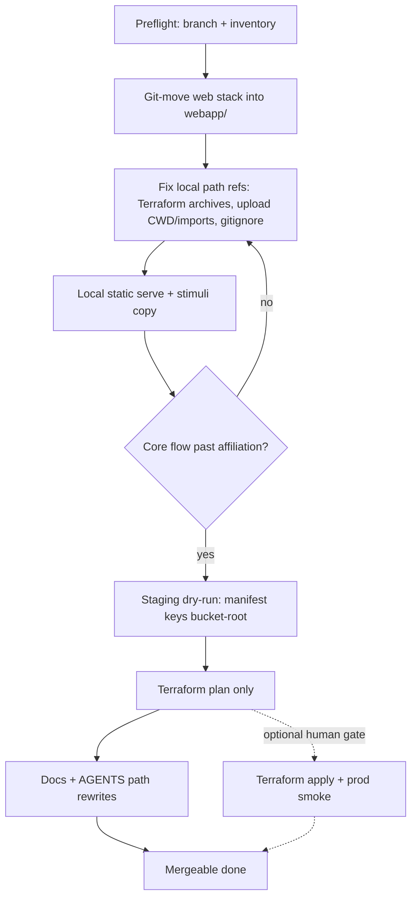

# Relocate the MirrorView deployable web stack under a single `webapp/` unit

## Remember
- Exact file paths always
- Exact commands with expected output
- DRY, YAGNI, TDD, frequent commits
- Delegated tasks must be impossible to misread.

## Overview

Collocate the participant-facing MirrorView stack—static site, Lambdas, Terraform, npm package files, S3 upload tooling, and smoke-test stubs—under one `webapp/` tree so deploy and local-serve paths stop competing with root-level Python/ML tooling. Live S3 object keys and API Gateway URLs stay identical; only local repo paths change. Terraform apply remains optional and explicitly gated. Detailed move inventory, doc rewrite list, and phased gates live in the prep packet: [FILES_MOVED.md](FILES_MOVED.md), [RUNBOOK_UPDATES.md](RUNBOOK_UPDATES.md), [ROLLOUT_PLAN.md](ROLLOUT_PLAN.md).

## Happy flow

An operator or agent checks out the reorg branch, serves the static experiment from the new webapp public tree (with the local stimulus catalog copied into place), confirms assignment still hits the live API and trials render, dry-runs staging so bucket keys remain root-relative, reviews a path-correct Terraform plan without applying, then updates runbooks and agent bootstrap so the next person never serves the old root `public/` tree.

## Approach

Treat this as a reversible filesystem and documentation reorg, not a product or infra redesign. Prefer `git mv` so history follows; keep analysis/ML packages at the repo root; move upload tooling with the web unit (agreed Option A); verify with static serve and staging key assertions rather than broken npm scripts; never require a cloud apply to call the work done.

## Steps

### Step 1: Preflight and branch

Confirm a dedicated branch, a clean-enough working tree, and that the expected web roots still sit at the repo top before any move. Abort if unexpected edits touch the live site, Lambdas, or infra tree. Details: [steps/step1.md](steps/step1.md).

### Step 2: Move the deployable unit under `webapp/`

Relocate the static site, Lambda sources (under a dedicated lambdas folder), Terraform module, npm package files, upload-to-S3 package, and smoke-test stubs into `webapp/` per the prep move map. Leave jobs, experiments, shared Python libs, analysis scripts, docs, root image analysis assets, and local_data fixtures at the repo root. Ensure no leftover root copies of the moved trees remain. Details: [steps/step2.md](steps/step2.md).

### Step 3: Repair local path contracts

Update Terraform archive source paths for the new Lambda locations, standardize upload tooling on a single CWD / `PYTHONPATH` convention under the webapp unit, and retarget gitignore rules for the moved public and infra artifacts. Do not change S3 allowlist key shapes or live API URLs in site config. Details: [steps/step3.md](steps/step3.md).

### Step 4: Verify local static serve

Copy the stimulus catalog into the new public image path, serve that public tree with a static HTTP server, and confirm the experiment loads config with unchanged API URLs, fetches the catalog locally, and progresses past political affiliation without assignment errors. Do not use npm start/dev for this gate; save-to-S3 completion is optional. Details: [steps/step4.md](steps/step4.md).

### Step 5: Staging dry-run without upload

Run the staging script so it finds the new public tree and emits a manifest whose keys match today’s bucket-root layout (no `webapp/` or `public/` prefix on keys). Stop before any production S3 write; if AWS credentials are missing, document that limitation and still prove path resolution. Details: [steps/step5.md](steps/step5.md).

### Step 6: Terraform plan only

From the moved infra module, confirm Lambda source files resolve on disk and run plan. Accept empty or zip-hash-only churn with identical source; fail hard on missing files or destroy/replace of bucket or API. Do not apply in this step. Details: [steps/step6.md](steps/step6.md).

### Step 7: Update operator and agent documentation

Rewrite agent bootstrap, root README structure, deployment and stimuli runbooks, smoke README, and job-config comment pointers to the new local paths—without rewriting S3 keys, job source-of-record paths, or live API URLs. Follow the must-update set and order in the prep runbook doc. Details: [steps/step7.md](steps/step7.md).

### Step 8: Optional gated apply

Only after Steps 1–6 pass and a human explicitly approves: apply Terraform and smoke the live assignment endpoint. This step is out of merge criteria; treat it as a separate release gate with a named rollback owner. Details: [steps/step8.md](steps/step8.md).

## What "done" looks like

1. The full deployable web unit lives only under `webapp/`; root no longer has the old public site, infra module, Lambda entrypoints, or npm package files for that stack.
2. Upload-to-S3 and smoke stubs live under the webapp unit; analysis scripts, jobs, experiments, Python project files, docs, root analysis images, and local_data remain at the repo root.
3. Staging manifests still use bucket-root keys identical in shape to today; site config still points at the same live API URLs.
4. Local static serve from the new public tree plus stimuli copy completes the core moderation path past affiliation.
5. Terraform plan is path-correct (or blocked only on credentials after on-disk path proof); apply was not required to merge.
6. Agent bootstrap and must-update runbooks instruct serving and copying under `webapp/`, so operators cannot accidentally use the old root public path.
7. Prep packet decisions are honored: no `server-local` restore, no S3/API redesign, no ML tree relocation into `webapp/`.

---

**Status:** Confirmed. Step detail files written under [steps/](steps/).
