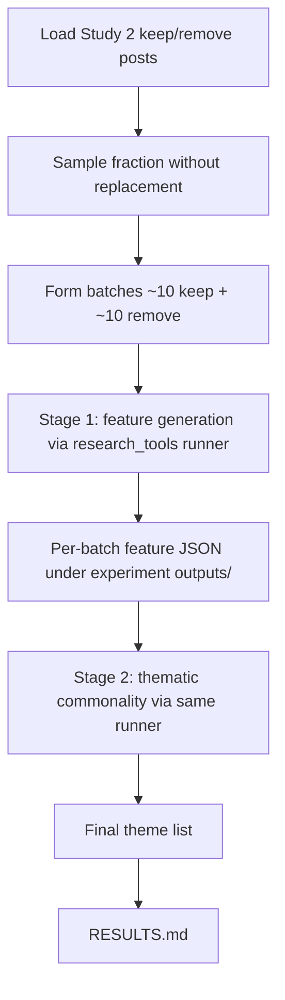

# Build an LLM feature-generation then theme-synthesis experiment under `experiments/llm_based_feature_generation_2026_07_31/`

## Remember
- Exact file paths always
- Exact commands with expected output
- DRY, YAGNI, frequent commits
- Delegated tasks must be impossible to misread.

## Overview

Stand up the experiment described in `experiments/llm_based_feature_generation_2026_07_31/README.md`: sample Study 2 human keep/remove-labeled posts, form mixed batches (~10 keep + ~10 remove), ask an LLM for plausible linguistic/content features (prompt lineage from `experiments/followup_model_error_analysis_2026_07_15/extract/prompts.py`, reworded away from confusion-bucket / FP-FN framing), then run a second LLM pass over those features to extract thematic commonalities. That theme list is the substantive experimental result. All LLM orchestration uses the filesystem-backed item runner from `research_tools`, following the call-site pattern in that library’s runner recipe (`research_tools.llm.recipes.runner`).

Confirmed decisions:
- **Post source:** Study 2 training frame from `experiments/predict_keep_remove_2026_07_01/data/dataloader.py` (one row per post, modal human keep/remove).
- **Sample size:** target corpus is **50%** of posts; when executing, start with a **1% pilot** first.
- **Model:** `gpt-5.4-nano` (OpenAI id accepted by `research_tools` / LiteLLM).
- **Schemas:** experiment-local only — do **not** put feature/theme schemas in `shared/schemas.py`.
- **Batch shape:** mixed ~10 keep + ~10 remove per stage-1 call.
- **Theme framing:** synthesis of recurring features across keep/remove groups; **no** FP-vs-TN overrepresentation language.
- **No duplicate labels:** sampling without replacement; each post id appears in at most one batch within a run; re-runs use a new timestamped output folder and can exclude previously written post ids so accidental double-processing is avoidable.
- **Verification:** no pytest unit-test suite for this experiment; pipeline correctness is checked via a tiny live smoke under `smoke_tests/`, then a 1% pilot.

## Happy flow

An operator loads labeled posts, samples a fraction without replacement, forms keep/remove batches, runs feature generation via the shared runner (timestamped JSON under the experiment `outputs/`), feeds those features into a second runner pass for thematic synthesis, then writes `RESULTS.md` from the final theme list.

## Approach

Reuse the 2026-07-15 *scientific* shape (feature extract → theme synthesis) but replace its LangChain client loops with the `research_tools` runner recipe: one item → prompt messages → structured response model → mapped JSON row, with run metadata written under `outputs/{timestamp}/`. Keep the experiment thin: data sampling/batching and prompt/schema design live in this experiment folder; LLM I/O and persistence stay in the library. Verify with a tiny smoke sample, then pilot at 1% before any 50% run.

## Steps

### Step 1: Scaffold experiment inputs, schemas, and batching

Add experiment-local modules under `experiments/llm_based_feature_generation_2026_07_31/` for loading keep/remove posts via the Study 2 dataloader, sampling a configurable fraction without replacement, forming ~10+10 batches with unique post ids across batches, and defining structured response schemas for feature generation and theme synthesis. Adapt prompt text from the 2026-07-15 extract prompts so the task targets keep vs remove groups rather than Qwen confusion buckets, and so theme synthesis has no FP/TN-overrepresentation language. No unit-test package for this experiment.

### Step 2: Implement feature-generation stage on the research_tools runner

Wire stage 1 so each batch is one runner item, following the call-site pattern demonstrated by `research_tools.llm.recipes.runner` (prompt builder → structured completion → writer map → timestamped output folder). Model is `gpt-5.4-nano`. Do not reintroduce the LangChain extract path from `experiments/followup_model_error_analysis_2026_07_15/extract/extract_features.py`.

### Step 3: Implement thematic-commonality stage on the same runner

Wire stage 2 so aggregated stage-1 features become runner item(s) whose structured output is the thematic commonality list. Reuse the same runner interface and output layout; prompt intent mirrors the clustering/synthesis role of the 2026-07-15 clustering prompt lineage without FP/TN framing.

### Step 4: CLI entry and smoke_tests harness

Add a CLI that selects sample fraction and batch sizes, runs both stages, and writes under the experiment `outputs/` tree. Add `experiments/llm_based_feature_generation_2026_07_31/smoke_tests/` with a small operable smoke that drives the real CLI on a very tiny sample (enough for ~1 stage-1 batch or less), still without-replacement / no duplicate labels. Document the exact smoke command in the experiment README.

### Step 5: 1% pilot run and RESULTS.md

Execute the **1% pilot** with repo `.env` credentials (smoke is the tiny-sample verification path; pilot is the substantive 1% run). Produce `experiments/llm_based_feature_generation_2026_07_31/RESULTS.md` with the pilot theme list and note that the 50% run remains gated.

## What "done" looks like

1. `experiments/llm_based_feature_generation_2026_07_31/` contains a runnable two-stage pipeline (feature generation → thematic synthesis) driven by the `research_tools` LLM runner recipe, not LangChain extract/cluster scripts.
2. Posts come from the Study 2 dataloader; sample fraction is configurable (1% pilot / 50% target); batches are ~10 keep + ~10 remove with no duplicate post ids across batches in a run.
3. Feature/theme schemas live only under the experiment folder; `shared/schemas.py` is untouched for this work.
4. Stage-1 and stage-2 runs each write under the experiment’s `outputs/` tree via the shared runner (metadata + per-item JSON).
5. `smoke_tests/` runs a very small live sample end-to-end; there is no pytest unit-test suite under this experiment.
6. A 1% pilot completes successfully with credentials from repo `.env` via `research_tools`.
7. `experiments/llm_based_feature_generation_2026_07_31/RESULTS.md` records the pilot thematic commonality list and states that the 50% corpus run is gated.
8. No expansion into unrelated prompt-tuning or classifier work.
