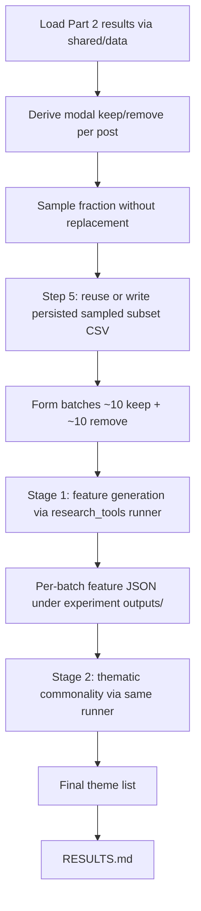

# Build an LLM feature-generation then theme-synthesis experiment under `experiments/llm_based_feature_generation_2026_07_31/`

## Remember

- Exact file paths always
- Exact commands with expected output
- DRY, YAGNI, frequent commits
- Delegated tasks must be impossible to misread.

## Overview

Stand up the experiment described in `experiments/llm_based_feature_generation_2026_07_31/README.md`: sample Study Phase 2 Part 2 human keep/remove-labeled posts, form mixed batches (~10 keep + ~10 remove), ask an LLM for plausible linguistic/content features (prompt lineage from `experiments/followup_model_error_analysis_2026_07_15/extract/prompts.py`, reworded away from confusion-bucket / FP-FN framing), then run a second LLM pass over those features to extract thematic commonalities. That theme list is the substantive experimental result. All LLM orchestration uses the filesystem-backed item runner from `research_tools`, following the call-site pattern in that library’s runner recipe (`research_tools.llm.recipes.runner`).

**Workspace note:** the experiment folder currently holds only `README.md` (prior implementation deleted). This plan recreates the pipeline from scratch under that folder; do not restore deleted modules from git unless a later decision says so.

Confirmed decisions:

- **Post source:** Study Phase 2 Part 2 full results via the shared raw dataset loader under `shared/data/` (canonical path). Experiment-local code derives one row per post with modal human keep/remove (tie → remove), matching the prior Study 2 training-frame recipe. Do **not** load from `experiments/predict_keep_remove_2026_07_01/data/dataloader.py` for runtime.
- **Sample size:** production corpus is **50%** of posts (Step 5), persisted as a sampled subset CSV and reused on later 50% runs. Cheap validation is a tiny live smoke (Step 4); smoke must not write that CSV.
- **Model:** `gpt-5.4-nano` (OpenAI id accepted by `research_tools` / LiteLLM).
- **Schemas:** experiment-local only — do **not** put feature/theme schemas in `shared/schemas.py`.
- **Batch shape:** mixed ~10 keep + ~10 remove per stage-1 call.
- **Theme framing:** synthesis of recurring features across keep/remove groups; **no** FP-vs-TN overrepresentation language.
- **No duplicate labels:** sampling without replacement; each post id appears in at most one batch within a run; re-runs use a new timestamped output folder and can exclude previously written post ids so accidental double-processing is avoidable.
- **Frozen 50% subset (Step 5 only):** the production run persists a sampled subset CSV under the experiment folder and reuses it on subsequent 50% runs so posts/labels do not reshuffle; smoke (Step 4) must not create or overwrite that file.
- **Progress:** runner stages show tqdm progress for items as they complete (see Steps 2–3).
- **Verification:** no pytest unit-test suite for this experiment; pipeline correctness is checked via a tiny live smoke under `smoke_tests/` (Step 4). **Do not start Step 5 until the user explicitly approves after reviewing Step 4 smoke results.** Step 5 is the full 50% production run.

## Happy flow

An operator loads labeled posts from the shared Part 2 results dataset, derives the per-post keep/remove frame, samples a fraction without replacement (Step 5: load or write a persisted sampled subset CSV for the 50% corpus), forms keep/remove batches, runs feature generation via the shared runner (timestamped JSON under the experiment `outputs/`), feeds those features into a second runner pass for thematic synthesis, then writes `RESULTS.md` from the final theme list.

## Approach

Reuse the 2026-07-15 *scientific* shape (feature extract → theme synthesis) but replace its LangChain client loops with the `research_tools` runner recipe: one item → prompt messages → structured response model → mapped JSON row, with run metadata written under `outputs/{timestamp}/`. Keep the experiment thin: raw CSV comes from `shared/data/`; sampling/batching and prompt/schema design live in this experiment folder; LLM I/O and persistence stay in the library. Show tqdm progress for runner items. Verify with a tiny smoke sample (Step 4). **Do not start Step 5 until the user explicitly approves after reviewing Step 4 smoke results.** Step 5 runs the 50% corpus to completion (persisting and reusing a sampled subset CSV so re-runs do not reshuffle) and writes `RESULTS.md`.

## Steps

### Step 1: Scaffold experiment inputs, schemas, and batching

Add experiment-local modules under `experiments/llm_based_feature_generation_2026_07_31/` for loading Part 2 results through the shared raw loader, deriving the modal keep/remove training frame, sampling a configurable fraction without replacement, forming ~10+10 batches with unique post ids across batches, and defining structured response schemas for feature generation and theme synthesis. Adapt prompt text from the 2026-07-15 extract prompts so the task targets keep vs remove groups rather than Qwen confusion buckets, and so theme synthesis has no FP/TN-overrepresentation language. No unit-test package for this experiment.

### Step 2: Implement feature-generation stage on the research_tools runner

Wire stage 1 so each batch is one runner item, following the call-site pattern demonstrated by `research_tools.llm.recipes.runner` (prompt builder → structured completion → writer map → timestamped output folder). Model is `gpt-5.4-nano`. Add tqdm progress for stage-1 items as they complete (the installed runner has no progress callback; wrap via the call site — see step file). Do not reintroduce the LangChain extract path from `experiments/followup_model_error_analysis_2026_07_15/extract/extract_features.py`.

### Step 3: Implement thematic-commonality stage on the same runner

Wire stage 2 so aggregated stage-1 features become runner item(s) whose structured output is the thematic commonality list. Reuse the same runner interface and output layout; prompt intent mirrors the clustering/synthesis role of the 2026-07-15 clustering prompt lineage without FP/TN framing. Same tqdm progress pattern as stage 1.

### Step 4: CLI entry and smoke_tests harness

Add a CLI that selects sample fraction and batch sizes, runs both stages, and writes under the experiment `outputs/` tree. Add `experiments/llm_based_feature_generation_2026_07_31/smoke_tests/` with a small operable smoke that drives the real CLI on a very tiny sample (enough for ~1 stage-1 batch or less), still without-replacement / no duplicate labels. Document the exact smoke command in the experiment README. This step is the cheap validation path only; the 50% production run is Step 5 after approval.

**Approval gate:** Do not start Step 5 until the user explicitly approves after reviewing Step 4 smoke results.

### Step 5: 50% production run and RESULTS.md

After explicit user approval of Step 4 smoke results, execute the **50%** corpus run to completion with repo `.env` credentials. Sample 50% of posts once and persist that subset to a CSV under the experiment folder; on later 50% runs, reuse the persisted sampled subset CSV if present so the corpus does not reshuffle. Produce `experiments/llm_based_feature_generation_2026_07_31/RESULTS.md` with the theme list from that run. Do not start this step without that approval (process gate for humans — stop if approval has not been given). Smoke (Step 4) must not create or overwrite that persisted subset file.

## What "done" looks like

1. `experiments/llm_based_feature_generation_2026_07_31/` contains a runnable two-stage pipeline (feature generation → thematic synthesis) driven by the `research_tools` LLM runner recipe, not LangChain extract/cluster scripts.
2. Posts come from Study Phase 2 Part 2 full results via `shared/data/`; sample fraction is configurable (scaffolding / smoke); the production run uses a **frozen 50%** persisted sampled subset CSV (created once in Step 5, reused if present); batches are ~10 keep + ~10 remove with no duplicate post ids across batches in a run.
3. Feature/theme schemas live only under the experiment folder; `shared/schemas.py` is untouched for this work.
4. Stage-1 and stage-2 runs each write under the experiment’s `outputs/` tree via the shared runner (metadata + per-item JSON), with tqdm progress during item processing.
5. `smoke_tests/` runs a very small live sample end-to-end; there is no pytest unit-test suite under this experiment.
6. **Explicit user approval** is obtained after Step 4 smoke before any 50% run begins.
7. A **50%** production run completes successfully with credentials from repo `.env` via `research_tools`, using a persisted sampled subset CSV (create once, reuse if present).
8. `experiments/llm_based_feature_generation_2026_07_31/RESULTS.md` records the 50% run thematic commonality list (model, sample fraction, output paths, frozen subset path).
9. No expansion into unrelated prompt-tuning or classifier work.
