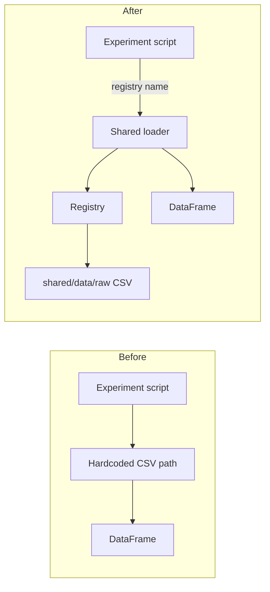

# Migrate obvious experiment loaders onto the shared dataset registry

## Remember
- Exact file paths always
- Exact commands with expected output
- DRY, YAGNI, TDD, frequent commits
- Delegated tasks must be impossible to misread.

## Overview

Thirteen experiment entry points still read study CSVs via hardcoded paths under `scripts/` or experiment-local flip files. The shared registry and raw loader from the prior shared-data work already cover those tables. This plan swaps only the obvious drop-ins: same frame shape, no transforms. Rebuilds of slim keep/remove exports, modal aggregates, attrition timestamp logic, producers, and unfinished experiments stay out of scope (see `strategy_planning/migrate_to_single_dataloader_2026_07_31/migration_plan.md` Phases 2–3).

## Happy flow

An analysis or generation script asks the shared loader for a named pilot-results or Part 2 stimuli dataset and receives the same DataFrame it previously got from a pinned path.

## Approach

Two batches only: Part 1 pilot results consumers, then Part 2 stimuli consumers. Each change is a path-for-name substitution; existing post-load filters stay local. No new shared transforms, no registry expansion, no deletion of legacy CSVs.

## Steps

### Step 1: Point Part 1 pilot-results callers at the shared loader

Update free-response, mirrors content analysis, basic summary stats (including toxicity breakdown), and the keep/remove metrics fallback so they load the registered Part 1 pilot results table instead of `scripts/` or pinned export paths.

### Step 2: Point Part 2 stimuli callers at the shared loader

Update match-lengths runners/ablations, truncate-posts defaults (v1–v3 and v5), and the combined-flips length validator so they load the registered Part 2 stimuli table instead of `combined_flips/flips.csv`.

### Step 3: Smoke-check both registry loads from the migrated call sites

Run short import/load checks that confirm Part 1 pilot results and Part 2 stimuli resolve and return expected shapes, and that one script from each batch no longer depends on the old path constants.

## What "done" looks like

1. All thirteen Phase 1 files from the migration plan use the shared loader for their study CSV ingress.
2. No new transforms or registry names are added.
3. Phases 2–3 migration items remain untouched.
4. Smoke commands succeed when the local raw CSVs under `shared/data/raw/` are present.
5. Legacy `scripts/` exports and `combined_flips/flips.csv` may still exist on disk; nothing in this plan deletes them.
