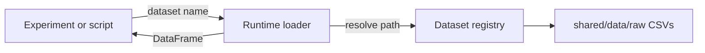

# Build a shared dataset registry and runtime loader for study raw data

## Remember
- Exact file paths always
- Exact commands with expected output
- DRY, YAGNI, TDD, frequent commits
- Delegated tasks must be impossible to misread.

## Overview

Experiments currently pin CSVs with one-off paths and local dataloader classes. `shared/data/raw/` now holds the canonical Phase 2 Part 1 and Part 2 result and stimuli tables. This plan adds a named-dataset registry plus a raw-only runtime loader in `shared/data/` so callers request a dataset by name and get a DataFrame, without hardcoding paths. No transforms, no tests, and no experiment migrations in this work. The replaceability tracker below records which experiment loaders become replaceable later.

## Happy flow

A modeling or analysis script imports the shared loader, asks for a named study dataset (for example Part 2 results full, or Part 2 stimuli), and receives a DataFrame from the matching file under `shared/data/raw/`.

## Approach

Registry is the single source of truth for dataset name → on-disk path. Loader is thin: resolve, exist-check, read CSV, return. No linked-fate filters, modal aggregation, or feature joins. SCREAMING_SNAKE names for the five CSVs already under `shared/data/raw/`.

## Replaceability tracker

| Experiment | Shared datasets needed | After this plan |
|---|---|---|
| `basic_summary_stats_2026_04_27` | Part 1 results pilot (or full) | Load path replaceable |
| `free_response_analysis_2026_04_28` | Part 1 results pilot | Load path replaceable |
| `mirrors_content_analysis_2026_04_24` | Part 1 results pilot | Load path replaceable; keep local trial filter |
| `predict_keep_remove_2026_05_07` | Part 1 results pilot | Load replaceable; keep label joins |
| `simplified_predict_remove_2026_05_13` | Part 1 results pilot | Same as 05_07 + local aggregation |
| `predict_keep_remove_2026_07_01` | Part 2 results full | Load replaceable; slim keep/remove CSV becomes derived |
| `model_errors_analysis_2026_07_15` | Part 2 results full (via 07_01) | Gold labels via shared; prediction artifacts stay local |
| `followup_model_error_analysis_2026_07_15` | Part 2 (optional re-join) | Intermediate CSVs stay custom |
| `scaled_mirrors_generation_2026_06_02` | None (producer) | Out of scope |
| `truncate_posts_2026_06_19` | None (producer lineage) | Out of scope |
| `match_lengths_original_mirrors_2026_06_19` | Optional Part 2 stimuli | Optional later; today uses combined flips |
| `fetch_reddit_pushshift_dump_2026_06_15` | None | Out of scope |
| `llm_based_feature_generation_2026_07_31` | Part 2 results full | Load replaceable when wired |

**This plan does not migrate those experiments.**

## Steps

### Step 1: Freeze registry entries and on-disk map

Lock the five SCREAMING_SNAKE names to exact CSV paths under `shared/data/raw/`, plus the metadata fields each registry entry carries.

### Step 2: Implement registry module

Add `shared/data/registry.py` as the catalog and path resolver. Path construction only—no CSV reads.

### Step 3: Implement raw runtime loader

Fill `shared/data/dataloader.py` so callers pass a registry name and get a pandas DataFrame (or a clear error if the name or file is missing).

## What "done" looks like

1. Every CSV under `shared/data/raw/study_phase_2_part_{1,2}/` has a stable SCREAMING_SNAKE registry name.
2. Callers can load any of those datasets by name via `shared/data/dataloader.py` without knowing filesystem layout.
3. Unknown names and missing files raise clear errors.
4. No unit tests added in this plan.
5. Experiment migrations in the replaceability tracker remain deferred.
