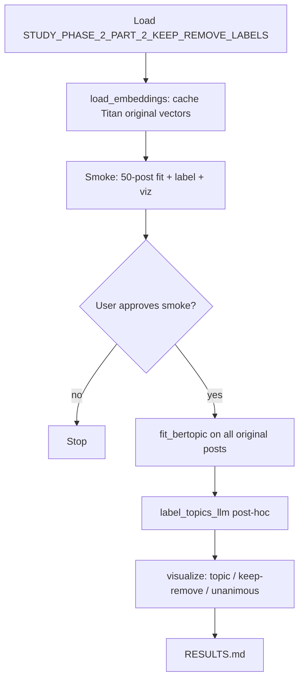

# Build a four-stage BERTopic pipeline on Titan original-post embeddings under `experiments/bertopic_modeling_2026_08_05/`

## Remember
- Exact file paths always
- Exact commands with expected output
- DRY, YAGNI, TDD, frequent commits
- Delegated tasks must be impossible to misread.

## Overview

Stand up the experiment described in `experiments/bertopic_modeling_2026_08_05/README.md`: load Study Phase 2 Part 2 modal keep/remove posts via `shared/data/dataloader.py` (`STUDY_PHASE_2_PART_2_KEEP_REMOVE_LABELS`), resolve precomputed Amazon Titan Text Embeddings V2 vectors (`shared/embeddings/bedrock.py`: `amazon.titan-embed-text-v2:0`, 256-d, L2-normalized) into a committed local cache under `experiments/bertopic_modeling_2026_08_05/outputs/embeddings/original/`, fit BERTopic on **all original-text posts** with embeddings passed in explicitly (no re-embedding inside BERTopic), write c-TF-IDF topic artifacts without calling an LLM, then label topics post-hoc with OpenAI (`gpt-5.4-nano` via `bertopic.representation.OpenAI`), and emit three 2-D cluster maps (by topic, by keep/remove, by unanimous vs not) from one shared UMAP projection. Unanimous labels come from a join to `STUDY_PHASE_2_PART_2_RESULTS_FULL`; keep/remove and unanimous are visualization overlays only — they never enter the fit.

**Workspace note:** the experiment folder currently holds only `README.md`. This plan creates the pipeline from scratch. Related sibling: `experiments/create_llm_features_2026_08_05/` clusters **LLM-generated feature** embeddings by keep/remove class; this experiment clusters **post** embeddings with BERTopic on the full original corpus.

**Out of scope (v1):** mirror-text BERTopic under `outputs/**/mirror/`; `export_features.py` for downstream keep/remove classifiers; any non-Titan embedding model inside BERTopic.

**Files that will be added** (exact paths):

| Path | Role |
| --- | --- |
| `experiments/bertopic_modeling_2026_08_05/src/__init__.py` | Package marker |
| `experiments/bertopic_modeling_2026_08_05/src/paths.py` | Experiment roots; text role fixed to `original` in v1 |
| `experiments/bertopic_modeling_2026_08_05/src/data.py` | Load keep/remove labels; join unanimous flag from results full |
| `experiments/bertopic_modeling_2026_08_05/src/load_embeddings.py` | Stage 1: resolve Titan vectors into local cache (no Bedrock when complete) |
| `experiments/bertopic_modeling_2026_08_05/src/fit_bertopic.py` | Stage 2: fit_transform with passed embeddings; c-TF-IDF + UMAP-2D; no LLM |
| `experiments/bertopic_modeling_2026_08_05/src/label_topics_llm.py` | Stage 3: post-hoc OpenAI topic labels; skip noise topic |
| `experiments/bertopic_modeling_2026_08_05/src/visualize_clusters.py` | Stage 4: three Plotly HTML + PNG overlays from shared UMAP-2D |
| `experiments/bertopic_modeling_2026_08_05/RESULTS.md` | Written after the production full-corpus run |
| `experiments/bertopic_modeling_2026_08_05/outputs/embeddings/original/` | Committed Titan cache (`embeddings.npy`, `index.parquet`, `metadata.json`) |
| `experiments/bertopic_modeling_2026_08_05/outputs/topics/original/<UTC_TS>/` | Stage-2 run artifacts (assignments, topic info, umap_2d, model) |
| `experiments/bertopic_modeling_2026_08_05/outputs/labels/original/<UTC_TS>/` | Stage-3 LLM labels + provenance |
| `experiments/bertopic_modeling_2026_08_05/outputs/figures/original/<UTC_TS>/` | Stage-4 HTML + PNG figures |

**Dependency change:** declare `bertopic` (and its usual UMAP/HDBSCAN pull-ins as that package requires) as an **optional** `[project.optional-dependencies]` extra named `bertopic` in `pyproject.toml` — same pattern as the existing `modernbert-training` extra. Do **not** add it to the default `dependencies` list or the `dev` dependency group. Operators install with `uv sync --extra bertopic` and run stages with `PYTHONPATH=. uv run --extra bertopic python …`. Reuse `openai` / repo-root `.env` `OPENAI_API_KEY` for labeling. Reuse AWS credentials only for optional embedding-cache backfill.

**Not changed:** `shared/data/`, `shared/embeddings/bedrock.py`, `shared/schemas.py`. No mirror outputs in v1.

## Happy flow

An operator installs the optional `bertopic` extra, builds the local Titan embedding cache for all original posts (Bedrock only if rows are missing), smoke-tests fit → LLM label → three viz overlays on a fixed **50-post** sample, gets explicit approval, then runs the same stages on the full original corpus and records outcomes in `RESULTS.md`.

## Approach

Keep stages isolated so UMAP/HDBSCAN retunes never re-spend OpenAI calls: embeddings and fit produce durable artifacts; LLM labeling is a separate, pointer-linked run; visualization reuses the fit-time 2-D UMAP and only recolors. Pass Titan vectors into BERTopic explicitly. Fit on the full original corpus for production; keep/remove and unanimous join only for overlays. Prefer parquet/npy/json artifacts; gitignore large saved model dirs if needed. Keep BERTopic off the default/dev install path so unrelated workflows stay lean.

## Steps

Full contracts, file allow/forbid lists, and pass/fail commands: [`steps/`](./steps/).

### Step 1: Scaffold package, paths, data join, and optional dependencies

[`steps/step1.md`](./steps/step1.md) — Create `src/` (`paths.py`, `data.py` with unanimous join rule `all_linked_fate_raters_same_decision`, four stage stubs), add optional `bertopic` extra in `pyproject.toml`, document CLI order in README.

### Step 2: Implement Titan embedding cache loader

[`steps/step2.md`](./steps/step2.md) — Implement `load_embeddings.py`: local cache under `outputs/embeddings/original/`; DynamoDB+S3 identity-cache refresh; optional Bedrock `--backfill` for residuals only.

### Step 3: Implement BERTopic fit (no LLM)

[`steps/step3.md`](./steps/step3.md) — Implement `fit_bertopic.py`: README UMAP/HDBSCAN/CountVectorizer; embeddings passed in; smoke `--sample-size 50` with `min_cluster_size` override; topics artifacts + `umap_2d.npy`.

### Step 4: Implement post-hoc LLM topic labeling

[`steps/step4.md`](./steps/step4.md) — Implement `label_topics_llm.py`: `update_topics` + `bertopic.representation.OpenAI` (`gpt-5.4-nano`); skip topic `-1`; labels run linked to source topics run.

### Step 5: Implement three-overlay cluster visualizations

[`steps/step5.md`](./steps/step5.md) — Implement `visualize_clusters.py`: one shared `umap_2d.npy`; topic / keep-remove / unanimous overlays; six Plotly HTML+PNG files.

### Step 6: Smoke end-to-end on 50 posts (approval gate)

[`steps/step6.md`](./steps/step6.md) — Run stages 1–4 on 50 posts; verify artifacts; **stop for explicit approval** before full corpus.

### Step 7: Full-corpus production run and RESULTS.md

[`steps/step7.md`](./steps/step7.md) — After approval: fit/label/viz on all original cached posts; write `RESULTS.md`.

## What "done" looks like

1. `experiments/bertopic_modeling_2026_08_05/src/` contains the six modules listed in Overview.
2. `bertopic` is declared only under `[project.optional-dependencies]` as the `bertopic` extra in `pyproject.toml` (not in default deps or `dev`); install with `uv sync --extra bertopic`; stages run with `PYTHONPATH=. uv run --extra bertopic python …`.
3. `outputs/embeddings/original/` holds a complete Titan cache aligned to original-text posts by `message_id`.
4. Stage 2 writes a timestamped topics run (assignments, c-TF-IDF topic info, `umap_2d.npy`, model) with no OpenAI calls.
5. Stage 3 writes LLM topic labels for non-noise topics only, linked to a specific topics run.
6. Stage 4 writes six figure files (HTML + PNG × three overlays) from one 2-D projection.
7. Smoke completes on a fixed **50-post** sample; full-corpus run is gated on explicit user approval of smoke artifacts.
8. Production fit uses **all** original posts; keep/remove and unanimous overlays do not affect clustering.
9. `RESULTS.md` records the production run parameters and artifact paths.
10. No mirror pipeline, no `export_features.py`, no changes to `shared/data/` or `shared/embeddings/bedrock.py`.
