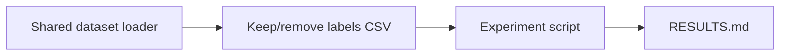

# Build a keep/remove × platform crosstab experiment for Study Phase 2 Part 2 labels

## Remember
- Exact file paths always
- Exact commands with expected output
- DRY, YAGNI, TDD, frequent commits
- Delegated tasks must be impossible to misread.

## Overview

Add a small analysis experiment under `experiments/compare_keep_remove_rates_across_integrations_2026_08_04/` that loads the materialized Study Phase 2 Part 2 keep/remove labels via the shared dataset loader, derives each post’s platform from its id prefix, and reports a 2×3 count matrix of keep/remove versus Bluesky / Reddit / Twitter. Deliverables are exactly three files: a terse README, one Python script, and a terse RESULTS table.

## Happy flow

An operator runs the experiment script from the repo root; it loads the registered keep/remove labels, maps each post id to a platform, prints and writes a 2×3 contingency table to `RESULTS.md`.

## Approach

Keep the experiment thin and read-only against shared data. Load by registry name (not a hardcoded path). Derive platform by splitting the post id on `_` and mapping the first token to a display platform name. Crosstab keep/remove decisions against platform; write only counts. No plots, no rates commentary, no tests package.

## Steps

### Step 1: Add experiment script

Create the experiment folder and a single Python script that loads the keep/remove labels through the shared loader, derives platform from the id prefix, builds the 2×3 count matrix, and overwrites `RESULTS.md` with that table only.

### Step 2: Add README and commit RESULTS

Add a short `README.md` (context, exact `uv run` command, pointer to `RESULTS.md`). Run the script once so `RESULTS.md` contains the live table, then leave the three experiment files as the complete deliverable.

## What "done" looks like

1. `experiments/compare_keep_remove_rates_across_integrations_2026_08_04/` exists with exactly three files: `README.md`, one `.py` script, and `RESULTS.md`.
2. The script loads labels only via the shared dataset loader and registry name for the Part 2 keep/remove labels CSV.
3. Platform is derived from the first `_`-split token of each post id (`bluesky` → Bluesky, `reddit` → Reddit, `twitter` → Twitter).
4. `RESULTS.md` contains only the 2×3 keep/remove × platform count table (no narrative).
5. `README.md` states context, the exact run command, and points at `RESULTS.md`.
6. No changes under `shared/data/` or other experiments.
