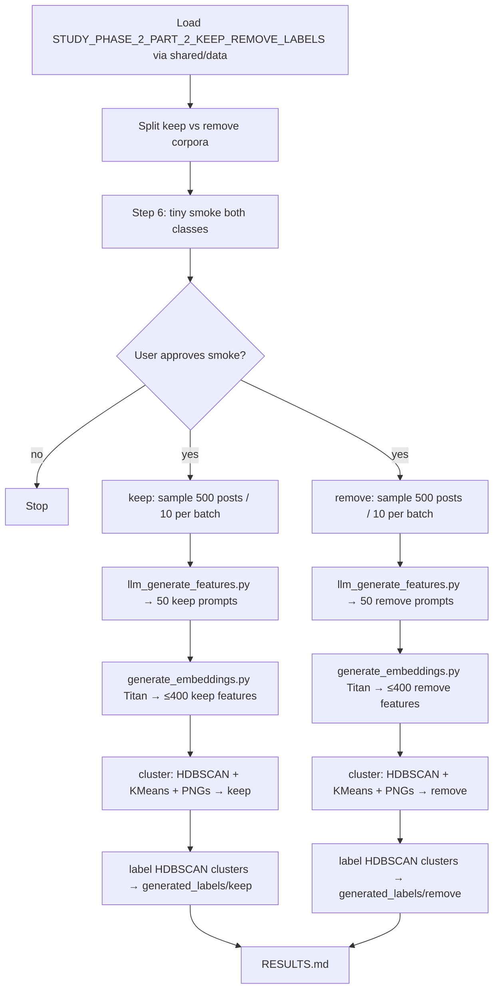

# Build a keep/remove-split LLM feature → embed → cluster → label pipeline under `experiments/create_llm_features_2026_08_05/`

## Remember
- Exact file paths always
- Exact commands with expected output
- DRY, YAGNI, TDD, frequent commits
- Delegated tasks must be impossible to misread.

## Overview

Stand up the experiment in `experiments/create_llm_features_2026_08_05/README.md`: load Study Phase 2 Part 2 modal keep/remove posts via `shared/data/dataloader.py` (`STUDY_PHASE_2_PART_2_KEEP_REMOVE_LABELS`), run **separate** keep and remove streams (not mixed batches), and for each stream: (1) batch posts into an LLM feature-generation stage via the `research_tools` runner, (2) embed each generated feature with Amazon Titan Text Embeddings V2 through `shared/embeddings/bedrock.py` (`amazon.titan-embed-text-v2:0`, 256-d, L2-normalized), (3) cluster those embeddings with **both HDBSCAN and KMeans** (PNG comparison; **HDBSCAN is the downstream source of truth**), (4) label each HDBSCAN cluster with a second LLM pass that sees a random sample of member features. LLM model id is `gpt-5.4-nano` (README’s `gpt5.4-nano`; same OpenAI id used by `experiments/llm_based_feature_generation_2026_07_31/`). Persist all stage artifacts under the experiment `outputs/` tree with `{keep,remove}` splits.

**Production sample (pinned):** after a tiny smoke and explicit user approval, generate features for **500 keep** and **500 remove** posts only. Batch size is **10 posts per prompt** → **50 keep** + **50 remove** feature-generation prompts. Cap is **≤8 features per prompt** → upper bound **800 features** to embed, then cluster and label. Write `RESULTS.md` from that production run’s labeled clusters.

**Workspace note:** the experiment folder currently holds only `README.md`. This plan creates the pipeline from scratch under that folder. Related but unfinished: `experiments/create_llm_feature_clusters_2026_08_02/` (plan-only, consumes July-31 stage-1 features). This experiment regenerates features itself and uses embedding clustering rather than that folder’s part_1–3 layout.

**Files that will be added** (exact paths):

| Path | Role |
| --- | --- |
| `experiments/create_llm_features_2026_08_05/src/__init__.py` | Package marker |
| `experiments/create_llm_features_2026_08_05/src/llm_generate_features.py` | Stage 1: LLM feature generation via `research_tools` runner |
| `experiments/create_llm_features_2026_08_05/src/generate_embeddings.py` | Stage 2: Titan embeddings for generated features |
| `experiments/create_llm_features_2026_08_05/src/cluster_embeddings.py` | Stage 3: dual HDBSCAN + KMeans clustering + PNG viz |
| `experiments/create_llm_features_2026_08_05/src/generate_labels_for_embeddings.py` | Stage 4: LLM cluster labels via `research_tools` runner (HDBSCAN clusters only) |
| `experiments/create_llm_features_2026_08_05/RESULTS.md` | Written after the Step-7 production run (500 keep + 500 remove) |
| `experiments/create_llm_features_2026_08_05/outputs/generated_features/{keep,remove}/` | Stage-1 JSON (created by stage 1; `.gitkeep` only if needed to track empty dirs) |
| `experiments/create_llm_features_2026_08_05/outputs/generated_embeddings/{keep,remove}/` | Stage-2 embedding artifacts |
| `experiments/create_llm_features_2026_08_05/outputs/clusters/{keep,remove}/` | Stage-3 dual-method assignments / diagnostics / PNGs |
| `experiments/create_llm_features_2026_08_05/outputs/clusters/keep/cluster_hdbscan.png` | HDBSCAN scatter PNG (keep) |
| `experiments/create_llm_features_2026_08_05/outputs/clusters/keep/cluster_kmeans.png` | KMeans scatter PNG (keep; comparison only) |
| `experiments/create_llm_features_2026_08_05/outputs/clusters/remove/cluster_hdbscan.png` | HDBSCAN scatter PNG (remove) |
| `experiments/create_llm_features_2026_08_05/outputs/clusters/remove/cluster_kmeans.png` | KMeans scatter PNG (remove; comparison only) |
| `experiments/create_llm_features_2026_08_05/outputs/generated_labels/{keep,remove}/` | Stage-4 labeled cluster outputs (from HDBSCAN) |

**Not added / not changed:** `shared/embeddings/bedrock.py` (reuse as-is), `shared/schemas.py` (no new shared schemas), `shared/data/` (reuse existing registry entry), `pyproject.toml` (scikit-learn + boto3 already in the `dev` group; matplotlib already in project deps; use `sklearn.cluster.HDBSCAN` — do **not** add a separate `hdbscan` package). Supporting experiment-local prompt/schema helpers, if needed, live **inside** the four `src/` stage modules or as small siblings under `experiments/create_llm_features_2026_08_05/src/` only — do not invent a parallel top-level module tree outside `src/` and `outputs/`.

## Happy flow

An operator loads modal keep/remove posts from the shared transformed labels CSV, splits into keep and remove corpora, smoke-tests the four stages on a tiny sample per class (including dual-cluster PNGs), gets explicit approval, then runs production on **500 keep** and **500 remove** posts (10 posts/batch → 50+50 feature prompts; ≤8 features/prompt → ≤800 embeddings), clusters with HDBSCAN+KMeans (labels from HDBSCAN), and records the labeled cluster criteria in `RESULTS.md`.

## Approach

Keep the experiment thin and stage-isolated: one runnable script per pipeline stage under `src/`, each reading the prior stage’s on-disk artifacts and writing only under its own `outputs/` subtree. Reuse the shared modal-label loader and Titan helper; reuse the `research_tools` runner call-site shape from `experiments/llm_based_feature_generation_2026_07_31/stage1.py` for both LLM stages. Prefer separate keep/remove runs over mixed batches so cluster labels are class-conditional. At clustering, always fit **both** HDBSCAN and KMeans, write both assignment artifacts and comparison PNGs; **downstream labeling and RESULTS use HDBSCAN only** (KMeans is visual/reproducible comparison). Verify with a tiny live smoke on both classes before the production run of **500 keep + 500 remove**; production credentials come from repo-root `.env` (`OPENAI_API_KEY`) plus AWS credentials for Bedrock.

## Steps

Detail for each step lives under `steps/`. Edit draft LLM prompts in [steps/step2.md](steps/step2.md) and [steps/step5.md](steps/step5.md) before implementation.

### Step 1: Scaffold `src/` package, keep/remove split, and output layout

→ [steps/step1.md](steps/step1.md)

Create `experiments/create_llm_features_2026_08_05/src/__init__.py` and the four stage module stubs listed above. Wire loading through `shared/data/dataloader.py` / `STUDY_PHASE_2_PART_2_KEEP_REMOVE_LABELS`, split posts into keep vs remove, and define how each stage resolves `outputs/generated_features|generated_embeddings|clusters|generated_labels/{keep,remove}/`. Document the intended stage run order in the existing README (commands only; no redesign of the scientific approach), including the pinned production sizes: **500 keep / 500 remove**, **10 posts/batch**, **≤8 features/prompt**.

### Step 2: Implement LLM feature generation for keep and remove

→ [steps/step2.md](steps/step2.md) *(includes draft keep/remove feature-generation prompts)*

Implement `experiments/create_llm_features_2026_08_05/src/llm_generate_features.py` so each batch of same-class posts is one `research_tools` runner item (call-site reference: `experiments/llm_based_feature_generation_2026_07_31/stage1.py`). Model `gpt-5.4-nano`. Write per-run JSON under `experiments/create_llm_features_2026_08_05/outputs/generated_features/{keep,remove}/`. Prompt lineage may adapt keep/remove feature language from `experiments/llm_based_feature_generation_2026_07_31/prompts.py`, but batches are **single-class**, not mixed 10+10. Default batch size **10 posts**; response cap **≤8 features per prompt**. Production will call with `--sample-size 500` per class (50 prompts each); smoke uses `--sample-size 10`.

### Step 3: Embed generated features with Titan

→ [steps/step3.md](steps/step3.md)

Implement `experiments/create_llm_features_2026_08_05/src/generate_embeddings.py` to read stage-1 feature texts for one class, call `shared/embeddings/bedrock.py` (fixed model id / 256-d / L2-normalize), and write vectors plus provenance under `experiments/create_llm_features_2026_08_05/outputs/generated_embeddings/{keep,remove}/`. Requires AWS credentials and `uv sync` with the `dev` group (boto3). Production upper bound: ≤800 features total across both classes (≤400 per class at 8 features × 50 prompts).

### Step 4: Cluster feature embeddings (HDBSCAN + KMeans)

→ [steps/step4.md](steps/step4.md)

Implement `experiments/create_llm_features_2026_08_05/src/cluster_embeddings.py` to load stage-2 embeddings for one class, fit **both** HDBSCAN (`sklearn.cluster.HDBSCAN`) and KMeans (silhouette \(k\) selection; reference: `experiments/model_errors_analysis_2026_07_15/analyze/cluster.py`), write both assignment artifacts, and save comparison PNGs at the exact class-root paths listed in Overview. Downstream stages consume **HDBSCAN** assignments only.

### Step 5: Label HDBSCAN clusters with an LLM

→ [steps/step5.md](steps/step5.md) *(includes draft keep/remove cluster-labeling prompts)*

Implement `experiments/create_llm_features_2026_08_05/src/generate_labels_for_embeddings.py` so each **HDBSCAN** cluster is one runner item: sample member feature texts, ask `gpt-5.4-nano` for a short cluster name/label, write under `experiments/create_llm_features_2026_08_05/outputs/generated_labels/{keep,remove}/`. Do **not** label KMeans clusters. Same runner call-site family as stage 1 (`experiments/llm_based_feature_generation_2026_07_31/stage1.py`).

### Step 6: Smoke both classes end-to-end (approval gate)

→ [steps/step6.md](steps/step6.md)

Run a tiny live path (**10 posts per class**, **10 posts/batch** → 1 feature prompt each) through all four stages for **both** keep and remove. Confirm artifacts land in the four `outputs/` subtrees, including dual-cluster PNGs and HDBSCAN-based labels. **Stop and wait for explicit user approval.** Do **not** run the 500/500 production sample in this step. Do **not** write production `RESULTS.md` here.

**Approval gate:** Do not start Step 7 until the user explicitly approves after reviewing the smoke artifacts.

### Step 7: Production run (500 keep + 500 remove) and RESULTS.md

→ [steps/step7.md](steps/step7.md)

Only after Step-6 approval: sample **500 keep** and **500 remove** posts (`--sample-size 500`, `--posts-per-batch 10`, seed `42`), run all four stages per class (**50 keep** + **50 remove** feature-generation prompts; ≤8 features/prompt → ≤**800** features to embed; dual cluster + HDBSCAN labels), and write `experiments/create_llm_features_2026_08_05/RESULTS.md` summarizing model ids, embedding config, HDBSCAN cluster counts, sample sizes, PNG paths, and paths to keep/remove labeled outputs.

## What "done" looks like

1. `experiments/create_llm_features_2026_08_05/src/` contains the four runnable stage modules plus `__init__.py` (paths listed in Overview).
2. Posts load from `STUDY_PHASE_2_PART_2_KEEP_REMOVE_LABELS` via `shared/data/`; keep and remove are processed as separate streams.
3. Stage 1 writes under `experiments/create_llm_features_2026_08_05/outputs/generated_features/{keep,remove}/` using the `research_tools` runner and `gpt-5.4-nano`, with **10 posts per batch** and **≤8 features per prompt**.
4. Stage 2 writes under `experiments/create_llm_features_2026_08_05/outputs/generated_embeddings/{keep,remove}/` using `shared/embeddings/bedrock.py` Titan v2 256-d L2-normalized embeddings.
5. Stage 3 writes both HDBSCAN and KMeans assignments under `experiments/create_llm_features_2026_08_05/outputs/clusters/{keep,remove}/`, plus the four comparison PNGs at the exact Overview paths.
6. Stage 4 labels **HDBSCAN** clusters only under `experiments/create_llm_features_2026_08_05/outputs/generated_labels/{keep,remove}/` via the same runner family and model.
7. A tiny live smoke (10 posts/class) completes for both classes; production is gated on explicit user approval of smoke results.
8. Production run samples exactly **500 keep** and **500 remove** posts → **50 + 50** feature-generation prompts → ≤**800** features embedded/clustered/labeled.
9. `experiments/create_llm_features_2026_08_05/RESULTS.md` records the production labeled-cluster outcomes (including the 500/500 / 50+50 / ≤800 numbers, HDBSCAN as the labeling source, and PNG paths) and artifact paths.
10. No changes to `shared/schemas.py`, `shared/embeddings/bedrock.py`, or `pyproject.toml` (use `sklearn.cluster.HDBSCAN`); no implementation under `experiments/create_llm_feature_clusters_2026_08_02/` as part of this plan.
