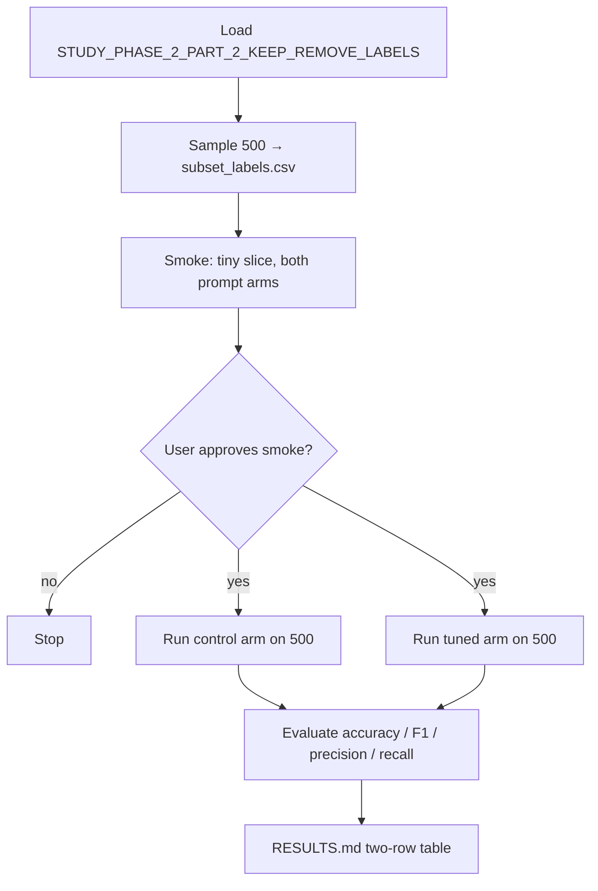

# Run a keep/remove LLM classifier comparing control vs feature-tuned prompts on a frozen 500-post subset

## Remember
- Exact file paths always
- Exact commands with expected output
- DRY, YAGNI, TDD, frequent commits
- Delegated tasks must be impossible to misread.

## Overview

Finish the experiment in `experiments/llm_prompt_engineering_2026_08_05/README.md`: load Study Phase 2 Part 2 modal keep/remove labeled posts from the shared catalog entry `STUDY_PHASE_2_PART_2_KEEP_REMOVE_LABELS`, freeze a **500-post** evaluation subset as `experiments/llm_prompt_engineering_2026_08_05/subset_labels.csv` (committed to git), classify each pair twice with one runner — **control** (study prompt only) vs **prompt-tuned** (same prompt plus the keep/remove feature addendum already in `experiments/llm_prompt_engineering_2026_08_05/prompt.py`) — using `gpt-5.4-nano` via `research_tools.llm.runner.run` and the shared structured response in `shared/schemas.py`, then write accuracy / F1 / precision / recall for both arms into a two-row `experiments/llm_prompt_engineering_2026_08_05/RESULTS.md`.

**Confirmed decisions:** simple **random** sample of 500 rows with seed **42** (not stratified). Positive class for precision / recall / F1 is **remove**.

**Already in place (do not redesign):** study prompt + feature addendum (`experiments/llm_prompt_engineering_2026_08_05/prompt.py`), renderer (`experiments/llm_prompt_engineering_2026_08_05/generate_prompt.py`), feature criteria source (`experiments/llm_prompt_engineering_2026_08_05/KEEP_REMOVE_FEATURES.md`), and response schema (`shared/schemas.py`). Prompt text is out of scope unless a bug blocks the run.

**Files that will be added** (exact paths):

| Path | Role |
| --- | --- |
| `experiments/llm_prompt_engineering_2026_08_05/subset_labels.csv` | Frozen 500-row evaluation subset (git-tracked) |
| `experiments/llm_prompt_engineering_2026_08_05/build_subset.py` | Load catalog labels, sample 500, write subset CSV |
| `experiments/llm_prompt_engineering_2026_08_05/run_classifier.py` | Single runner: control and/or tuned arm over the subset |
| `experiments/llm_prompt_engineering_2026_08_05/evaluate.py` | Score predictions vs gold; emit metrics table |
| `experiments/llm_prompt_engineering_2026_08_05/RESULTS.md` | Two-row control vs tuned metrics (production run) |
| `experiments/llm_prompt_engineering_2026_08_05/outputs/` | Timestamped runner artifacts (predictions per arm) |

**Not changed:** `shared/schemas.py`, `shared/data/registry.py`, `shared/data/dataloader.py`, `experiments/llm_prompt_engineering_2026_08_05/prompt.py` / `generate_prompt.py` (reuse as-is), `pyproject.toml`.

## Happy flow

An operator freezes a 500-post subset from the shared keep/remove labels, smoke-tests both prompt arms on a tiny slice, gets explicit approval, runs both arms on the full frozen subset with `gpt-5.4-nano`, scores predictions against gold keep/remove, and records a two-row metrics table in `RESULTS.md`.

## Approach

Keep the experiment thin and reuse what exists: prompts and schema are already done; new work is subset freeze, one dual-arm classifier runner on `research_tools`, metrics, and a gated production write of `RESULTS.md`. Prefer a frozen git-tracked subset so control vs tuned compare on the same rows. Verify with a tiny live smoke before spending the full 500×2 API budget.

## Steps

Detail for each step lives under `steps/`.

### Step 1: Freeze the 500-post evaluation subset

→ [steps/step1.md](steps/step1.md)

Load labels via the shared catalog, random-sample **500** posts with seed **42**, write `experiments/llm_prompt_engineering_2026_08_05/subset_labels.csv`, and leave that CSV ready to commit so both prompt arms share one immutable eval set.

### Step 2: Implement the dual-arm classifier runner

→ [steps/step2.md](steps/step2.md)

Add a single runnable module that reads the frozen subset, builds control or tuned prompts through the existing renderer, calls `research_tools.llm.runner.run` with `gpt-5.4-nano` and the shared keep/remove response schema, and writes per-arm prediction artifacts under `experiments/llm_prompt_engineering_2026_08_05/outputs/`.

### Step 3: Score predictions and define the RESULTS table shape

→ [steps/step3.md](steps/step3.md)

Compare predicted remove/keep labels to gold; compute accuracy, F1, precision, and recall for each arm (remove = positive class); freeze the exact two-row `RESULTS.md` table (control vs prompt-tuned).

### Step 4: Smoke both arms on a tiny slice (approval gate)

→ [steps/step4.md](steps/step4.md)

Run a live smoke on **5** subset rows for **both** arms end-to-end (prompt → runner → metrics). **Stop and wait for explicit user approval.** Do not run the full 500×2 production pass in this step.

### Step 5: Production run on 500 and write RESULTS.md

→ [steps/step5.md](steps/step5.md)

Only after Step-4 approval: run both arms on the full frozen 500-post subset and write `experiments/llm_prompt_engineering_2026_08_05/RESULTS.md` with the two-row metrics table.

## What "done" looks like

1. `experiments/llm_prompt_engineering_2026_08_05/subset_labels.csv` exists, has exactly 500 rows randomly sampled with seed 42 from `STUDY_PHASE_2_PART_2_KEEP_REMOVE_LABELS`, and is tracked in git.
2. One classifier runner can execute the control arm and the feature-tuned arm over that subset via `research_tools.llm.runner.run` and `gpt-5.4-nano`.
3. Predictions use the shared response schema in `shared/schemas.py`; prompts come from the existing experiment renderer (no prompt redesign).
4. Accuracy, F1, precision, and recall are computed for both arms against gold labels.
5. A tiny live smoke of both arms completes; production is gated on explicit user approval.
6. Production run covers all 500 subset rows for both arms.
7. `experiments/llm_prompt_engineering_2026_08_05/RESULTS.md` contains a two-row table (control vs prompt-tuned) with accuracy, F1, precision, and recall.
8. No changes to `shared/schemas.py`, `shared/data/`, or the existing prompt template files unless a blocking bug is found.
