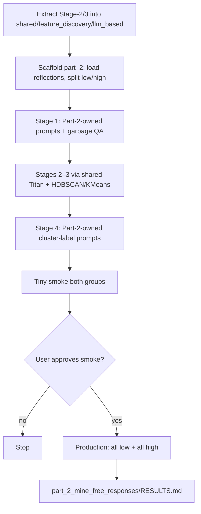

# Build Part 2 free-response LLM feature discovery by extracting shared Stages 2–3 (keep/remove left unchanged)

## Remember
- Exact file paths always
- Exact commands with expected output
- DRY, YAGNI, TDD, frequent commits
- Delegated tasks must be impossible to misread.

## Overview

Stand up Part 2 of `experiments/mine_free_response_for_features_2026_08_03/`: mine Phase 1 pair-reflection free responses for features, split by Likert into **low** (`< 4`) and **high** (`≥ 4`), using the same four-stage LLM → embed → cluster → label approach as `experiments/create_llm_features_2026_08_05/`.

**Shared extraction (locked):** lift only domain-agnostic **Stage-2 embedding** and **Stage-3 dual clustering/PNG** logic (plus timestamp helpers and a generic cluster-label response shape) into `shared/feature_discovery/llm_based/`. Do **not** share Stage-1 prompts or feature schemas. Do **not** rewire `experiments/create_llm_features_2026_08_05/` onto shared in this plan (optional follow-up later). Part 2 is the first consumer of the shared package; keep/remove keeps its existing copies.

**Part 2 owns Stage-1 entirely:** experiment-local prompts with **open thematic categories** plus **garbage/nonsense QA** (return zero features when the batch is clearly unusable). This intentionally diverges from keep/remove post-linguistics prompts so QA does not leak into the other experiment.

**Data:** `STUDY_PHASE_2_PART_2_USER_REFLECTION_FEEDBACK` via `shared/data/` (~1177 usable rows; ~255 low / ~922 high).

**Identity:** source document id is `participant_id`. Feature join keys use `batch_id` + index within batch. Embed **feature** texts, not raw free responses.

**Production (pinned):** after tiny smoke + explicit approval, run **all** low and **all** high users with usable text + rating, **10 reflections per feature-gen prompt**, **≤8 features per prompt**. Write `part_2_mine_free_responses/RESULTS.md` only from that run.

**Forbidden:** edit `experiments/mine_free_response_for_features_2026_08_03/README.md`; touch Part 1 histogram; change keep/remove experiment behavior; add BERTopic to Part 2.

Detail for each step: [steps/](steps/).

## Happy flow

Lift reusable embed/cluster code into shared, scaffold Part 2 low/high loaders, run experiment-owned Stage-1 (with QA), call shared for Stages 2–3, label HDBSCAN clusters with Part-2-owned prompts, smoke both groups, then production-run full corpora and write `RESULTS.md`.

## Approach

Shared owns embedding, clustering, and stage-artifact conventions. Part 2 owns the corpus, the low/high split, Stage-1 (themes + QA), and Stage-4 labeling prompts. Leave the finished keep/remove experiment alone. Smoke before full-corpus production.

## Steps

### Step 1: Extract `shared/feature_discovery/llm_based/` from the keep/remove pipeline

→ [steps/step1.md](steps/step1.md)

Lift Stage-2 embed + Stage-3 dual-cluster/PNG logic and timestamp helpers out of `experiments/create_llm_features_2026_08_05/src/` into `shared/feature_discovery/llm_based/`. Do not change keep/remove call sites in this step.

### Step 2: Scaffold Part 2 package, low/high loader, and output layout

→ [steps/step2.md](steps/step2.md)

Create `part_2_mine_free_responses/src/` with stage stubs and a paths/loader that loads reflection feedback, filters usable text + Likert, and splits low/high. Define the four `outputs/` subtrees. Do not edit the parent README.

### Step 3: Implement free-response LLM feature generation (with QA)

→ [steps/step3.md](steps/step3.md)

Implement Stage 1 via `research_tools` runner and `gpt-5.4-nano`. Part-2-owned prompts: open thematic categories + reject garbage/nonsense with empty features. Batch size 10; ≤8 features per prompt; provenance `participant_id`.

### Step 4: Wire Stages 2–3 through shared

→ [steps/step4.md](steps/step4.md)

Thin Part-2 CLIs that call shared Titan embed and dual HDBSCAN+KMeans clustering, writing under Part 2 `outputs/`.

### Step 5: Label HDBSCAN clusters with Part-2-owned prompts

→ [steps/step5.md](steps/step5.md)

Stage 4 via `research_tools` runner: sample member features, label with free-response-specific prompts. HDBSCAN only.

### Step 6: Smoke both groups end-to-end (approval gate)

→ [steps/step6.md](steps/step6.md)

Tiny live path for low and high through all four stages. Stop for explicit approval. No production run or production `RESULTS.md`.

### Step 7: Production run (full low + full high) and RESULTS.md

→ [steps/step7.md](steps/step7.md)

After approval: full corpora through Stages 1–4; write `part_2_mine_free_responses/RESULTS.md`.

## What "done" looks like

1. `shared/feature_discovery/llm_based/` owns reusable embed + dual-cluster + timestamp helpers; keep/remove experiment files are unchanged as call sites.
2. `part_2_mine_free_responses/src/` has four stage CLIs plus low/high paths/loader.
3. Stage 1 uses Part-2-owned prompts (open themes + garbage QA) and writes under `outputs/generated_features/{low,high}/`.
4. Stages 2–3 call shared and write under matching Part 2 `outputs/` trees; Stage 4 labels HDBSCAN only with Part-2-owned prompts.
5. Smoke completes for both groups; production gated on explicit approval.
6. Production uses full low and high corpora; `RESULTS.md` records outcomes and paths.
7. Parent README and Part 1 are untouched.
