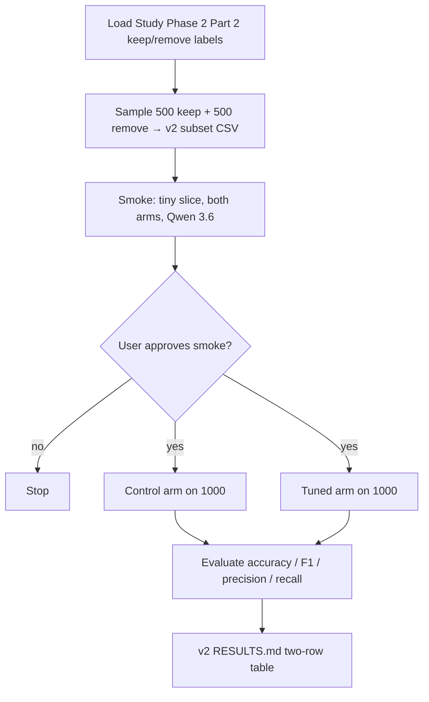

# Stand up a v2 prompt-engineering classifier experiment on a larger balanced subset with Qwen 3.6

## Remember
- Exact file paths always
- Exact commands with expected output
- DRY, YAGNI, TDD, frequent commits
- Delegated tasks must be impossible to misread.

## Overview

Add `experiments/llm_prompt_engineering_v2_2026_08_05/` as a thin sibling of `experiments/llm_prompt_engineering_2026_08_05/`. Same control vs feature-tuned prompt comparison, same shared response schema, same runner path — but freeze a **1,000-post** evaluation set that is **class-balanced (500 keep + 500 remove)**, classify both arms with the **latest Qwen 3.6** model already wired through `research_tools`, and write a two-row metrics table under the new experiment tree. Prefer **importing** v1 modules over copying them; only override subset construction, defaults (size / balance / model / paths), and a brief README that points back to v1.

**Out of scope:** redesigning prompts or feature criteria; changing `shared/schemas.py` or the shared data catalog; editing the v1 experiment tree except as an import source; production API spend before an explicit smoke approval.

## Happy flow

An operator freezes a balanced 1,000-post subset, smoke-tests both prompt arms on a tiny slice with Qwen 3.6, gets approval, runs both arms on the full frozen subset, and records control vs tuned metrics in the v2 `RESULTS.md`.

## Approach

Clone the v1 experiment shape by **import and override**, not by forking logic. Keep prompts, evaluation math, and runner call-site behavior in v1; v2 only changes the frozen subset policy (larger + balanced), the default inference model (Qwen 3.6 via `research_tools`), and output paths. Gate the full 1000×2 run behind a live smoke approval so API cost stays intentional.

## Steps

### Step 1: Scaffold the v2 experiment package and brief README

Create `experiments/llm_prompt_engineering_v2_2026_08_05/` with a terse README that states it mirrors v1 (link to `experiments/llm_prompt_engineering_2026_08_05/README.md`) and lists only the three deltas: 1,000 posts, 500/500 balance, Qwen 3.6. Add thin entrypoint modules that import from v1 where possible.

### Step 2: Freeze a balanced 1,000-post evaluation subset

Adapt subset freezing so the committed CSV under the v2 tree has exactly 500 keep and 500 remove (seed 42), sourced from the same Study Phase 2 Part 2 labels catalog entry used by v1. Reuse v1 load/validate helpers via import; replace only the sampling policy.

### Step 3: Wire dual-arm classification and evaluation defaults for v2

Expose classifier and evaluate entrypoints under the v2 tree that reuse v1 prompt rendering, runner wiring, and metrics code, with defaults pointed at the v2 subset, v2 outputs directory, and the research_tools Qwen 3.6 model id. Do not reimplement scoring or prompt text.

### Step 4: Smoke both arms on a tiny slice (approval gate)

Run a live smoke on a handful of subset rows for both arms with Qwen 3.6. Stop for explicit user approval before any full-subset production pass.

### Step 5: Production run on 1,000 and write RESULTS.md

After Step-4 approval only: run both arms on the full frozen balanced subset and write `experiments/llm_prompt_engineering_v2_2026_08_05/RESULTS.md` with the same two-row control vs prompt-tuned metrics shape as v1.

## What "done" looks like

1. `experiments/llm_prompt_engineering_v2_2026_08_05/` exists with a brief README that references the v1 experiment and states the three deltas only.
2. `experiments/llm_prompt_engineering_v2_2026_08_05/subset_labels.csv` is git-tracked, has exactly 1,000 rows, and is balanced 500 keep / 500 remove (seed 42).
3. Dual-arm classification runs over that subset via `research_tools` using the latest Qwen 3.6 model id registered there.
4. Prompt text, feature addendum, response schema, and metrics definitions are reused from v1 (import), not copied/rewritten.
5. A tiny live smoke of both arms completes; production is gated on explicit approval.
6. Production covers all 1,000 rows × both arms; `experiments/llm_prompt_engineering_v2_2026_08_05/RESULTS.md` holds the two-row metrics table.
7. No changes to `shared/schemas.py`, `shared/data/`, or the v1 experiment tree except as an import dependency.
