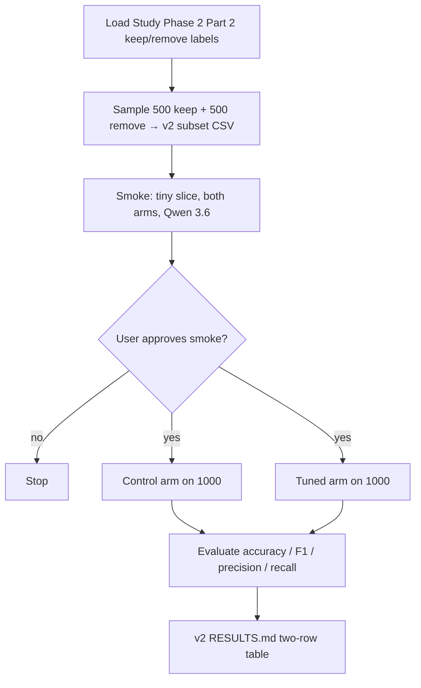

# Stand up a v2 prompt-engineering classifier experiment on a larger balanced subset with Qwen 3.6

## Remember
- Exact file paths always
- Exact commands with expected output
- DRY, YAGNI, TDD, frequent commits
- Delegated tasks must be impossible to misread.

## Overview

Add `experiments/llm_prompt_engineering_v2_2026_08_05/` as a thin sibling of `experiments/llm_prompt_engineering_2026_08_05/`. Same control vs feature-tuned prompt comparison, same shared response schema, same runner path — but freeze a **1,000-post** evaluation set that is **class-balanced (500 keep + 500 remove)**, classify both arms with the **latest Qwen 3.6** model already wired through `research_tools`, and write a two-row metrics table under the new experiment tree. Prefer **importing** v1 modules over copying them; only override subset construction, defaults (size / balance / model / paths), and a brief README that points back to v1.

**Out of scope:** redesigning prompts or feature criteria; changing `shared/schemas.py` or the shared data catalog; editing the v1 experiment tree except as an import source; production API spend before an explicit smoke approval.

## Happy flow

An operator freezes a balanced 1,000-post subset, smoke-tests both prompt arms on a tiny slice with Qwen 3.6, gets approval, runs both arms on the full frozen subset, and records control vs tuned metrics in the v2 `RESULTS.md`.

## Approach

Clone the v1 experiment shape by **import and override**, not by forking logic. Keep prompts, evaluation math, and runner call-site behavior in v1; v2 only changes the frozen subset policy (larger + balanced), the default inference model (Qwen 3.6 via `research_tools`), and output paths. Gate the full 1000×2 run behind a live smoke approval so API cost stays intentional.

## Steps

Detail for each step lives under `steps/`.

### Step 1: Scaffold v2 package, brief README, and balanced 1,000-post subset

→ [steps/step1.md](steps/step1.md)

Create `experiments/llm_prompt_engineering_v2_2026_08_05/` with a terse README (link to v1; three deltas only). Freeze a git-tracked balanced subset: **500 keep + 500 remove** (seed 42) by importing v1 load/write helpers and replacing only the sampling policy.

### Step 2: Wire dual-arm classifier defaults for v2 (Qwen 3.6)

→ [steps/step2.md](steps/step2.md)

Add a v2 classifier entrypoint that imports v1 prompt/writer/item helpers and runs both arms via `research_tools`, defaulting to the v2 subset, v2 outputs tree, and model id `qwen/qwen3.6-plus`.

### Step 3: Wire evaluation / RESULTS shape for v2 (n=1000, Qwen header)

→ [steps/step3.md](steps/step3.md)

Import v1 scorers; assemble the two-row RESULTS markdown with v2 provenance (`n=1000`, balanced note, Qwen model id). Do not edit v1’s hardcoded `n=500` helper — reassemble the header in v2 only.

### Step 4: Smoke both arms on a tiny slice (approval gate)

→ [steps/step4.md](steps/step4.md)

Live smoke on **5** rows × both arms with `qwen/qwen3.6-plus` (Bedrock AWS creds). **Stop for explicit user approval.** Do not run the full 1000×2 pass in this step.

### Step 5: Production run on 1,000 and write RESULTS.md

→ [steps/step5.md](steps/step5.md)

Only after Step-4 approval: run both arms on the full frozen balanced subset and write `experiments/llm_prompt_engineering_v2_2026_08_05/RESULTS.md`.

## What "done" looks like

1. `experiments/llm_prompt_engineering_v2_2026_08_05/` exists with a brief README that references the v1 experiment and states the three deltas only.
2. `experiments/llm_prompt_engineering_v2_2026_08_05/subset_labels.csv` is git-tracked, has exactly 1,000 rows, and is balanced 500 keep / 500 remove (seed 42).
3. Dual-arm classification runs over that subset via `research_tools` using the latest Qwen 3.6 model id registered there.
4. Prompt text, feature addendum, response schema, and metrics definitions are reused from v1 (import), not copied/rewritten.
5. A tiny live smoke of both arms completes; production is gated on explicit approval.
6. Production covers all 1,000 rows × both arms; `experiments/llm_prompt_engineering_v2_2026_08_05/RESULTS.md` holds the two-row metrics table.
7. No changes to `shared/schemas.py`, `shared/data/`, or the v1 experiment tree except as an import dependency.
