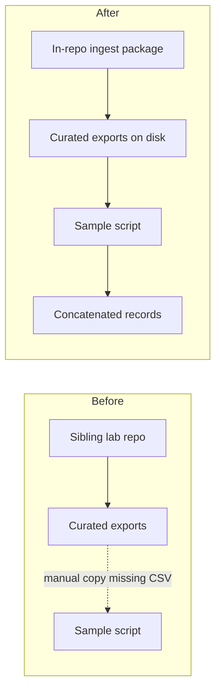

# Move platform ingest and curation into this repository

## Remember
- Exact file paths always
- Exact commands with expected output
- DRY, YAGNI, TDD, frequent commits
- Delegated tasks must be impossible to misread.

## Overview

Platform fetch, preprocess, feature labeling, and per-platform curation still live in a sibling lab repository. This repository only starts once curated exports exist, and those exports are not checked in. The next data collection round needs ingest and curation runnable from this tree, then handed to the existing sample and mirror path. Strategy source: `strategy_planning/migrate_data_ingestion_pipeline.md`. Cross-platform sampling, mirror generation, webapp deploy, and participant assignment stay out of this plan.

## Happy flow

An operator runs per-platform sync through curation in this repository, gets curated exports on disk, and the existing sample script discovers those exports and writes a new concatenated records file for the mirror pipeline.

## Approach

Copy the batch package and its LLM helpers into this repository as an import-compatible tree, merge secrets and dependencies without overwriting existing shared library behavior, make local-disk platforms pass the durability gate without requiring cloud upload, point the sample script at the new curated root, bring tests, and update operator docs. Package rename to a different folder name is deferred. A full live multi-platform sync and stimuli ship are operator follow-on work after this plan, not part of the code land.

## Steps

### Step 1: Land the ingest package, tooling, deps, and env allowlist

Copy the platform batch tree and LLM tooling from the sibling lab repo into this repository, add the missing Python dependencies, and extend the shared env allowlist so platform API keys load. Prove the package imports under `PYTHONPATH=.`.

### Step 2: Make local-disk sync pass the durability gate

Twitter and Reddit never mark runs as uploaded, so preprocess fails. Mark successful local syncs durable for those platforms. Default Bluesky in this repository to local-only unless an explicit opt-in enables the shared lab bucket upload, so a routine sync does not write to the lab cloud account by accident.

### Step 3: Point the sample script at the new curated root

Change curated discovery so the sample script reads metadata and exports from the landed package data tree instead of the experiment-local snapshot folder that lacks CSV files.

### Step 4: Port unit tests and run the ingest test suite

Copy the lab ingest tests into this repository, adjust paths for the new home, and run them until the subset that does not need live APIs or live AWS is green.

### Step 5: Update operator docs for in-repo ingest

Document env keys, commands, local-only Bluesky default, and the handoff into the sample and stimuli runbooks so the next collection round does not require opening the sibling lab repo for Mirrorview ingest.

## What "done" looks like

1. The platform batch package and LLM tooling live in this repository and import cleanly.
2. Twitter and Reddit local sync can proceed through preprocess without a fake cloud upload.
3. Bluesky defaults to local-only; cloud upload requires an explicit opt-in.
4. The sample script discovers curated exports under the landed package data tree.
5. Ported unit tests pass without live external APIs.
6. Runbooks and agent notes describe in-repo ingest for the next collection round.
7. Live full sync, mirror generation, job CSV promotion, webapp upload, and assignment regeneration remain follow-on operator work after this plan.
8. Renaming the on-disk package folder is not done in this plan.
