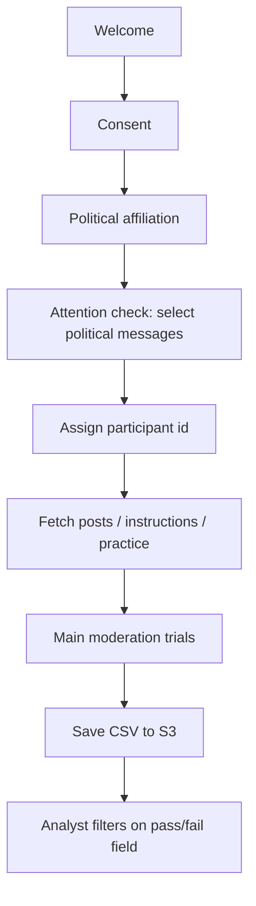

# Insert a pre-study political-expression attention check that never blocks the experiment

## Remember
- Exact file paths always
- Exact commands with expected output
- DRY, YAGNI, TDD, frequent commits
- Delegated tasks must be impossible to misread.

## Overview

Add one comprehension-style attention check to the MirrorView webapp **before** the main moderation task. Participants select all messages that express a political view (same content and intent as the lab’s prior “Political Expression” check). Everyone continues into the study regardless of correctness; a durable pass/fail field is written into saved results so analysts can filter failed respondents after export.

**Out of scope:** blocking or ejecting failers mid-session; changing Prolific completion logic; redesigning consent, party affiliation, or moderation trials; Lambda / Terraform changes; automatic post-export filtering scripts (document the filter field only).

## Happy flow

After consent and party confirmation, the participant sees the political-expression attention check, selects statements, clicks Continue, then proceeds into assignment and the main task. Saved study data carries a pass/fail marker on every trial row for later filtering.

## Approach

Reuse the existing pre-survey HTML-form plugin (already loaded) rather than adding a new jsPsych plugin. Score the exact correct option set in the trial finish handler; store pass/fail plus raw selections on the shared jsPsych data properties so they appear on every exported row—same pattern as party group. Never branch the timeline on failure.

## Screenshots (plan review)

| What | Path |
|------|------|
| Before (no attention check in timeline) | [images/before/no_attention_check_timeline.png](images/before/no_attention_check_timeline.png) |
| After UI mockup (target screen) | [images/after/attention_check_ui.png](images/after/attention_check_ui.png) |
| After data-field mockup (filter column) | [images/after/attention_check_data_field.png](images/after/attention_check_data_field.png) |
| Static HTML sources for mockups | [images/mockups/](images/mockups/) |

Implementation Step 4 re-captures live screenshots from the running webapp and overwrites the after images.

## Steps

Detail for each step lives under `steps/`.

### Step 1: Freeze scoring contract and pure helpers

→ [steps/step1.md](steps/step1.md)

Define the six option texts, the exact correct set, and a pure pass/fail scorer with unit tests. No timeline wiring yet.

### Step 2: Build the attention-check trial UI in the pre-survey module

→ [steps/step2.md](steps/step2.md)

Add the select-all political-expression trial (HTML form + callout + Continue) using the existing survey form plugin and styles consistent with the mockup.

### Step 3: Insert into the study timeline and persist export columns

→ [steps/step3.md](steps/step3.md)

Place the trial after political affiliation and before participant-id assignment. Write pass/fail and selected options onto shared data properties; add both to the CSV column allowlist. Failures never redirect or abort.

### Step 4: Capture live UI and data-field screenshots

→ [steps/step4.md](steps/step4.md)

Run the webapp locally, screenshot the live attention check, complete once correctly and once incorrectly, and screenshot the resulting pass/fail values in saved/exported data. Replace the plan after images with live captures.

## What "done" looks like

1. Participants see the political-expression attention check after party confirmation and before the main task setup.
2. Correct answers are the four political statements only; ice cream and winter are non-political distractors.
3. Failures still continue through the full experiment and save data.
4. Exported CSVs include a clear pass/fail column (and raw selections) on every row for post-hoc filtering.
5. Live screenshots of the UI and the filter field live under this plan’s `images/after/`.
6. No Lambda, consent, or moderation-trial behavior changes.
