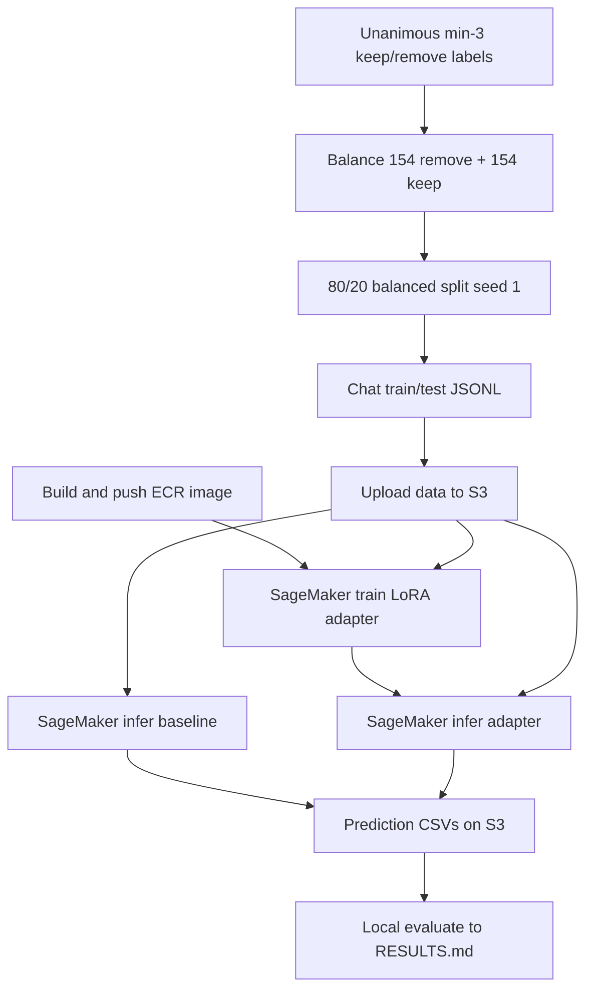

# Stand up a SageMaker LoRA fine-tune of Qwen3-4B on high-agreement keep/remove labels

## Remember
- Exact file paths always
- Exact commands with expected output
- DRY, YAGNI, TDD, frequent commits
- Delegated tasks must be impossible to misread.

## Overview

Build `experiments/finetune_qwen_model_2026_08_08/` from the confirmed teachability design: a **small, unanimous, class-balanced** Study Phase 2 Part 2 keep/remove set; chat-format supervised fine-tuning of **Qwen3-4B-Instruct** with **LoRA in bf16**; and a **baseline vs adapter** comparison on train and test. Training and both inference passes run on **SageMaker** via a **custom Docker image**; metrics and `RESULTS.md` are produced locally from prediction CSVs. This is an exploratory prelim before collecting more labels — no numeric F1 bar.

**Out of scope:** QLoRA; LoRA rank sweeps; prompt ablations; post-order blinding; local-first training as the acceptance path; changing the shared unanimous-min3 dataset or prompt-engineering experiments; scaling beyond the frozen n=308 balanced set.

## Happy flow

An operator freezes the balanced split and chat files locally, uploads them to the experiment S3 prefix, builds/pushes the training image, launches SageMaker train then baseline and adapter inference, syncs prediction CSVs, and writes train/test comparison tables into `RESULTS.md`.

## Approach

Lock the scientific skeleton in the experiment README, then implement a thin vertical slice: local reproducible data freeze → single container with three modes → one launcher that submits SageMaker jobs → local scoring. Prefer a vendored rubric prompt (edited closing line) over cross-experiment imports. Reuse the ModernBERT SageMaker operational lessons (role ARN, W&B key injection, us-east-2) without copying its Hugging Face estimator path — this experiment owns a custom image as specified.

## Steps

Full contracts, file allow/forbid lists, and pass/fail commands: [`steps/`](./steps/).

### Step 1: Align README and scaffold the experiment tree

[`steps/step1.md`](./steps/step1.md) — Rewrite the experiment README to the confirmed design; stub entrypoints; add optional-deps group `finetune-qwen-2026-08-08`.

### Step 2: Freeze balanced CSV splits and chat JSONL locally

[`steps/step2.md`](./steps/step2.md) — Build balanced 80/20 CSVs and vendored-prompt chat JSONL (`chat_train` / `chat_test`) with `seed=1`.

### Step 3: Implement training entrypoint (TRL + PEFT LoRA)

[`steps/step3.md`](./steps/step3.md) — Lock TRL/PEFT train CLI (assistant-only loss, bf16 LoRA, W&B); dry-run gate without requiring local full GPU train.

### Step 4: Implement inference entrypoint (baseline and adapter)

[`steps/step4.md`](./steps/step4.md) — Greedy short generation; strict keep/remove parse; prediction CSV schema with `__invalid__`.

### Step 5: Implement local evaluation and RESULTS.md writer

[`steps/step5.md`](./steps/step5.md) — Score four pred CSVs into train/test baseline vs fine-tuned tables; invalid never correct.

### Step 6: Package custom Docker image and ECR push path

[`steps/step6.md`](./steps/step6.md) — Repo-root Dockerfile; three container modes; document ECR push in `us-east-2`.

### Step 7: SageMaker launcher for train and both infer modes

[`steps/step7.md`](./steps/step7.md) — Single launcher (`--mode`); `ml.g5.xlarge`; inject `HF_TOKEN` / `WANDB_API_KEY`; frozen S3 layout; dry-run without submit.

### Step 8: Upload data, run remote jobs, produce RESULTS.md

[`steps/step8.md`](./steps/step8.md) — Sync data to S3; explicit GPU-spend approval gate; train then both infers; sync preds; write `RESULTS.md`.

## What "done" looks like

1. Experiment README matches the confirmed design (no stale single chat JSONL name; bf16 LoRA; three SageMaker modes; S3 layout).
2. Local `data/train.csv`, `data/test.csv`, `data/chat_train.jsonl`, and `data/chat_test.jsonl` exist, are reproducible with `seed=1`, and reflect n=308 with balanced splits.
3. SageMaker training job completes and writes a LoRA adapter under the experiment S3 adapters prefix.
4. SageMaker baseline and adapter inference jobs write four prediction CSVs under the preds prefix.
5. Local evaluation writes `RESULTS.md` with train and test tables comparing baseline vs fine-tuned (accuracy / precision / recall / F1; remove = positive).
6. Custom image is buildable and pushed to ECR `mirrorview-finetune_qwen_model_2026_08_08` in us-east-2.
7. No edits to the shared unanimous-min3 transform, prompt-engineering experiment trees (beyond read-only reference when vendoring text), or ModernBERT code.
