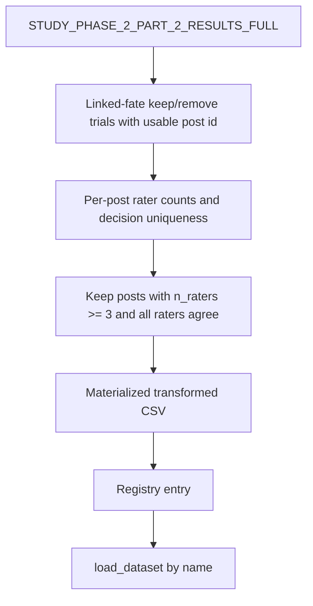

# Add a shared Phase 2 Part 2 keep/remove dataset restricted to unanimous posts with at least three raters

## Remember
- Exact file paths always
- Exact commands with expected output
- DRY, YAGNI, TDD, frequent commits
- Delegated tasks must be impossible to misread.

## Overview

Modeling and analysis often need a high-agreement subset of Study Phase 2 Part 2 keep/remove labels: posts that received **at least three** linked-fate ratings **and** where every rater agreed (all keep or all remove). That filter exists today only as an on-the-fly join inside `experiments/bertopic_modeling_2026_08_05/src/data.py` (unanimous flag only; no min-rater cutoff; not registered). This plan materializes the filtered table as a new **transformed** shared dataset under `shared/data/transformed/study_phase_2_part_2/`, registers it beside the existing modal labels, and documents how to regenerate it.

**Measured size on current raw results (for review / acceptance):** 1644 posts (1490 keep / 154 remove).

**Out of scope:** changing the existing modal labels dataset; migrating experiments (including BERTopic) onto the new registry name; extracting shared helper modules used by BERTopic; any new raw exports from S3.

## Happy flow

An operator regenerates Part 2 transforms (or the new script alone), then any experiment loads the new registry name via the shared dataloader and receives one row per post that passed the unanimous + min-three filter.

## Approach

Mirror the existing Part 2 transformed-artifact pattern (`keep_remove_labels` / user reflection feedback): one focused transform script, CSV next to the script, SCREAMING_SNAKE registry entry with `kind="transformed"`, README contract, and `main.py` regeneration. Derive labels from results-full trials (not by filtering the modal CSV), so unanimous agreement is defined from the same trial set used for counts. Reuse the BERTopic unanimous rule text for “all raters same decision,” and add the explicit `n_raters >= 3` gate. Do not alter the modal training labels.

## Steps

Full contracts, file allow/forbid lists, and pass/fail commands: [`steps/`](./steps/).

### Step 1: Freeze filter contract, registry name, and output schema

[`steps/step1.md`](./steps/step1.md) — Lock inclusion rules, output columns, expected row counts, and the new registry name/path before any code lands.

### Step 2: Implement transform build/write with failing-then-passing checks

[`steps/step2.md`](./steps/step2.md) — Add the transform module that builds and materializes the filtered CSV from results-full; verify with synthetic frames and a full-data smoke count.

### Step 3: Register dataset, wire regeneration, document

[`steps/step3.md`](./steps/step3.md) — Add the registry entry, update `main.py` and the transformed README, confirm `load_dataset` resolves the new name.

## What "done" looks like

1. A new transformed CSV exists under `shared/data/transformed/study_phase_2_part_2/` containing only posts with ≥3 linked-fate keep/remove ratings that are unanimous.
2. A new SCREAMING_SNAKE name in `shared/data/registry.py` points at that CSV with `kind="transformed"`.
3. Callers can load it via `shared/data/dataloader.py` without hardcoding paths.
4. Regenerating via the Part 2 transform `main.py` (and the dedicated script) rewrites the CSV reproducibly.
5. The transformed README documents source, filter steps, columns, and expected size (~1644 rows; ~1490 keep / ~154 remove).
6. Existing modal keep/remove labels and their registry entry are unchanged.
7. No experiment migrations in this plan.
