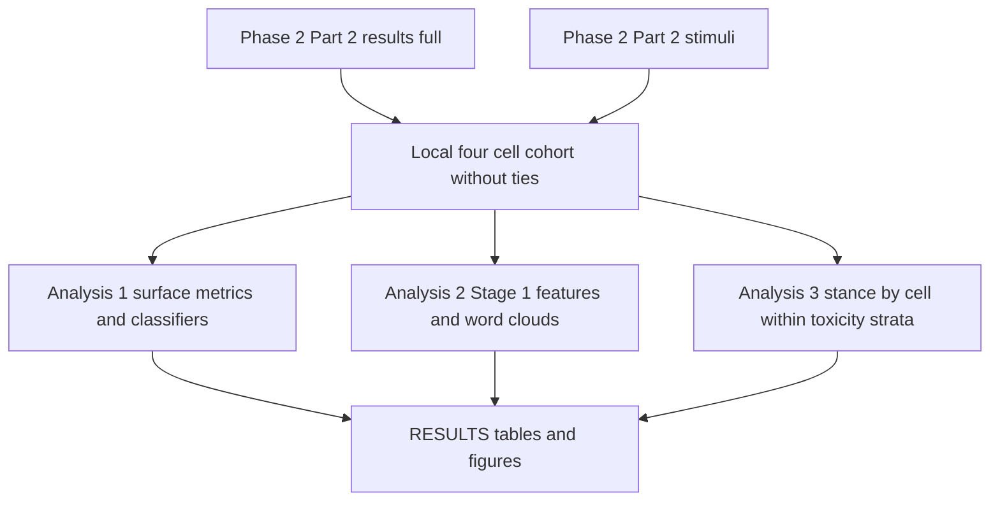

# Build a descriptive four-cell analysis of unanimous versus majority keep and remove labels

## Remember
- Exact file paths always
- Exact commands with expected output
- DRY, YAGNI, TDD, frequent commits
- Delegated tasks must be impossible to misread.

## Overview

Study Phase 2 Part 2 assigns each post a keep or remove label from linked-fate ratings. Posts where every rater agrees and posts where raters split can receive the same keep or remove label, and the shared modal label table does not separate those cases.

The experiment in `experiments/unanimous_vs_majority_labels_2026_08_08/` asks whether unanimous posts and strict-majority posts differ in measurable ways. The primary claim is that unanimous keep and unanimous remove posts sit at clearer extremes of content, while strict-majority posts sit in the middle on toxicity and length and look more arguable. The secondary claim is that heavy remove cells look more like high toxicity than like a left versus right political split. Both claims are descriptive only. The work does not run hypothesis tests or confidence intervals.

The analysis set is linked-fate posts with at least three raters. Posts fall into four cells: unanimous keep, majority keep, majority remove, and unanimous remove. Exact ties are dropped and are not analyzed. The cohort file stays inside the experiment directory. No new shared registry dataset is added.

On the current raw results, the expected cell sizes are about 1,490 unanimous keep, 1,480 majority keep, 594 majority remove, and 154 unanimous remove.

The grill lock in `experiments/unanimous_vs_majority_labels_2026_08_08/GRILL.md` is the contract for this plan. The older README in the same folder is outdated where it keeps ties or treats political disagreement as the headline claim.

Out of scope for this plan:

- analyzing exact ties
- formal statistical tests
- work under `experiments/rater_agreement_2026_08_06/`
- embedding, clustering, or cluster labeling stages from `experiments/create_llm_features_2026_08_05/`
- new shared transformed catalog entries
- a strategy document writeup

## Happy flow

An operator builds one local four-cell cohort, runs three analysis scripts, and then reads tables and figures in a results document.

## Approach

Build the cohort first so every analysis reads the same partition. Prefer reuse over new model work. Deterministic length and readability metrics, plus valence, intergroup, and PRIME classifiers, come from `shared/textual_features/`. Stage 1 language model features reuse rows already written under `experiments/create_llm_features_2026_08_05/` when the post id overlaps, and only call the model for missing posts. Feature extraction keeps the dual text prompt so new rows stay comparable to reused rows. Analysis 1 metrics and the length and toxicity summaries use original text only. The shippable evidence is scripts under the experiment folder, a rewritten README, `RESULTS.md`, and files under `outputs/`.

## Steps

Full contracts, file allow and forbid lists, and pass or fail commands live in [`steps/`](./steps/).

### Step 1: Freeze the cohort contract and write the four cell table

[`steps/step1.md`](./steps/step1.md) locks cell rules, joins for toxicity and stance, expected counts, and the local cohort path. It also requires a builder that writes the cohort file later steps read.

### Step 2: Run Analysis 1 on original text

[`steps/step2.md`](./steps/step2.md) computes the locked surface metrics and classifiers on original text, summarizes them by cell, and writes tables under the experiment outputs tree.

### Step 3: Run Analysis 2 Stage 1 features and word clouds

[`steps/step3.md`](./steps/step3.md) loads reused Stage 1 features for overlapping posts, generates features only for missing posts, and builds four word clouds plus top token tables with the locked token counting rules.

### Step 4: Run Analysis 3 stance tables within each toxicity stratum

[`steps/step4.md`](./steps/step4.md) builds three left or right by cell tables, one for each toxicity stratum, from fields already on the cohort.

### Step 5: Rewrite the README and freeze RESULTS

[`steps/step5.md`](./steps/step5.md) replaces the outdated experiment README with the grill contract, and writes `RESULTS.md` that presents all three analyses without statistical tests.

## What "done" looks like

1. A local four cell cohort exists under `experiments/unanimous_vs_majority_labels_2026_08_08/` with ties excluded and cell sizes matching the grill expectations on current data.
2. Analysis 1 has written descriptive per cell summaries for the locked surface metrics and classifiers on original text.
3. Analysis 2 has Stage 1 features for every four cell post, reusing prior rows where possible, plus four word clouds and top token tables with about 30 tokens per cell.
4. Analysis 3 has three stance by cell tables, one per toxicity stratum.
5. `experiments/unanimous_vs_majority_labels_2026_08_08/README.md` matches `experiments/unanimous_vs_majority_labels_2026_08_08/GRILL.md`.
6. `experiments/unanimous_vs_majority_labels_2026_08_08/RESULTS.md` and `experiments/unanimous_vs_majority_labels_2026_08_08/outputs/` hold the tables and figures above.
7. Shared registry datasets, `experiments/rater_agreement_2026_08_06/`, and committed outputs under `experiments/create_llm_features_2026_08_05/` are unchanged.
