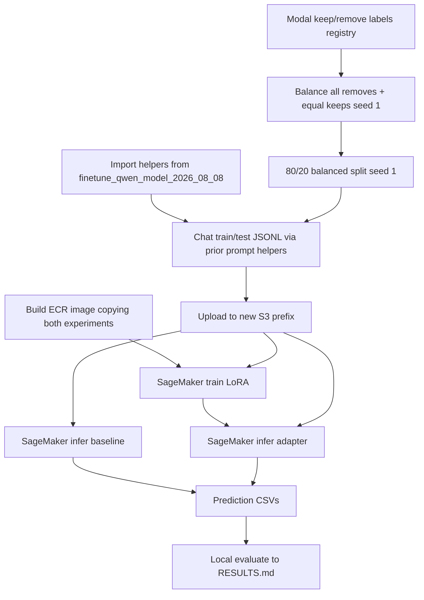

# Replicate Qwen3-4B LoRA teachability on modal keep/remove labels via thin wrappers

## Remember
- Exact file paths always
- Exact commands with expected output
- DRY, YAGNI, TDD, frequent commits
- Delegated tasks must be impossible to misread.

## Overview

Stand up `experiments/larger_finetune_qwen_model_2026_08_08/` as a **near-clone** of the completed unanimous-min3 teachability run (`experiments/finetune_qwen_model_2026_08_08/`, PR #54), but train on the **modal** Study Phase 2 Part 2 keep/remove set (`STUDY_PHASE_2_PART_2_KEEP_REMOVE_LABELS` → `shared/data/transformed/study_phase_2_part_2/keep_remove_labels.csv`). Keep the same model, LoRA recipe, prompt, split math (1:1 keep/remove, 80/20, `seed=1`), SageMaker custom-image path, and baseline-vs-adapter comparison. Prefer **imports from the prior experiment** over copying code; new files should be thin path/registry/S3 wrappers.

**Out of scope:** changing the prior experiment’s scientific results or frozen unanimous data; QLoRA or hyperparam sweeps; prompt ablations; editing the shared modal-label transform; local GPU train as the acceptance path.

## Happy flow

An operator freezes a larger balanced modal-label split locally (all removes + equal keeps), uploads to a **new** experiment S3 prefix, builds an image that can import both experiment packages, runs SageMaker train + baseline/adapter infer, then writes local `RESULTS.md` with the same metric tables as PR #54.

## Approach

Treat PR #54’s package as the implementation source of truth. The new experiment owns only: (1) registry selection and output paths, (2) experiment identity strings (ECR, S3 prefix, W&B project), (3) Docker copy list so prior imports resolve, and (4) IAM S3-prefix allow-list extension for the new prefix. Do not re-vendor the rubric prompt or reimplement TRL/PEFT/eval/parse logic. If a prior module hardcodes experiment identity inside a reusable function, prefer calling its pure helpers from the new wrapper; only extract a tiny identity-free helper in the prior tree if imports otherwise force a large copy.

## Steps

Full contracts, file allow/forbid lists, and pass/fail commands: [`steps/`](./steps/).

### Step 1: Scaffold the modal-labels experiment as thin wrappers

[`steps/step1.md`](./steps/step1.md) — README design freeze; package tree; reuse optional-deps group `finetune-qwen-2026-08-08`; stub mains that import from `experiments.finetune_qwen_model_2026_08_08`.

### Step 2: Freeze balanced modal-label CSV splits and chat JSONL

[`steps/step2.md`](./steps/step2.md) — Load `STUDY_PHASE_2_PART_2_KEEP_REMOVE_LABELS`; reuse prior balance/split and chat helpers; write new `data/` artifacts (~5626 rows).

### Step 3: Wire train, inference, and evaluate wrappers

[`steps/step3.md`](./steps/step3.md) — CLI entrypoints default to new paths / W&B project; call prior train/infer/eval implementations or shared helpers; no logic forks.

### Step 4: Docker image and SageMaker launcher for the new identity

[`steps/step4.md`](./steps/step4.md) — Image copies both experiment trees; launcher uses new ECR/S3/W&B names; dry-run config tests.

### Step 5: Extend SageMaker IAM for the new S3/ECR identity

[`steps/step5.md`](./steps/step5.md) — Reuse execution role `mirrorview-qwen-finetune-sm-exec`; add the new S3 prefix and ECR repo to Terraform allow-lists (do not recreate PassRole from scratch).

### Step 6: Upload data, run remote jobs, write RESULTS.md

[`steps/step6.md`](./steps/step6.md) — Same operator sequence as PR #54 Step 8, against the new prefixes; hard GPU-spend approval gate.

## What "done" looks like

1. New experiment README documents modal-label source, 1:1 balance of all removes, and identical model/LoRA/SageMaker contracts to PR #54 aside from identity strings and expected row counts.
2. Local `data/train.csv`, `data/test.csv`, `data/chat_train.jsonl`, `data/chat_test.jsonl` exist under the new experiment, reproducible with `seed=1`, balanced, sized from current modal data (5626 total → 4500/1126).
3. New package imports prior helpers for balance/split/prompt/parse/train-config/eval rather than duplicating bodies.
4. Custom image builds with both experiment packages present; SageMaker launcher dry-run prints the new S3/ECR layout.
5. IAM allow-list covers the new S3 prefix and ECR repo for the existing execution role.
6. After approved remote run: four pred CSVs scored into `RESULTS.md` (remove = positive; same table shape as PR #54).
7. No edits to shared modal-label transform outputs; prior experiment’s frozen unanimous `data/` and `RESULTS.md` remain untouched.
