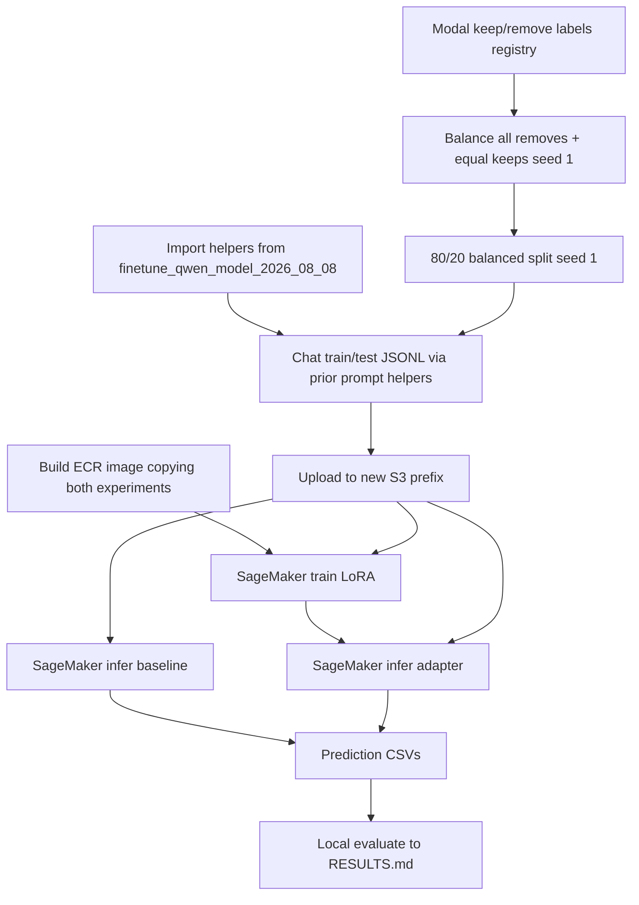

# Replicate the Qwen3-4B LoRA teachability run on modal keep/remove labels with thin wrappers

## Remember
- Exact file paths always
- Exact commands with expected output
- DRY, YAGNI, TDD, frequent commits
- Delegated tasks must be impossible to misread.

## Overview

Create `experiments/larger_finetune_qwen_model_2026_08_08/` so it matches the completed teachability run in `experiments/finetune_qwen_model_2026_08_08/` from pull request 54, except for the training labels. The earlier run used the unanimous min-3 keep/remove set. The new run uses the modal keep/remove set from the shared registry name `STUDY_PHASE_2_PART_2_KEEP_REMOVE_LABELS`, which points at `shared/data/transformed/study_phase_2_part_2/keep_remove_labels.csv`.

The model, LoRA settings, prompt, split rules (equal keep and remove counts, 80/20 train/test, `seed=1`), SageMaker custom image path, and baseline versus adapter comparison stay the same as pull request 54. New code should import helpers from the earlier experiment whenever that is possible. New files should mainly set paths, registry names, and cloud names such as the ECR repository, S3 prefix, and Weights and Biases project.

Work that is out of scope includes changing the earlier experiment's frozen unanimous data or results, using QLoRA, sweeping hyperparameters, trying alternate prompts, editing the shared modal-label transform, and treating a local GPU train as the acceptance path.

## Happy flow

An operator builds a larger balanced split from the modal labels by keeping every remove row and sampling the same number of keep rows. The operator uploads that data to a new experiment S3 prefix, builds a Docker image that can import both experiment packages, runs SageMaker training and then baseline and adapter inference, and writes local `RESULTS.md` with the same metric tables as pull request 54.

## Approach

Treat the package from pull request 54 as the place where the real training and evaluation logic lives. The new experiment chooses the modal-label registry entry and writes outputs under its own folder. It also uses its own cloud names for ECR, S3, and Weights and Biases. Its Docker image copies both experiment trees so imports of the earlier package still resolve. Its IAM rules also allow the new S3 prefix.

Do not copy the rubric prompt text into the new tree, and do not rewrite the TRL, PEFT, evaluation, or parse logic. If a helper in the earlier package hardcodes that experiment's cloud names inside a function you need, call the pure helpers from a new wrapper instead. Only extract a small helper with no experiment-specific names in the earlier tree if importing would otherwise force a large copy.

## Steps

The step files under [`steps/`](./steps/) hold the contracts, the lists of files you may change, and the pass and fail commands.

### Step 1: Scaffold the larger experiment as thin wrappers

[`steps/step1.md`](./steps/step1.md) freezes the README facts, creates the package tree, reuses the optional dependency group `finetune-qwen-2026-08-08`, and adds stub mains that import from `experiments.finetune_qwen_model_2026_08_08`.

### Step 2: Freeze balanced modal-label CSV splits and chat JSONL

[`steps/step2.md`](./steps/step2.md) loads `STUDY_PHASE_2_PART_2_KEEP_REMOVE_LABELS`, reuses the earlier balance, split, and chat helpers, and writes new `data/` files with about 5626 rows on the current CSV.

### Step 3: Wire train, inference, and evaluate wrappers

[`steps/step3.md`](./steps/step3.md) points the CLI defaults at the new paths and Weights and Biases project, and calls the earlier train, infer, and evaluate code or shared helpers without changing the scientific settings.

### Step 4: Docker image and SageMaker launcher for the new cloud names

[`steps/step4.md`](./steps/step4.md) builds an image that copies both experiment trees, points the launcher at the new ECR and S3 names, and adds dry-run config tests.

### Step 5: Extend SageMaker IAM for the new S3 and ECR names

[`steps/step5.md`](./steps/step5.md) reuses the execution role `mirrorview-qwen-finetune-sm-exec` and adds the new S3 prefix and ECR repository to the Terraform allow lists, without rebuilding PassRole from scratch.

### Step 6: Upload data, run remote jobs, and write RESULTS.md

[`steps/step6.md`](./steps/step6.md) follows the same operator sequence as Step 8 in pull request 54, but against the new prefixes, and it requires explicit approval before spending GPU time.

## What "done" looks like

1. The new experiment README names the modal-label source, the equal keep and remove balance that keeps all remove rows, and the same model, LoRA, and SageMaker contracts as pull request 54, aside from cloud names and expected row counts.
2. Local `data/train.csv`, `data/test.csv`, `data/chat_train.jsonl`, and `data/chat_test.jsonl` exist under the new experiment, rebuild the same way with `seed=1`, stay class-balanced, and match the current modal data size of 5626 total rows with a 4500 and 1126 train and test split.
3. The new package imports earlier helpers for balance, split, prompt, parse, train config, and evaluate, instead of copying their bodies.
4. The custom image builds with both experiment packages present, and the SageMaker launcher dry-run prints the new S3 and ECR layout.
5. The IAM allow list covers the new S3 prefix and ECR repository for the existing execution role.
6. After an approved remote run, four prediction CSVs are scored into `RESULTS.md`, with remove as the positive class and the same table shape as pull request 54.
7. The shared modal-label transform outputs stay unchanged, and the earlier experiment's frozen unanimous `data/` and `RESULTS.md` stay untouched.
