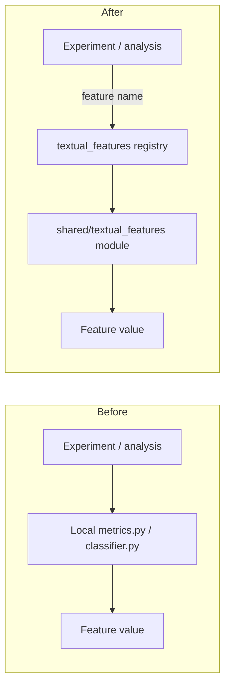

# Extract textual feature extractors into `shared/textual_features/` with a registry and migrate experiment call sites

## Remember
- Exact file paths always
- Exact commands with expected output
- DRY, YAGNI, TDD, frequent commits
- Delegated tasks must be impossible to misread.

## Overview

Length, readability, valence, intergroup, and PRIME feature logic today lives only under `experiments/mirrors_content_analysis_2026_04_24/analysis/`. Downstream work (notably `experiments/predict_keep_remove_2026_05_07/`) consumes precomputed label CSVs from those modules, so the formulas and LLM classifiers are not reusable as a library. This plan lifts each listed feature into its own module under `shared/textual_features/`, adds a name→feature registry (same catalog role as `shared/data/registry.py`), and migrates the mirrors analysis implementations to call the shared modules so there is a single source of truth.

**Features in scope (one module each under `shared/textual_features/`):**

| Feature | Current home |
| --- | --- |
| Character count | `experiments/mirrors_content_analysis_2026_04_24/analysis/length_compression_analysis/metrics.py` |
| Word count | same |
| Sentence count | same |
| Average sentence length | same |
| Punctuation density | same (keeps sibling punctuation count for existing label CSV columns) |
| Flesch–Kincaid grade | `experiments/mirrors_content_analysis_2026_04_24/analysis/readability_complexity_analysis/metrics.py` |
| Reading ease | same |
| Valence | `experiments/mirrors_content_analysis_2026_04_24/analysis/valence_classifier/classifier.py` |
| Intergroup discussion | `experiments/mirrors_content_analysis_2026_04_24/analysis/intergroup_classifier/classifier.py` |
| PRIME cues (prestige / in-group / moral / emotional as today’s single binary any-of cue) | `experiments/mirrors_content_analysis_2026_04_24/analysis/prime_classifier/classifier.py` |

**Out of scope:** rewriting MirrorView trial aggregation / table rendering in `metric_aggregator.py` and `table_renderer.py`; regenerating historical label CSVs; changing keep/remove model feature column names; expanding PRIME into four separate classifiers; moving `shared/data/` loaders.

## Finalized file structure

```text
shared/textual_features/
  __init__.py                 # re-exports registry helpers + public metric/classifier entrypoints
  base.py                     # CalculateMetric ABC (lifted from mirrors analysis/interfaces.py)
  text_utils.py               # shared regexes, safe_divide, syllable/readability count helpers
  registry.py                 # SCREAMING_SNAKE name → FeatureEntry catalog + get_feature()
  char_count.py
  word_count.py
  sentence_count.py
  avg_sentence_length.py
  punctuation_count.py        # sibling kept for existing label CSV columns
  punctuation_density.py
  flesch_kincaid_grade.py
  reading_ease.py
  valence.py                  # LLM classifier (no CSV I/O)
  intergroup.py               # LLM classifier (no CSV I/O)
  prime.py                    # LLM binary any-of PRIME classifier (no CSV I/O)
  tests/
    test_length_metrics.py
    test_readability_metrics.py
    test_registry.py

# Migrated experiment thin wrappers (formulas deleted; imports from shared):
experiments/mirrors_content_analysis_2026_04_24/analysis/
  interfaces.py                                    # re-export CalculateMetric from shared
  length_compression_analysis/metrics.py           # re-export length metrics + DEFAULT_LENGTH_METRICS
  readability_complexity_analysis/metrics.py       # re-export readability metrics + DEFAULT_READABILITY_METRICS
  valence_classifier/classifier.py                 # classify_* → shared.textual_features.valence; keep CSV __main__
  intergroup_classifier/classifier.py              # same pattern
  prime_classifier/classifier.py                   # same pattern
```

**Registry names (frozen):**

| Registry constant | Metric / classifier `name` field | Module |
| --- | --- | --- |
| `CHAR_COUNT` | `char_count` | `char_count.py` |
| `WORD_COUNT` | `word_count` | `word_count.py` |
| `SENTENCE_COUNT` | `sentence_count` | `sentence_count.py` |
| `AVG_SENTENCE_LENGTH` | `avg_sentence_length` | `avg_sentence_length.py` |
| `PUNCTUATION_COUNT` | `punctuation_count` | `punctuation_count.py` |
| `PUNCTUATION_DENSITY` | `punctuation_density` | `punctuation_density.py` |
| `FLESCH_KINCAID_GRADE` | `flesch_kincaid_grade` | `flesch_kincaid_grade.py` |
| `READING_EASE` | `flesch_reading_ease` | `reading_ease.py` |
| `VALENCE` | `valence` | `valence.py` |
| `INTERGROUP` | `intergroup` | `intergroup.py` |
| `PRIME` | `prime` | `prime.py` |

## Example module and usage

Deterministic features are one class per file implementing `CalculateMetric`. Example shape for `shared/textual_features/char_count.py` (parity with today’s `CharCountMetric`):

```python
"""Character-count textual feature."""

from __future__ import annotations

from shared.textual_features.base import CalculateMetric


class CharCountMetric(CalculateMetric):
    @property
    def name(self) -> str:
        return "char_count"

    def describe(self) -> str:
        return (
            "Post length in characters. Counts every codepoint in the string after "
            "normalization (including spaces, punctuation, and line breaks). "
            "Formula: float(len(text))."
        )

    def calculate(self, text: str) -> float:
        return float(len(text))
```

**Direct use:**

```python
from shared.textual_features.char_count import CharCountMetric

CharCountMetric().calculate("Hello world!")  # → 12.0
```

**Registry use (preferred discovery surface):**

```python
from shared.textual_features.registry import CHAR_COUNT, get_feature

feature = get_feature(CHAR_COUNT)          # FeatureEntry for char_count
metric = feature.build()                   # CharCountMetric instance
metric.calculate("Hello world!")           # → 12.0
```

**After migration, experiment wrappers stay import-compatible:**

```python
# experiments/.../length_compression_analysis/metrics.py becomes a thin re-export
from shared.textual_features.char_count import CharCountMetric
from shared.textual_features.word_count import WordCountMetric
# ...
from shared.textual_features.punctuation_density import PunctuationDensityMetric

DEFAULT_LENGTH_METRICS = (
    CharCountMetric(),
    WordCountMetric(),
    # ...
)
```

LLM features (`valence.py`, `intergroup.py`, `prime.py`) expose `classify_post(text)` / `classify_texts(posts)` and register under `kind="classifier"`; MirrorView CSV write paths stay in the experiment `classifier.py` `__main__` blocks only.

## Happy flow

An experiment or script asks the shared textual-features registry for a named feature, computes it on a string (deterministic metrics locally; LLM classifiers via existing OpenAI path), and gets the same numeric or boolean result previously produced by the mirrors-content-analysis modules. Mirrors analysis scripts keep their CLI entry points and label CSV paths, but import extractors from `shared/textual_features/` instead of owning the formulas.



## Approach

Lift, do not redesign: copy the proven metric math and classifier prompts into shared modules with stable registry names, then thin the experiment files to re-export or call those modules so existing label CSV schemas and analysis CLIs stay valid. Registry is the discovery surface; individual files remain the implementation surface. Prefer behavioral parity over cleanup.

## Steps

Detail for each step lives under `steps/`.

### Step 1: Freeze shared package layout, registry names, and parity contract

→ [steps/step1.md](steps/step1.md)

Scaffold `shared/textual_features/` with stub modules matching the finalized tree, freeze `FeatureEntry` / registry constants / `CalculateMetric`, and add failing tests that lock metric names and known-input outputs against today’s experiment classes.

### Step 2: Implement deterministic length and readability modules plus registry

→ [steps/step2.md](steps/step2.md)

Flesh length and readability modules (and `text_utils.py` helpers) to parity with the current `metrics.py` formulas; make `get_feature` resolve all deterministic registry names; turn Step-1 metric/registry tests green.

### Step 3: Implement valence, intergroup, and PRIME classifier modules

→ [steps/step3.md](steps/step3.md)

Move prompts, structured-output models, and `classify_post` / `classify_texts` into shared classifier modules; register them; keep OpenAI env/model behavior; leave CSV labeling in experiment scripts.

### Step 4: Migrate mirrors content analysis to the shared package

→ [steps/step4.md](steps/step4.md)

Replace local metric/classifier implementations with thin imports from shared; keep `main.py`, aggregators, renderers, link helpers, and label CSV paths unchanged.

### Step 5: Smoke parity and import checks

→ [steps/step5.md](steps/step5.md)

Run shared unit tests, registry completeness checks, migrated-module import smoke, and confirm keep/remove dataloader still joins the existing mirrors analysis label CSVs.

## What "done" looks like

1. `shared/textual_features/` exists with one module per in-scope feature, plus a registry and package init.
2. Every listed feature is discoverable by stable registry name and computable without importing experiment packages.
3. Deterministic metrics have unit tests proving parity with the pre-migration formulas.
4. Valence, intergroup, and PRIME classify helpers live in shared; experiment classifiers are thin callers.
5. Mirrors length/readability `metrics.py` files no longer own the formulas; they delegate to shared.
6. Existing mirrors analysis CLIs and label CSV paths remain valid; `experiments/predict_keep_remove_2026_05_07/` needs no join-path rewrite for this plan.
7. No PRIME four-way expansion, no label CSV regeneration, no aggregator/renderer redesign.
