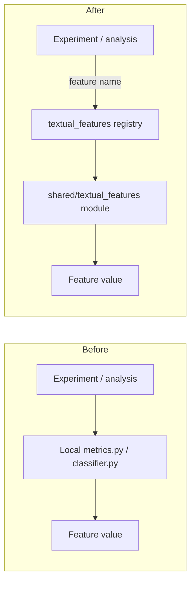

# Move text feature code into `shared/textual_features/` with a registry, and point old experiment code at it

## Remember
- Exact file paths always
- Exact commands with expected output
- DRY, YAGNI, TDD, frequent commits
- Delegated tasks must be impossible to misread.

## Overview

The length, readability, valence, intergroup, and PRIME feature code currently lives only under `experiments/mirrors_content_analysis_2026_04_24/analysis/`. Other work, especially `experiments/predict_keep_remove_2026_05_07/`, reads precomputed label CSV files from those modules, so the formulas and language-model classifiers are not available as a shared library. The plan puts each listed feature in its own module under `shared/textual_features/`, adds a name-to-feature registry in the same role as `shared/data/registry.py`, and updates the mirrors analysis modules so they call the shared modules instead of keeping their own copies.

**Features in scope (one module each under `shared/textual_features/`):**

| Feature | Current home |
| --- | --- |
| Character count | `experiments/mirrors_content_analysis_2026_04_24/analysis/length_compression_analysis/metrics.py` |
| Word count | same |
| Sentence count | same |
| Average sentence length | same |
| Punctuation density | same (also keep punctuation count, because existing label CSV columns still use it) |
| Flesch-Kincaid grade | `experiments/mirrors_content_analysis_2026_04_24/analysis/readability_complexity_analysis/metrics.py` |
| Reading ease | same |
| Valence | `experiments/mirrors_content_analysis_2026_04_24/analysis/valence_classifier/classifier.py` |
| Intergroup discussion | `experiments/mirrors_content_analysis_2026_04_24/analysis/intergroup_classifier/classifier.py` |
| PRIME cues (prestige, in-group, moral, and emotional, as today's single yes-or-no "any of these" classifier) | `experiments/mirrors_content_analysis_2026_04_24/analysis/prime_classifier/classifier.py` |

**Out of scope:** rewriting MirrorView trial aggregation or table rendering in `metric_aggregator.py` and `table_renderer.py`; regenerating historical label CSV files; changing keep-or-remove model feature column names; expanding PRIME into four separate classifiers; moving `shared/data/` loaders.

## Finalized file structure

```text
shared/textual_features/
  __init__.py                 # re-exports registry helpers and public metric/classifier entry points
  base.py                     # CalculateMetric base class (moved from mirrors analysis/interfaces.py)
  text_utils.py               # shared regexes, safe_divide, syllable and readability count helpers
  registry.py                 # SCREAMING_SNAKE name to FeatureEntry catalog, plus get_feature()
  char_count.py
  word_count.py
  sentence_count.py
  avg_sentence_length.py
  punctuation_count.py        # kept because existing label CSV columns still use it
  punctuation_density.py
  flesch_kincaid_grade.py
  reading_ease.py
  valence.py                  # language-model classifier (no CSV read or write)
  intergroup.py               # language-model classifier (no CSV read or write)
  prime.py                    # language-model yes-or-no PRIME classifier (no CSV read or write)
  tests/
    test_length_metrics.py
    test_readability_metrics.py
    test_registry.py

# Experiment files after migration (formulas removed; they import from shared):
experiments/mirrors_content_analysis_2026_04_24/analysis/
  interfaces.py                                    # re-export CalculateMetric from shared
  length_compression_analysis/metrics.py           # re-export length metrics and DEFAULT_LENGTH_METRICS
  readability_complexity_analysis/metrics.py       # re-export readability metrics and DEFAULT_READABILITY_METRICS
  valence_classifier/classifier.py                 # classify_* from shared.textual_features.valence; keep CSV __main__
  intergroup_classifier/classifier.py              # same pattern
  prime_classifier/classifier.py                   # same pattern
```

**Registry names (fixed):**

| Registry constant | Metric or classifier `name` field | Module |
| --- | --- | --- |
| `CHAR_COUNT` | `char_count` | `char_count.py` |
| `WORD_COUNT` | `word_count` | `word_count.py` |
| `SENTENCE_COUNT` | `sentence_count` | `sentence_count.py` |
| `AVG_SENTENCE_LENGTH` | `avg_sentence_length` | `avg_sentence_length.py` |
| `PUNCTUATION_COUNT` | `punctuation_count` | `punctuation_count.py` |
| `PUNCTUATION_DENSITY` | `punctuation_density` | `punctuation_density.py` |
| `FLESCH_KINCAID_GRADE` | `flesch_kincaid_grade` | `flesch_kincaid_grade.py` |
| `READING_EASE` | `flesch_reading_ease` | `reading_ease.py` |
| `VALENCE` | `valence` | `valence.py` |
| `INTERGROUP` | `intergroup` | `intergroup.py` |
| `PRIME` | `prime` | `prime.py` |

## Example module and usage

Each length or readability feature is one class per file that implements `CalculateMetric`. The example below is the shape for `shared/textual_features/char_count.py`, matching today's `CharCountMetric`.

```python
"""Character-count textual feature."""

from __future__ import annotations

from shared.textual_features.base import CalculateMetric


class CharCountMetric(CalculateMetric):
    @property
    def name(self) -> str:
        return "char_count"

    def describe(self) -> str:
        return (
            "Post length in characters. Counts every codepoint in the string after "
            "normalization (including spaces, punctuation, and line breaks). "
            "Formula: float(len(text))."
        )

    def calculate(self, text: str) -> float:
        return float(len(text))
```

**Direct use:**

```python
from shared.textual_features.char_count import CharCountMetric

CharCountMetric().calculate("Hello world!")  # -> 12.0
```

**Registry use (preferred way to look up a feature by name):**

```python
from shared.textual_features.registry import CHAR_COUNT, get_feature

feature = get_feature(CHAR_COUNT)          # FeatureEntry for char_count
metric = feature.build()                   # CharCountMetric instance
metric.calculate("Hello world!")           # -> 12.0
```

**After migration, experiment wrappers keep the same import names:**

```python
# experiments/.../length_compression_analysis/metrics.py becomes a short re-export
from shared.textual_features.char_count import CharCountMetric
from shared.textual_features.word_count import WordCountMetric
# ...
from shared.textual_features.punctuation_density import PunctuationDensityMetric

DEFAULT_LENGTH_METRICS = (
    CharCountMetric(),
    WordCountMetric(),
    # ...
)
```

The language-model features in `valence.py`, `intergroup.py`, and `prime.py` expose `classify_post(text)` and `classify_texts(posts)`, and they register under `kind="classifier"`. The MirrorView CSV write paths stay in the experiment `classifier.py` `__main__` blocks only.

## Happy flow

An experiment or script asks the shared textual-features registry for a named feature, computes that feature on a string, and gets the same number or yes-or-no result that the mirrors content analysis modules used to produce. Length and readability metrics run locally. Valence, intergroup, and PRIME classifiers use the existing OpenAI path. Mirrors analysis scripts keep their command-line entry points and label CSV paths, but they import extractors from `shared/textual_features/` instead of owning the formulas.



## Approach

Copy the existing metric math and classifier prompts into shared modules under stable registry names. Do not redesign the formulas. Then shorten the experiment files so they re-export or call those shared modules, and leave existing label CSV schemas and analysis command-line tools valid. The registry is how callers look up features by name. The individual files still hold the implementations. Matching today's outputs matters more than cleanup.

## Steps

Detail for each step lives under `steps/`.

### Step 1: Freeze shared package layout, registry names, and matching-output contract

→ [steps/step1.md](steps/step1.md)

Create `shared/textual_features/` with stub modules that match the finalized tree. Fix the `FeatureEntry` shape, registry constants, and `CalculateMetric` contract. Add failing tests that lock metric names and known-input outputs against today's experiment classes.

### Step 2: Implement length and readability modules plus the registry

→ [steps/step2.md](steps/step2.md)

Fill in the length and readability modules, and the helpers in `text_utils.py`, so they match the current `metrics.py` formulas. Make `get_feature` resolve all length and readability registry names. Make the Step 1 metric and registry tests pass.

### Step 3: Implement valence, intergroup, and PRIME classifier modules

→ [steps/step3.md](steps/step3.md)

Move prompts, structured-output models, and `classify_post` / `classify_texts` into shared classifier modules, and register them. Keep the OpenAI environment and model behavior. Leave CSV labeling in the experiment scripts.

### Step 4: Point mirrors content analysis at the shared package

→ [steps/step4.md](steps/step4.md)

Replace local metric and classifier implementations with short imports from shared. Leave `main.py`, aggregators, renderers, link helpers, and label CSV paths unchanged.

### Step 5: Run smoke checks for matching outputs and imports

→ [steps/step5.md](steps/step5.md)

Run shared unit tests and registry completeness checks. Import the migrated modules. Confirm that the keep-or-remove dataloader still joins the existing mirrors analysis label CSV files.

## What "done" looks like

1. `shared/textual_features/` exists with one module per in-scope feature, plus a registry and package init.
2. Every listed feature is findable by a stable registry name, and you can compute it without importing experiment packages.
3. Length and readability metrics have unit tests that prove they match the pre-migration formulas.
4. Valence, intergroup, and PRIME classify helpers live in shared, and experiment classifiers are short callers of those helpers.
5. Mirrors length and readability `metrics.py` files no longer own the formulas. They call shared instead.
6. Existing mirrors analysis command-line tools and label CSV paths still work, and `experiments/predict_keep_remove_2026_05_07/` needs no join-path rewrite for this plan.
7. The plan does not expand PRIME into four classifiers, does not regenerate label CSV files, and does not redesign aggregators or renderers.
