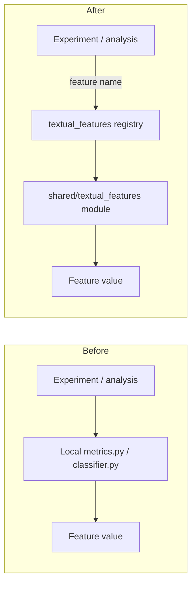

# Extract textual feature extractors into `shared/textual_features/` with a registry and migrate experiment call sites

## Remember
- Exact file paths always
- Exact commands with expected output
- DRY, YAGNI, TDD, frequent commits
- Delegated tasks must be impossible to misread.

## Overview

Length, readability, valence, intergroup, and PRIME feature logic today lives only under `experiments/mirrors_content_analysis_2026_04_24/analysis/`. Downstream work (notably `experiments/predict_keep_remove_2026_05_07/`) consumes precomputed label CSVs from those modules, so the formulas and LLM classifiers are not reusable as a library. This plan lifts each listed feature into its own module under `shared/textual_features/`, adds a name→feature registry (same catalog role as `shared/data/registry.py`), and migrates the mirrors analysis implementations to call the shared modules so there is a single source of truth.

**Features in scope (one module each under `shared/textual_features/`):**

| Feature | Current home |
| --- | --- |
| Character count | `experiments/mirrors_content_analysis_2026_04_24/analysis/length_compression_analysis/metrics.py` |
| Word count | same |
| Sentence count | same |
| Average sentence length | same |
| Punctuation density | same (keeps sibling punctuation count for existing label CSV columns) |
| Flesch–Kincaid grade | `experiments/mirrors_content_analysis_2026_04_24/analysis/readability_complexity_analysis/metrics.py` |
| Reading ease | same |
| Valence | `experiments/mirrors_content_analysis_2026_04_24/analysis/valence_classifier/classifier.py` |
| Intergroup discussion | `experiments/mirrors_content_analysis_2026_04_24/analysis/intergroup_classifier/classifier.py` |
| PRIME cues (prestige / in-group / moral / emotional as today’s single binary any-of cue) | `experiments/mirrors_content_analysis_2026_04_24/analysis/prime_classifier/classifier.py` |

**Out of scope:** rewriting MirrorView trial aggregation / table rendering in `metric_aggregator.py` and `table_renderer.py`; regenerating historical label CSVs; changing keep/remove model feature column names; expanding PRIME into four separate classifiers; moving `shared/data/` loaders.

## Happy flow

An experiment or script asks the shared textual-features registry for a named feature, computes it on a string (deterministic metrics locally; LLM classifiers via existing OpenAI path), and gets the same numeric or boolean result previously produced by the mirrors-content-analysis modules. Mirrors analysis scripts keep their CLI entry points and label CSV paths, but import extractors from `shared/textual_features/` instead of owning the formulas.

## Approach

Lift, do not redesign: copy the proven metric math and classifier prompts into shared modules with stable registry names, then thin the experiment files to re-export or call those modules so existing label CSV schemas and analysis CLIs stay valid. Registry is the discovery surface; individual files remain the implementation surface. Prefer behavioral parity over cleanup.

## Steps

### Step 1: Freeze shared package layout, registry names, and parity contract

Lock the exact module paths under `shared/textual_features/`, the SCREAMING_SNAKE registry names for each feature, the shared metric base type (today’s abstract metric contract from `experiments/mirrors_content_analysis_2026_04_24/analysis/interfaces.py`), and the numeric/boolean outputs that must match the current experiment implementations. Document that PRIME remains one binary any-of classifier, not four cue-specific models.

### Step 2: Implement deterministic length and readability modules plus registry

Add one file per length/readability feature under `shared/textual_features/`, move the shared regex/syllable helpers those metrics need, implement the registry catalog and lookup, and cover each metric with unit tests that pin known inputs to the same outputs as the current classes in the two `metrics.py` files.

### Step 3: Implement valence, intergroup, and PRIME classifier modules

Move the LangChain structured-output classifiers (prompts, response models, single-post and batch classify helpers) into `shared/textual_features/` modules registered alongside the deterministic features. Keep OpenAI key loading and default model behavior aligned with the existing classifier scripts. Do not embed MirrorView CSV I/O or label-path writes in the shared package.

### Step 4: Migrate mirrors content analysis to the shared package

Point `length_compression_analysis/metrics.py`, `readability_complexity_analysis/metrics.py`, and the three `*/classifier.py` files at the shared implementations (thin wrappers or direct imports). Leave `main.py`, link helpers, aggregators, renderers, and on-disk label CSV locations in place so `experiments/predict_keep_remove_2026_05_07/dataloader.py` keeps working without path changes.

### Step 5: Smoke parity and import checks

Run unit tests for the shared metrics, confirm registry lookup for every registered name, and smoke-import the migrated mirrors analysis modules so they resolve features from `shared/textual_features/` rather than duplicated local formulas. Confirm the keep/remove dataloader still joins the existing label CSV paths under the mirrors analysis tree.

## What "done" looks like

1. `shared/textual_features/` exists with one module per in-scope feature, plus a registry and package init.
2. Every listed feature is discoverable by stable registry name and computable without importing experiment packages.
3. Deterministic metrics have unit tests proving parity with the pre-migration formulas.
4. Valence, intergroup, and PRIME classify helpers live in shared; experiment classifiers are thin callers.
5. Mirrors length/readability `metrics.py` files no longer own the formulas; they delegate to shared.
6. Existing mirrors analysis CLIs and label CSV paths remain valid; `experiments/predict_keep_remove_2026_05_07/` needs no join-path rewrite for this plan.
7. No PRIME four-way expansion, no label CSV regeneration, no aggregator/renderer redesign.
