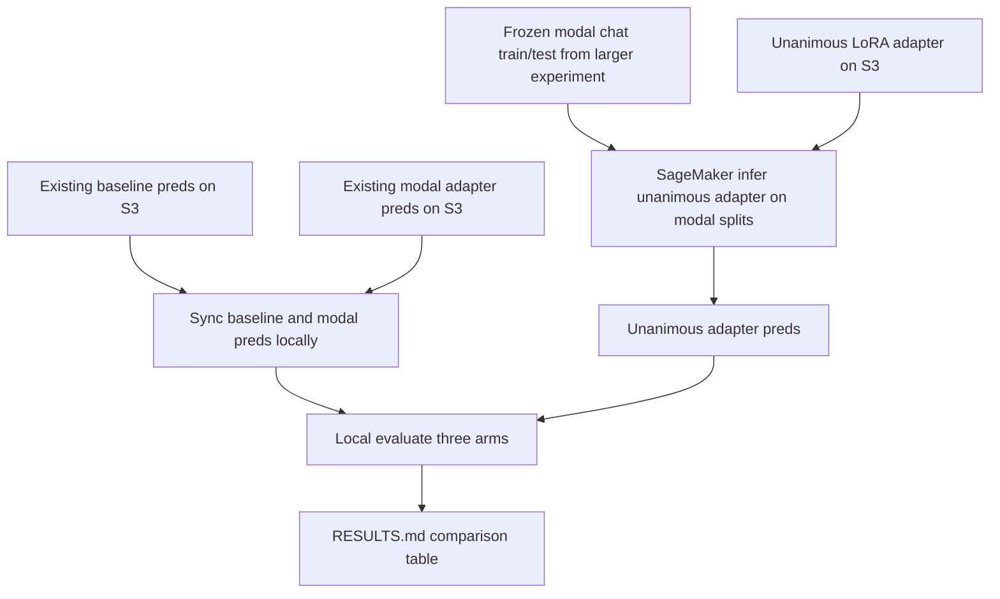

# Compare three Qwen keep/remove arms on one modal-label eval set

## Remember
- Exact file paths always
- Exact commands with expected output
- DRY, YAGNI, TDD, frequent commits
- Delegated tasks must be impossible to misread.

## Overview

Pull requests 54 and 57 each trained a Qwen3-4B LoRA adapter, but each wrote results on a different labeled set. Pull request 54 used the unanimous min-3 set. Pull request 57 used the modal keep/remove set. This plan puts three arms on one shared eval set drawn from the registry entry for the modal labels: baseline with no LoRA, the unanimous adapter from pull request 54, and the modal adapter from pull request 57.

All new code lives under `experiments/compare_qwen_lora_modal_eval_2026_08_12/`. The work reuses the frozen chat train and test files from `experiments/larger_finetune_qwen_model_2026_08_08/data/`, which already come from that modal registry entry. It does not retrain either adapter. It does not change the shared registry or the earlier experiment results.

## Happy flow

An operator syncs the existing baseline and modal prediction CSVs from the larger experiment S3 prefix, runs one SageMaker adapter inference job that loads the unanimous LoRA weights against the same modal chat splits, then scores all three arms into one local results table.

## Approach

Treat this as an evaluation only experiment. Keep the package thin. Import metric helpers from the earlier finetune package. Reuse the larger experiment Docker image and modal data channel for the one new remote job. Point that job at the existing unanimous adapter URI. Avoid copying train logic, prompt text, or a second optional dependency group.

## Steps

The step files under [`steps/`](./steps/) hold the contracts, the lists of files you may change, and the pass and fail commands.

### Step 1: Scaffold the comparison experiment

[`steps/step1.md`](./steps/step1.md) freezes the README facts and creates the thin package tree for sync, launch, and three-arm evaluate.

### Step 2: Wire three-arm evaluate and pred sync

[`steps/step2.md`](./steps/step2.md) scores baseline, unanimous LoRA, and modal LoRA prediction CSVs, and syncs the two existing prediction arms from S3 into the local preds layout.

### Step 3: Launch unanimous adapter inference on the modal splits

[`steps/step3.md`](./steps/step3.md) reuses the larger experiment image and data URI, mounts the unanimous adapter, writes predictions under a new preds arm, and covers dry-run config checks.

### Step 4: Run remote inference and write RESULTS.md

[`steps/step4.md`](./steps/step4.md) syncs existing preds, submits the SageMaker job, downloads the new arm, and writes the comparison table.

## What "done" looks like

1. `experiments/compare_qwen_lora_modal_eval_2026_08_12/README.md` names the three arms, the shared modal eval source, and the exact reuse of the larger experiment frozen chat files.
2. Local evaluate writes `experiments/compare_qwen_lora_modal_eval_2026_08_12/RESULTS.md` with train and test tables for baseline, unanimous LoRA, and modal LoRA.
3. The unanimous adapter is scored on the same modal chat splits used for the baseline and modal arms.
4. No retraining runs. The earlier experiment `data/` and `RESULTS.md` files stay unchanged.
5. Shared registry and transform outputs stay unchanged.
