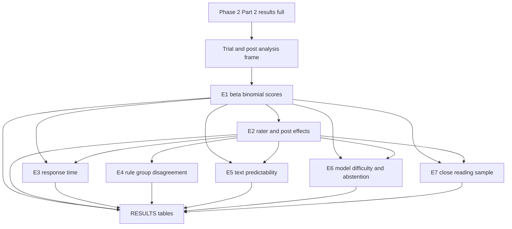

# Run current-data experiments that separate ambiguous boundary posts from clear ones

## Remember
- Exact file paths always
- Exact commands with expected output
- DRY, YAGNI, TDD, frequent commits
- Delegated tasks must be impossible to misread.

## Overview

The methods writeup hypothesizes a grey zone of posts people are unsure about. The four-cell unanimous versus majority analysis was a first cut, but observed agreement is mixed up with how many raters a post received, and the prior cohort dropped 275 tied posts that sit at the center of disagreement.

This plan implements the experiment series in `experiments/ambiguous_cases_2026_08_16/PROPOSAL.md` on Study Phase 2 Part 2 data already in the repo. The work produces continuous ambiguity scores, a rater-versus-post disagreement split, behavioral and rule-group checks, a text predictability test, a model-difficulty and abstention analysis, and a stratified sample for close reading. All outputs stay under `experiments/ambiguous_cases_2026_08_16/`. No new data collection and no new language-model API calls.

Out of scope:

- Fresh multi-sample LLM runs or Stage 1 feature regeneration
- Shared registry dataset additions
- Formal hypothesis tests and confidence intervals beyond descriptive summaries and posterior summaries from the beta-binomial fit
- Changes under `experiments/unanimous_vs_majority_labels_2026_08_08/` or `experiments/create_llm_features_2026_08_05/`

## Happy flow

An operator builds one trial and post analysis table, runs six analysis scripts that write scores and tables, exports a close-reading sample, and reads `RESULTS.md`.

## Approach

Build one shared analysis frame that keeps ties and records every linked-fate trial. Derive scores from that frame before any downstream analysis so E3 through E7 consume the same definitions. Prefer reuse of Titan embeddings, existing model correctness labels, shared surface features, and mined free-response rule clusters over new model work. Keep methods descriptive and reproducible with scripts under the experiment folder.

## Steps

Full contracts, file allow and forbid lists, and pass or fail commands live in [`steps/`](./steps/).

### Step 1: Build the shared trial and post analysis frame

[`steps/step1.md`](./steps/step1.md) loads Phase 2 Part 2 results, keeps linked-fate keep or remove trials, writes a trial-level table and a post-level table that includes ties, and prints rater-count and unanimity summaries.

### Step 2: Fit the beta-binomial noise floor and continuous scores

[`steps/step2.md`](./steps/step2.md) fits a beta-binomial model on per-post remove counts, writes per-post removal probability and middle-band scores, runs a high-rater half-split check, and estimates four-cell contamination under the fitted model.

### Step 3: Fit rater severity and post removability

[`steps/step3.md`](./steps/step3.md) fits a crossed logistic model with post and rater effects, writes adjusted post scores and rater severity, reports variance shares, and runs a party-by-stance interaction check.

### Step 4: Test response time against ambiguity scores

[`steps/step4.md`](./steps/step4.md) models trial response time against E1 and E2 ambiguity scores with length, trial order, and rater controls, and reports minority-voter and tie contrasts.

### Step 5: Join stated rule groups to disagreements

[`steps/step5.md`](./steps/step5.md) joins mined free-response rule clusters to raters, compares severity across rule groups, and tests whether disagreeing rater pairs come from different rule groups more often than chance.

### Step 6: Predict ambiguity from text

[`steps/step6.md`](./steps/step6.md) trains simple models that predict the modal label and the adjusted ambiguity score from Titan embeddings and shared surface features, compares feature importance, and evaluates on posts with one or two raters as a held-out set for the label model only.

### Step 7: Measure model difficulty and abstention value

[`steps/step7.md`](./steps/step7.md) joins existing Qwen correctness labels to human vote margins and ambiguity scores, builds accuracy-versus-coverage abstention curves for competing scores, and writes the comparison tables.

### Step 8: Export the close-reading sample and freeze README and RESULTS

[`steps/step8.md`](./steps/step8.md) exports stratified sample posts for ties, high-ambiguity multi-rater posts, and strongly reclassified posts, then writes `README.md` and `RESULTS.md` for the full series.

## What "done" looks like

1. Trial and post analysis frames exist under `experiments/ambiguous_cases_2026_08_16/outputs/` and include tied posts.
2. Every post with three or more raters has an E1 beta-binomial score and an E2 adjusted ambiguity score.
3. Response-time, rule-group, text-predictability, and model-abstention tables exist under the same outputs tree.
4. A close-reading sample CSV exists for the three strata named in the proposal.
5. `experiments/ambiguous_cases_2026_08_16/README.md` and `RESULTS.md` describe how to run the scripts and what the runs found.
6. No new LLM API calls were made, and shared registry datasets are unchanged.
