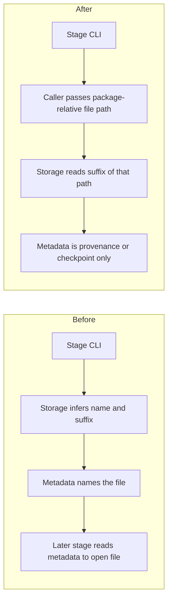

# Make data-platform I/O use explicit file paths and smaller stage metadata

## Remember
- Exact file paths always
- Exact commands with expected output
- DRY, YAGNI, TDD, frequent commits
- Delegated tasks must be impossible to misread.

## Overview

Pipeline stages infer record file names from platform defaults, rewrite suffixes from the dataset manifest, and duplicate that information in metadata maps and timestamps that already exist as directory names. Operators still run the same per-platform CLIs. After this work, every load and write is given a file path relative to the data-platform package, metadata shrinks to provenance and checkpoint fields that cannot be reconstructed from the tree, and loaders never consult metadata to find a records file.

## Happy flow

An operator runs ingest, preprocess, feature generation, and curation as today. Each stage writes beside its records file a smaller metadata document and never asks that document for the records filename.

## Approach

Introduce a single constants module and a path helper rooted at the data-platform package. Change storage so run-directory helpers return directories and load/write take file paths. Then slim each stage's new metadata in separate mergeable PRs. Do not migrate old JSON. Do not keep dual readers. Existing local datasets may redo a later stage once because upstream-run path strings get longer.

## Steps

### Step 1: Add package-relative path helpers and file-name constants

Land the constants module and a helper that resolves and validates paths relative to the data-platform package. Tests prove happy paths and reject traversal. No production caller switch yet.

### Step 2: Switch storage and all callers to explicit file paths

Storage no longer infers names or suffixes from the dataset manifest. Callers pass full file names and package-relative file paths. Ingest configs stop declaring output format; new dataset manifests omit format. Feature specs and curation configs use full export names. Upstream-run lists in newly written metadata use package-relative directory paths. Main stays green.

### Step 3: Slim preprocess metadata

New preprocess metadata is only dataset id, the list of raw run directories considered, and input/output row counts. Tests and the preprocess section of the stimuli runbook match.

### Step 4: Resume raw ingest from the run directory name

New raw metadata omits the sync timestamp field. Resume stamps row timestamps from the run directory name. Raw row-count field names stay as they are.

### Step 5: Drop curated file maps and update in-repo readers

New curated metadata omits the files map. Up-to-date checks and experiment scripts that currently read the export name from metadata recompute it from the curation config. Curation specs stop carrying a separate log noun.

## What "done" looks like

1. Load and write of records files always receive an explicit path relative to the data-platform package.
2. CSV versus parquet is taken from that path's suffix, not from the dataset manifest.
3. New dataset manifests have identity fields only; they do not record format.
4. New preprocess metadata has three concerns only: dataset id, raw runs considered, row counts.
5. New raw metadata is still a checkpoint document; it does not duplicate the run directory name as a timestamp field.
6. New curated metadata does not name the export file; in-repo readers no longer look it up from JSON.
7. Historical JSON on disk is untouched. No dual-key compatibility readers.
8. The stimuli runbook describes preprocess outputs and path conventions that match the new writers.
