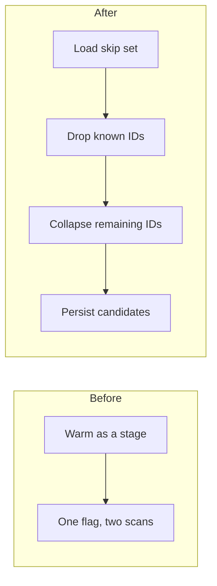

# Replace skip-set warmup with explicit incremental identity skip

## Remember
- Exact file paths always
- Exact commands with expected output
- DRY, YAGNI, TDD, frequent commits
- Delegated tasks must be impossible to misread.

## Overview

Ingest and preprocess skip already-written IDs through one session type, but that load is named and documented as a pipeline stage, and one config flag hides two different disk scans (this run directory vs every timestamped run under the stage). This plan makes skip-set load, exclude, and extend three explicit operations, and it stops treating skip-set initialization as a preprocess stage.

## Happy flow

An operator resumes ingest or re-runs preprocess. Known IDs are loaded into an in-memory skip set, incoming rows with those IDs are dropped, remaining rows are persisted as candidates, and the skip set grows only when the same process will see more batches.

Preprocess collapse is last-wins within the current batch. Ingest does not collapse; it excludes, persists, then extends the skip set for later batches.

## Approach

Keep one skip-set session type. Add the two load operations as first-class methods, then migrate ingest and preprocess off the old warmup entrypoint, then delete the flag and warmup name. Preprocess keeps pandas for dropping known IDs and gets a named collapse helper in the preprocess runner. YAML policy tokens stay; they only choose which load to call. Feature-generation unlabeled skip stays on the backlog.

## Steps

### Step 1: Add explicit skip-set load and row helpers next to the existing warmup API

Introduce this-run and all-runs load methods, plus exclude and extend helpers for list-of-dict ingest. Keep the current warmup method and prior-runs flag working so existing callers still compile. Prove the new methods with unit tests.

### Step 2: Switch ingest to the explicit skip-set loads

Bluesky, Twitter, and Reddit ingest pick one load from YAML policy, then exclude → persist → extend. Stop passing the prior-runs flag from ingest. Storage persist uses the new exclude and extend helpers.

### Step 3: Switch preprocess to skip then collapse

Load the all-runs skip set before creating the new preprocess run directory. Drop known IDs with pandas. Collapse remaining IDs last-wins in a named helper on the preprocess runner. Delete the helper that combined those two jobs. Skip-count print stays “already in a prior preprocessed run.”

### Step 4: Remove the warmup API and rewrite the stimuli runbook

Delete the warmup method and the prior-runs flag. Rename tests that still say warm. Update the stimuli runbook so skip-set load is not a mermaid node or named stage.

## What "done" looks like

1. One skip-set session type remains. There is no warmup method and no prior-runs flag on its config.
2. Ingest loads either this run or all runs from YAML policy, then excludes known IDs, persists, and extends the skip set.
3. Preprocess loads all prior preprocessed runs before creating the new run directory, never treating the stage root as a fake run directory.
4. Preprocess drops known IDs with pandas, then collapses remaining IDs last-wins. The skip count does not include rows removed by collapse.
5. The stimuli runbook describes load skip set → drop known IDs → collapse candidates → transform → filter → save.
6. Feature-generation unlabeled skip and YAML policy token rename are still out of this work.
