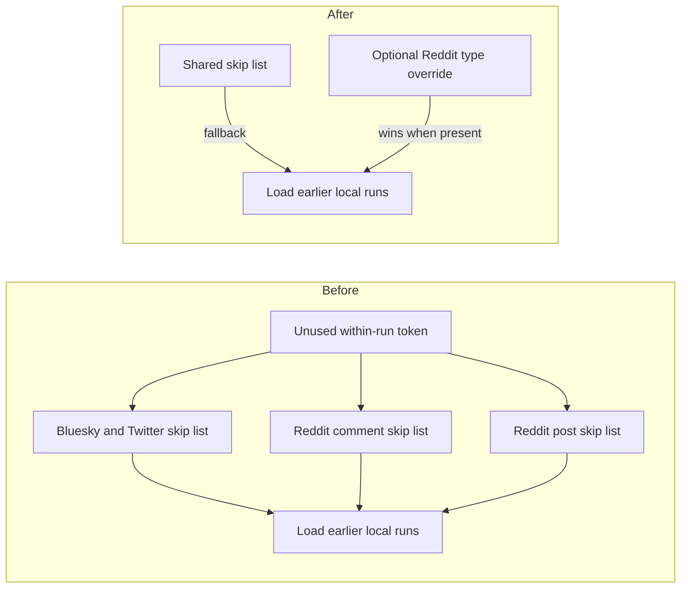

# Collapse ingest dedupe policy into one shared key plus optional per-type overrides

## Remember
- Exact file paths always
- Exact commands with expected output
- DRY, YAGNI, TDD, frequent commits
- Delegated tasks must be impossible to misread.

## Overview

Bluesky and Twitter name the ingest skip list with one YAML key. Reddit uses two keys, one for comments and one for posts. Every committed config also lists a token that does nothing, because within-run skip is always on. Only the cross-run token changes whether earlier local runs of the same dataset are loaded. The change uses one shared key on every platform, keeps the Reddit type keys as optional overrides, drops the unused token from committed YAML, and leaves older configs working through the same presence rules as other ingest aliases.

## Happy flow

An operator sets one skip list on Bluesky, Twitter, or Reddit YAML. Each sync command reads that list and loads earlier local runs only when the cross-run token is present. On Reddit, an operator can still set a comment list or a post list to override the shared list for that type. Committed configs in the repo use the shared key, omit the unused token, and keep a Reddit post override only where posts should not follow the shared list.

## Approach

Add one lookup helper in the shared checkpoint module, matching the existing ingest alias helpers. When a Reddit type key is present, use that list for that type and do not fall back. When it is absent, read the shared key. Bluesky and Twitter only read the shared key. Do not add a generic alias framework, a deprecation log, or a new skip-token enum. Keep the existing cross-run check as the only token that toggles loading. Update committed ingest YAML only. Leave existing checkpoint fixtures on the older Reddit keys and the unused token so those tests keep proving fallback and no-op behavior.

## Decisions (resolved from review)

1. One public lookup helper, not a wrapper that also runs the cross-run check, and not a policy object.
2. The Reddit type key wins when that key is present, including when its value is an empty list. The shared key is the fallback. Presence order is opposite the fetch-cap helper, because a type key is an override, not a leftover alias that should lose to the shared key.
3. Do not name a constant for the unused within-run token. The cross-run check already ignores it.
4. Duplicate-skip metadata counter names stay as they are.

## Steps

### Step 1: Read one shared skip list, with optional Reddit type overrides

Add the lookup helper in the checkpoint module. Call it from Bluesky and Twitter fetch with no override. Call it from Reddit fetch once for comments and once for posts, each with that type's override key. Drop the unused token from committed ingest YAML. Collapse Reddit files that used the same list on both types onto the shared key. Keep an empty post override on the Reddit scale files where posts currently skip only within the run. Prove lookup, caller wiring, and the YAML rename with tests on the helper, the platform fetch paths, the skip-token helper, and the ingest YAML key file.

## What "done" looks like

1. Bluesky and Twitter fetch read the shared skip list. Reddit comments and posts read a type override when that key is present, and otherwise read the shared list. An empty list or a missing list still means do not load earlier runs. Within-run skip stays on either way.
2. Committed ingest YAML no longer lists the unused within-run token. Bluesky, Twitter, and Reddit files that skip earlier runs list only the cross-run token under the shared key. Reddit scale files keep an empty post override so posts do not inherit the shared cross-run list. The Bluesky smoke file omits the skip list after the unused token is removed.
3. Existing checkpoint fixtures still use the older Reddit type keys and still list the unused token, so fallback and no-op coverage stay.
4. `PYTHONPATH=. uv run pytest tests/data_platform/ingestion/test_ingest_yaml_keys.py tests/data_platform/utils/test_deduplication.py tests/data_platform/ingestion/test_sync_bluesky_checkpoint.py tests/data_platform/ingestion/test_sync_twitter_checkpoint.py tests/data_platform/ingestion/test_sync_reddit_checkpoint.py tests/data_platform/ingestion/test_sync_checkpoint.py -q` exits 0.
5. `PYTHONPATH=. uv run pytest tests/data_platform/ingestion -q` exits 0 with no new failures.
6. Sibling ingest-contract work is not in this PR, including a rename of duplicate-skip counters.
