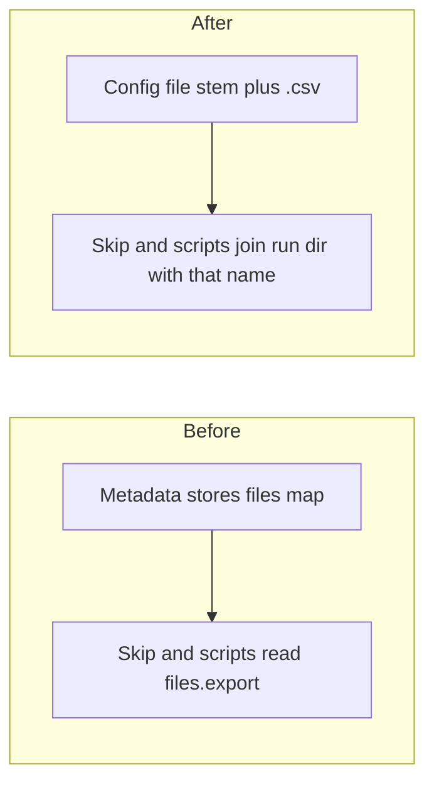

# Drop the curated files map and recompute the export name

## Remember
- Exact file paths always
- Exact commands with expected output
- DRY, YAGNI, TDD, frequent commits
- Delegated tasks must be impossible to misread.

## Overview

New curated metadata still stores a files map whose export name is already the yaml config stem plus `.csv`. The writer will omit that map. Skip-if-fresh and the two experiment scripts will join the curated run directory with that derived file name. Curation specs will stop carrying a separate log noun. Historical JSON on disk is left alone.

## Happy flow

An operator runs a curate CLI. The writer saves the export under the yaml file name with a `.csv` suffix, and it writes metadata with no files map. A second Bluesky curate with the same inputs skips, because the latest run directory already has that csv. Sampling scripts find the same csv by globbing metadata.json for run folders, then joining with the name derived from `mirrorview.yaml`.

## Approach

Match the child issue done list in the smallest way. Drop the files map from the shared curated metadata mapping. Derive the export file name as the curation config file stem plus `.csv`. Join that name onto the latest curated run directory in Bluesky skip-if-fresh, and onto each discovered run directory in the two experiment scripts. Remove the separate log noun from curation specs. Do not add a reader for the old files key. Do not rewrite JSON already on disk.

The new writer has one mapping. There is no second path that still emits the dropped key. Readers do not fall back to `files.export` when old JSON still has it. The yaml `output.filename` used on write already matches the config stem plus `.csv` in every production config.

## Steps

### Step 1: Omit the files map and recompute the export name

Stop writing the files map on new curated metadata. Skip-if-fresh joins the latest run directory with the yaml export file name. The two experiment scripts stop reading `files.export`. Curation specs drop the log noun. Tests and the architecture metadata list match.

## What "done" looks like

1. New curated metadata does not contain a `files` key.
2. Bluesky skip-if-fresh joins the latest curated run directory with the yaml export file name.
3. `experiments/scaled_mirrors_generation_2026_06_02/sample_data_to_mirror.py` and `count_missing_flips.py` do not read `files.export`.
4. `PYTHONPATH=. uv run pytest tests/data_platform/curate tests/data_platform -q` exits 0.
5. Historical JSON is not rewritten. There is no dual-key writer or reader.
6. Curation specs do not carry a separate log noun.
