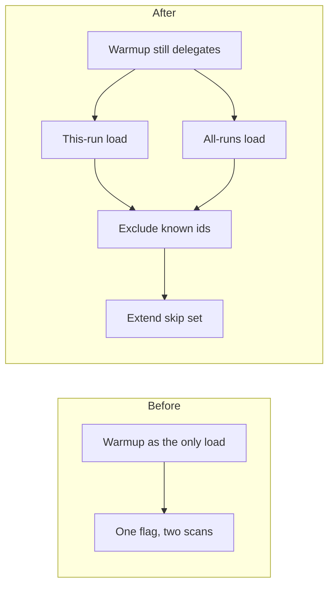

# Add explicit skip-set load and row helpers next to the existing warmup API

## Remember
- Exact file paths always
- Exact commands with expected output
- DRY, YAGNI, TDD, frequent commits
- Delegated tasks must be impossible to misread.

## Overview

Ingest and preprocess skip already-written record ids through one session type. A skip set is the in-memory set of already-written record ids. Filling the skip set is one warmup call today, and one config flag can trigger a second disk scan. The work adds explicit methods for this-run load, all-runs load, exclude, and extend, and it keeps the warmup call and the prior-runs flag so existing callers still compile. Ingest and preprocess files stay unchanged.

## Happy flow

A unit test constructs a skip-set session and calls the new load, exclude, and extend methods. Known ids are added to the skip set. The session drops incoming rows whose ids are already in the skip set, keeps the rest, and adds appended row ids to the skip set. The old warmup path still loads this-run ids, and it also loads all-run ids when the prior-runs flag is on.

## Approach

Add the new methods on the existing skip-set session. Do not add a second session type. Keep the old methods as delegates so ingest and preprocess keep compiling without edits. Prove the new methods with unit tests that mock storage.

## Steps

### Step 1: Add skip-set load and row helpers next to warmup

Add this-run and all-runs load methods that add disk ids to the skip set without replacing ids already in memory. Add exclude and extend helpers for ingest rows stored as dictionaries. Rewire warmup, filter, and note as delegates. Keep ingest, preprocess, and storage files unchanged.

## What "done" looks like

1. The skip-set session has this-run load, all-runs load, exclude, and extend methods, and each load adds disk ids to the skip set without replacing ids already in memory.
2. Warmup, filter, and note still exist and delegate to those methods.
3. `PYTHONPATH=. uv run pytest tests/data_platform/utils/test_deduplication.py tests/data_platform/utils/test_storage.py tests/data_platform/ingestion tests/data_platform/preprocessing -q` exits 0. Existing warmup, filter, and note tests still pass. New tests for the four methods pass.
4. Ingest and preprocess files are unchanged. Storage is unchanged.
