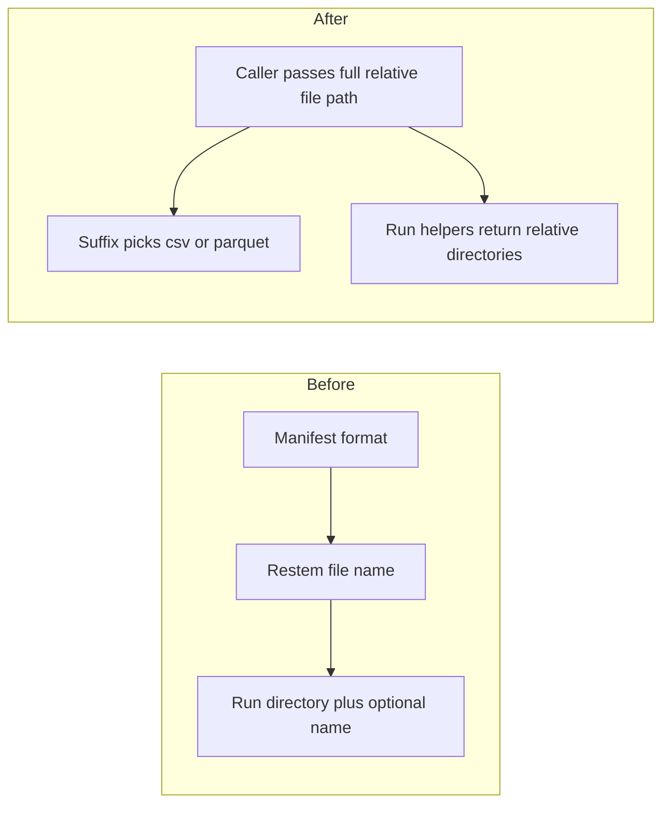

# Switch storage and pipeline callers to explicit file paths

## Remember
- Exact file paths always
- Exact commands with expected output
- DRY, YAGNI, TDD, frequent commits
- Delegated tasks must be impossible to misread.

## Overview

Storage currently infers the records file name and the csv versus parquet suffix from the dataset manifest. Callers then pass a run directory plus an optional file name. This plan stops that inference. Callers pass a full file path relative to the data-platform package. New dataset manifests no longer record format. Ingest configs no longer declare an output format. Feature and curation configs use the full export file name. Newly written upstream-run lists use directory paths relative to the package. Historical JSON on disk is left alone. Metadata field sets stay as they are, except the path string shape of those source-run lists.

## Happy flow

An ingest, preprocess, feature, or curate caller builds a path relative to the data-platform package, including the file name and suffix. Storage resolves that path, reads or writes the file using the suffix, and returns package-relative run directories from the helpers that create or look up a run.

## Approach

Match the child issue's done list in the smallest way. Storage no longer stores a records file name and no longer reads format from the manifest. Load and write take one package-relative file path. Run-directory helpers return package-relative directory strings. Callers join those directories with the shared full file names from the previous pull request. Do not slim preprocess, raw, or curated metadata keys. Do not rewrite JSON already on disk. Do not add a second reader for old short path strings.

Design choice: load and write take a single package-relative file path, and run-directory helpers return package-relative directory strings. Ingest YAML drops the output format key and always writes the shared posts and comments csv names. The two ingest configs that currently ask for parquet will write csv. Feature specs gain a full export file name. Curation configs replace the stem with that full file name. Tests point the package root at the temporary data directory so the existing path helpers can resolve and round-trip.

## Steps

### Step 1: Change storage and new dataset manifests

Give storage the new path contracts. Stop reading format from the dataset manifest. Write new manifests without a format key. Cover load, write, run helpers, and suffix choice with unit tests. Point the shared test data root at a temporary package root.

### Step 2: Switch ingest callers and drop output format from configs

Ingest CLIs pass full csv file paths built from run directories and the shared file names. Remove output format from ingest YAML. Stop writing format into new manifests.

### Step 3: Switch preprocess callers and newly written source-run paths

Preprocess loads and writes with explicit relative file paths. Newly written source-run lists use package-relative directories. Keep the rest of the preprocess metadata keys.

### Step 4: Switch feature generation to full export names

Feature specs carry the full export file name. Label writers and readers use that name in a package-relative path. Newly written feature metadata source-run lists use package-relative directories.

### Step 5: Switch curation configs and callers to full export names

Curation configs use the full export file name. The curator writes that file through a package-relative path. Newly written source-run lists use package-relative directories. Keep the curated files map.

## What "done" looks like

1. Storage has no stored records file name and does not restem from the dataset manifest.
2. Load and write take package-relative file paths. Csv versus parquet is the path suffix.
3. Run-directory helpers return package-relative directories.
4. `PYTHONPATH=. uv run pytest tests/data_platform -q` exits 0.
5. New dataset manifests have no format key.
6. Historical JSON on disk is not rewritten.
7. Sibling metadata-slimming issues are not bundled.
