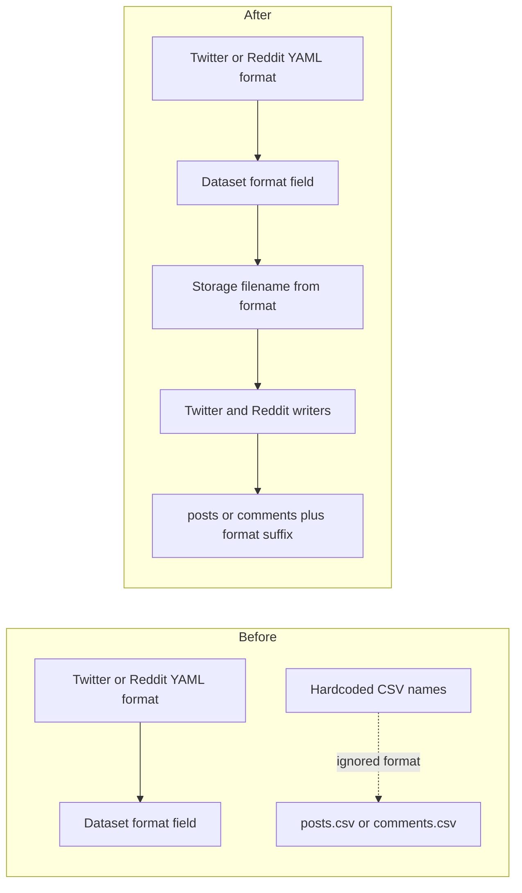

# Honor the declared ingest output format for Twitter and Reddit raw files

## Remember
- Exact file paths always
- Exact commands with expected output
- DRY, YAGNI, TDD, frequent commits
- Delegated tasks must be impossible to misread.

## Overview

Ingest YAML already names an output format, and the dataset file already stores that format. Bluesky already names the raw records file from that stored format. Twitter always writes a CSV name, and Reddit always maps record types to CSV names. This PR points the Twitter and Reddit writers at the same storage filename Bluesky already uses.

## Happy flow

An operator runs Twitter or Reddit ingest with a config that names CSV or Parquet. After the dataset file exists, the writer stores raw records under a file whose suffix matches that format.

## Approach

Copy the Bluesky writer path. Create the dataset file first, then build storage so it can read the format, then pass the storage filename into the write loop. Do not add a second filename helper. Do not teach the shared record type map about format. Do not change YAML keys, Twitter record type checks, Bluesky author filter, or the repo relative config path helper.

## Steps

### Step 1: Point the Twitter writer at the storage filename

Write the dataset file before the Twitter storage object is built for the run. Pass that object's records filename into the Twitter write loop, the same way Bluesky already does.

### Step 2: Point the Reddit writer at the storage filename

Write the dataset file before the Reddit storage objects are built for the run. Pass the comment and post storage filenames into the Reddit write loop, instead of the shared record type map that always returns CSV names.

## What "done" looks like

1. Twitter ingest writes raw posts with a suffix that matches the dataset format.
2. Reddit ingest writes raw comments and posts with suffixes that match the dataset format.
3. CSV remains the default when the config does not name a format.
4. `PYTHONPATH=. uv run pytest tests/data_platform/ingestion tests/data_platform/utils/test_storage.py tests/data_platform/utils/test_dataset.py -q` exits 0.
5. Sibling ingest contract work is not in this PR.
