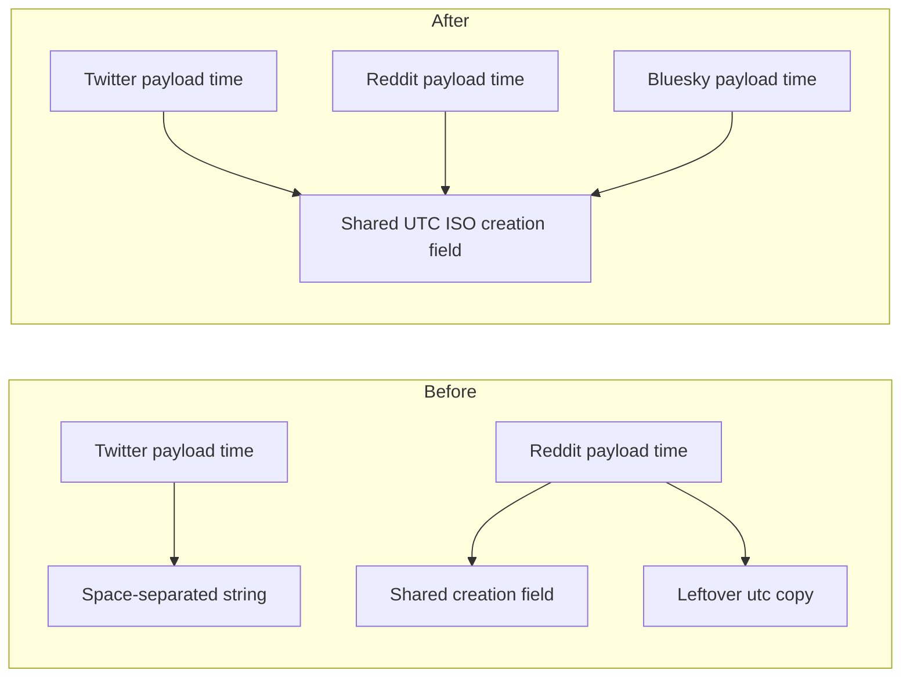

# Write UTC ISO creation times on raw ingest rows

## Remember
- Exact file paths always
- Exact commands with expected output
- DRY, YAGNI, TDD, frequent commits
- Delegated tasks must be impossible to misread.

## Overview

Bluesky, Twitter, and Reddit all store a creation time on each raw row, but they do not use the same string form. Twitter writes a space-separated datetime string. Reddit writes the same ISO time twice, once as the shared creation field and once as a leftover utc copy. New raw rows store one UTC ISO-8601 creation time, and Reddit no longer writes the leftover copy. Bluesky already writes that shared field, so it stays as it is.

## Happy flow

An operator runs a Twitter or Reddit sync. Each new raw row stores the post or comment creation time from the platform payload as a UTC ISO-8601 string in the shared creation field. Reddit rows no longer carry a second column with the same value. Later stages read that one field.

## Approach

Keep conversion next to each platform writer. Twitter formats the payload datetime with the standard ISO method. Reddit keeps converting the payload unix time to UTC ISO for the shared field, and it drops the leftover copy from rows and from the sync models. Do not add a new current-time helper. Do not change Bluesky. Do not change stimuli sampling. Do not rewrite rows that are already on disk.

## Decisions (resolved from review)

1. Call the datetime ISO method inline in the Twitter row writer. Do not add a shared timestamp formatter, because the current-time helper uses a different contract format and the row writers only need payload times.
2. Keep reading Reddit's payload unix time as input. Drop only the leftover output column and the matching model fields.
3. Do not backfill or strip the leftover column from completed run files.
4. Leave experiment dump code and CHANGELOG out of this PR.

## Steps

### Step 1: Write ISO creation times and drop the leftover Reddit column

Point the Twitter row writer at ISO output. Drop the leftover utc column from Reddit post and comment rows, from the sync models, and from Reddit test fixtures. Tighten the raw-row timestamp tests so Twitter must match ISO and Reddit must omit the leftover column.

## What "done" looks like

1. New Twitter raw rows store payload creation time as UTC ISO-8601 in the shared creation field. A missing payload time still stores an empty string.
2. New Reddit post and comment rows store that same shared field as UTC ISO-8601, and they do not include the leftover utc column. The Reddit sync models match that shape.
3. Bluesky rows still write the shared creation field from the payload, unchanged.
4. `PYTHONPATH=. uv run pytest tests/data_platform/ingestion/test_raw_row_timestamps.py -q` exits 0.
5. `PYTHONPATH=. uv run pytest tests/data_platform/ingestion -q` exits 0 with no new failures.
6. Sibling ingest-contract work is not in this PR, including stimuli sampling.
