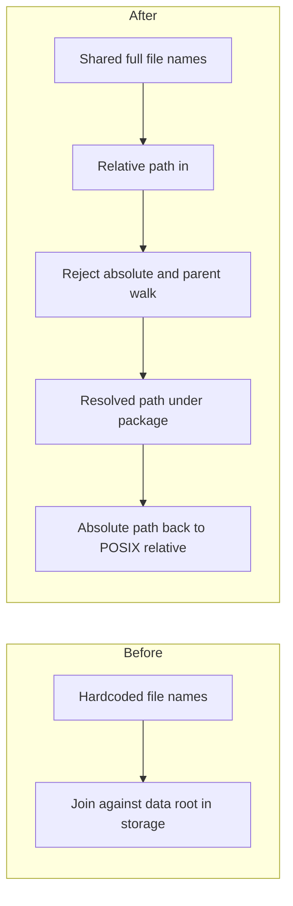

# Add package-relative path helpers for the data platform

## Remember
- Exact file paths always
- Exact commands with expected output
- DRY, YAGNI, TDD, frequent commits
- Delegated tasks must be impossible to misread.

## Overview

Pipeline stages still build record paths from platform defaults, suffix rewrites, and metadata. Later work in the parent epic will pass explicit paths relative to the data-platform package. The plan adds only the shared names and the path helper that later stages will call. Storage and stage CLIs stay on the old API.

## Happy flow

A later caller hands the helper a path relative to the data-platform package. The helper either returns a resolved path under that package, or it raises when the input is absolute or uses parent-directory parts to leave the package. A second helper turns an absolute path under the package back into a POSIX string relative to the package.

No production caller uses the helper yet. Tests are the only caller.

## Approach

Add the smallest set of names and functions that later explicit-path work can import without rewriting storage now. Keep checks inside the helper functions. Do not add a new path type, a custom error class, or a third function that only validates.

## Steps

### Step 1: Land constants, path helpers, and their tests

Add the package constants and the two helpers. Cover resolve, rejection, and reverse conversion with unit tests. Leave storage, ingest, preprocess, curate, and feature generation unchanged.

## What "done" looks like

1. Full file names for posts, comments, and metadata live in a production constants module next to the package root constant.
2. Helpers resolve package-relative paths, reject absolute paths and parent-directory traversal, and convert absolute paths back to package-relative POSIX strings.
3. `PYTHONPATH=. uv run pytest tests/data_platform/utils/test_paths.py -q` exits 0.
4. `PYTHONPATH=. uv run pytest tests/data_platform -q` has no new failures.
5. Storage and stage CLIs still use their current path API. Sibling issues are not bundled.
