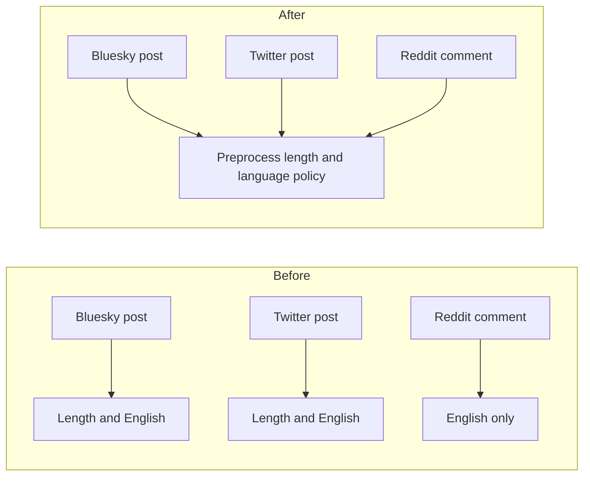

# Own length and language policy at preprocess

## Remember
- Exact file paths always
- Exact commands with expected output
- DRY, YAGNI, TDD, frequent commits
- Delegated tasks must be impossible to misread.

## Overview

Bluesky and Twitter already drop stimuli text that is too short, too long, or not English during preprocess. Reddit already requires English there, but it has no minimum length. This PR puts the numeric bounds in one preprocess-owned policy, documents the rule per record type, and adds Reddit's missing minimum-length gate. Ingest fetch filters stay as they are.

## Happy flow

An operator runs preprocess on a completed raw run. Kept Bluesky and Twitter posts still have to meet the current length bounds and English. Kept Reddit comments still have to be English, and they now also have to meet the preprocess minimum length. A Reddit comment that is English but shorter than that minimum is dropped at preprocess, even if ingest kept it.

## Approach

Put the existing numeric bounds in one preprocess policy module as named constants. Point the current Bluesky and Twitter length checks at those constants. Add a Reddit minimum-length check that uses the Reddit constant, and run it with the other Reddit preprocess text checks. Leave ingest YAML and ingest fetch code alone. Do not import experiment dump thresholds.

## Decisions (resolved from review)

1. One module of named constants plus a short policy docstring. Do not add a policy class, a registry, or a per-platform strategy type.
2. Keep the current numbers. Bluesky stays 100 to 300. Twitter stays 50 to 280. Reddit gets a minimum of 30 and no maximum.
3. Keep the existing English check. Do not add a second language implementation.
4. Reddit ingest still has its own fetch-time minimum body length. That ingest setting is not this policy, and ingest must not import the preprocess module.
5. Leave CHANGELOG, engagement-metric renaming, and configs-folder README work out of this PR.

## Steps

### Step 1: Own length and language policy at preprocess

Add the policy constants, point the existing length checks at them, add Reddit's minimum-length gate, and prove the bounds plus the new Reddit drop with tests. See [steps/step1.md](steps/step1.md).

## What "done" looks like

1. Preprocess owns named length bounds for Bluesky posts, Twitter posts, and Reddit comments, and it documents that English is required for all three.
2. Bluesky and Twitter length behavior is unchanged.
3. Reddit preprocess drops comments shorter than the Reddit minimum, and it still has no maximum.
4. Ingest fetch filters, including Reddit's fetch-time minimum body length, are unchanged.
5. `PYTHONPATH=. uv run pytest tests/data_platform/preprocessing/test_content_filter_policy.py tests/data_platform/preprocessing/test_preprocess_reddit.py tests/data_platform/preprocessing/test_preprocess_twitter.py -q` exits 0.
6. `PYTHONPATH=. uv run pytest tests/data_platform/preprocessing -q` exits 0 with no new failures.
7. Sibling ingest-contract work is not in this PR, including CHANGELOG.
