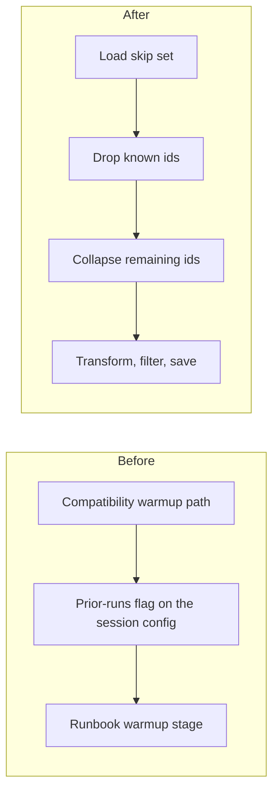

# Delete leftover skip-set compatibility names and rewrite the stimuli runbook

## Remember
- Exact file paths always
- Exact commands with expected output
- DRY, YAGNI, TDD, frequent commits
- Delegated tasks must be impossible to misread.

## Overview

Ingest and preprocess already load known ids with explicit skip-set methods. The skip-set session still keeps a compatibility warmup path, a prior-runs config flag, and two alias methods that only delegate. Tests and the stimuli runbook still talk about warmup as if it were a preprocess stage. The work deletes those leftover names, keeps the real skip-set methods, and rewrites the stimuli runbook so skip-set load is work that happens before the new preprocess run directory, not a named stage.

## Happy flow

A caller builds a skip-set session with only an id column and an optional filename. It loads this-run ids or all-run ids, drops rows whose ids are already known, and records newly written ids. An operator reading the stimuli runbook sees load skip set, then drop known ids, then collapse remaining ids, then transform, filter, and save.

## Approach

Delete the leftover compatibility path. Do not add a replacement helper. Do not migrate ingest, preprocess, or storage in this PR, because those callers already use the explicit methods. Keep the YAML policy helper that decides whether prior runs count. Land the stimuli runbook from the existing unmerged draft, and rewrite only the preprocess extra-details section so skip-set load is not a mermaid node or named stage.

## Steps

### Step 1: Delete leftover skip-set names, fix tests, and rewrite the stimuli runbook

Remove the compatibility warmup method, the prior-runs config flag, and the two alias methods. Rename tests that still say warm, and add a test that constructing the config with the old flag raises TypeError. Put the stimuli runbook on this branch with the preprocess extra-details chain load skip set, drop known ids, collapse candidates, transform, filter, save.

## What "done" looks like

1. The skip-set session config has only an id column and an optional filename.
2. The skip-set session public methods are this-run load, all-runs load, exclude, and extend. The YAML policy helper that names prior-run policies is still present.
3. Tests no longer call warmup, filter, or note helpers, and coverage of load, exclude, and extend remains.
4. The stimuli runbook describes load skip set, drop known ids, collapse candidates, transform, filter, and save. Skip-set load is not a preprocess stage.
5. `PYTHONPATH=. uv run pytest tests/data_platform -q` exits 0.
