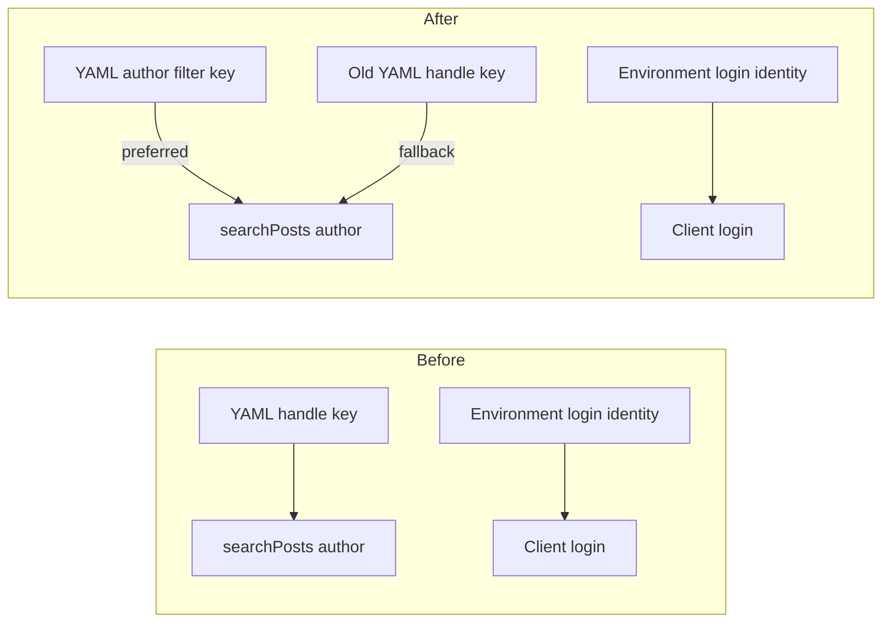

# Rename the Bluesky YAML author filter away from login identity

## Remember
- Exact file paths always
- Exact commands with expected output
- DRY, YAGNI, TDD, frequent commits
- Delegated tasks must be impossible to misread.

## Overview

Bluesky ingest YAML currently uses one key name for an optional search author filter. That name matches the environment login identity, so operators can mix the two up. This PR gives the YAML filter its own name, keeps the old YAML key working as a fallback, and updates committed Bluesky configs that still use the old key. Login identity in the environment does not change.

## Happy flow

An operator sets an author filter in Bluesky ingest YAML under the new key. The Bluesky sync command reads that value and passes it as the search author on each page fetch. If only the old YAML key is set, the command still uses that value. If neither is set, search is not limited to one author.

## Approach

Keep the lookup next to the Bluesky search page fetch. Prefer the new YAML key when it has a value, otherwise use the old key, matching the current truthy check. Do not add a shared alias helper or a migration tool. Repo research found no YAML key alias pattern to copy. Update only committed Bluesky configs that still set the old key. Leave Twitter and Reddit YAML, raw platform ids, post author fields on rows, and environment login unchanged.

## Steps

### Step 1: Rename the Bluesky YAML author filter

Add a local resolver in the Bluesky sync module. Use it from the search page fetch so the API author argument comes from the new YAML key, or from the old key when the new one is absent. Rename the old key in committed Bluesky YAML that still sets it. Prove the lookup and the YAML rename with tests in the Bluesky checkpoint file and the ingest YAML key file.

## What "done" looks like

1. Bluesky search page fetch reads the new YAML author filter key first, then the old YAML key, and omits the API author argument when both are empty.
2. Committed Bluesky ingest YAML that used the old key now uses the new key. Other Bluesky configs that never set the key stay unchanged.
3. Environment login identity is still read only from the existing Bluesky handle environment variable.
4. `PYTHONPATH=. uv run pytest tests/data_platform/ingestion/test_sync_bluesky_checkpoint.py tests/data_platform/ingestion/test_ingest_yaml_keys.py -q` exits 0.
5. `PYTHONPATH=. uv run pytest tests/data_platform/ingestion -q` exits 0 with no new failures.
6. Twitter and Reddit YAML keys, raw platform ids, and row-level author handle fields are unchanged. Sibling ingest-contract work is not in this PR.
