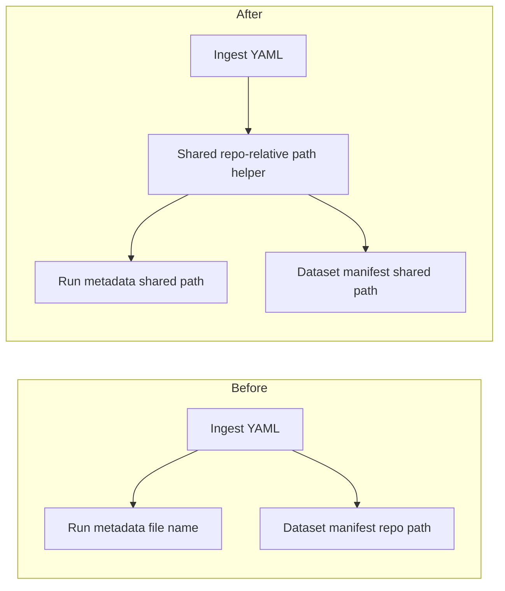

# Store the same repo-relative ingest config path in run metadata and dataset manifests

## Remember
- Exact file paths always
- Exact commands with expected output
- DRY, YAGNI, TDD, frequent commits
- Delegated tasks must be impossible to misread.

## Overview

Ingest currently stores the YAML config location in two different ways. Run metadata keeps only the file name. The dataset manifest keeps a path from the repo root. If two platforms use the same YAML file name, run metadata cannot tell them apart. Both writers will store one shared path, relative to the repo root and using forward slashes.

## Happy flow

An operator starts a sync with a YAML config that lives under the repo. The sync writes that config's path, relative to the repo root and with forward slashes, into both the new run's metadata and the dataset manifest.

## Approach

Add one small helper next to the existing config-path resolver. Point both writers at that helper. Do not reuse the package-relative helpers, because those drop the data-platform directory prefix that manifests already store. Do not change YAML keys, Twitter record types, or Bluesky author filter behavior.

## Steps

### Step 1: Share one repo-relative path helper

Add the helper, cover it and both writers with tests, and switch the two ingest writers to call it.

## What "done" looks like

1. Run metadata and the dataset manifest store the same repo-relative POSIX path for the ingest YAML file.
2. Two configs that share a file name on different platforms stay distinct in run metadata.
3. `PYTHONPATH=. uv run pytest tests/data_platform/ingestion/test_sync_checkpoint.py tests/data_platform/utils/test_dataset.py -q` exits 0.
4. `PYTHONPATH=. uv run pytest tests/data_platform/ingestion -q` has no new failures.
5. Sibling ingest-contract work is not in this PR.
