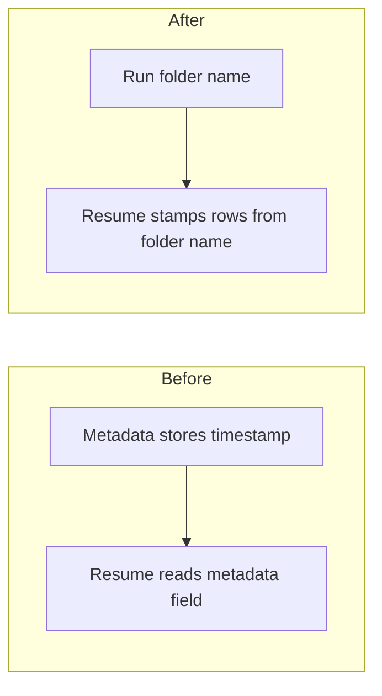

# Stamp raw ingest rows from the run folder name

## Remember
- Exact file paths always
- Exact commands with expected output
- DRY, YAGNI, TDD, frequent commits
- Delegated tasks must be impossible to misread.

## Overview

New raw metadata still has a sync timestamp field whose value is already the run folder name. The resume path reads that field when it stamps Twitter and Reddit rows. The shared writer will omit the field. The resume path will stamp rows from the timestamp folder name, not from the full package-relative path. Row models keep their timestamp column. Raw row-count field names stay as they are.

## Happy flow

An operator starts a raw ingest, then resumes into the same run directory. The second wave appends rows whose timestamps equal the folder name. The new metadata file has no timestamp field.

## Approach

Match the child issue done list in the smallest way. Drop the timestamp field from the shared raw metadata mapping. Derive the row stamp from the last path segment of the package-relative run directory. Keep the timestamp column on Twitter and Reddit row models. Do not add that column to Bluesky rows. Do not rename `row_count` or `post_row_count`. Do not add a reader for the old field. Do not rewrite JSON already on disk. Do not drop the curated files map.

The new writer has one mapping. There is no second path that still emits the dropped field. Resume of an old run that still has the field may keep that key on flush, because this work does not migrate historical JSON.

## Steps

### Step 1: Omit the metadata field and stamp rows from the folder name

Stop writing the timestamp field on new raw metadata. Stamp Twitter and Reddit rows from the run folder name. Update checkpoint tests so resume still completes a second wave into the same directory, and so row timestamps equal that folder name.

## What "done" looks like

1. New raw metadata does not contain `sync_timestamp`.
2. Resume tests complete a second wave into the same run directory, and row timestamps equal the run folder name.
3. `PYTHONPATH=. uv run pytest tests/data_platform/ingestion tests/data_platform -q` exits 0.
4. `row_count` and `post_row_count` are unchanged.
5. Row models still have a `sync_timestamp` column.
6. Historical JSON is not rewritten. There is no dual-key writer.
7. Curated files-map work is not bundled.
