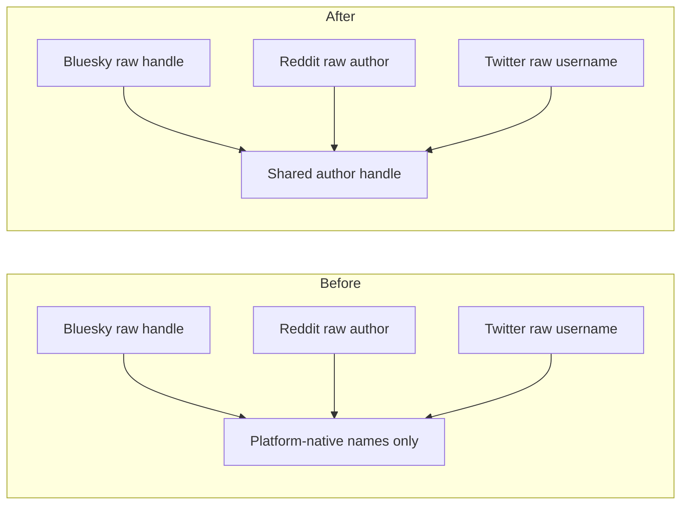

# Add shared author handle fields during preprocess

## Remember
- Exact file paths always
- Exact commands with expected output
- DRY, YAGNI, TDD, frequent commits
- Delegated tasks must be impossible to misread.

## Overview

Raw ingest keeps each platform's original author columns. Downstream stages need one author handle name. Preprocess copies or keeps that handle onto one shared column, and it keeps the platform author id only when the raw row already has one.

## Happy flow

An operator runs preprocess on a completed raw run. Every kept row in the preprocessed file has a shared author handle. Reddit still has its original author column. Twitter still has username and author id. Bluesky already used the shared handle name on raw rows, so preprocess leaves that value in place. Bluesky and Reddit preprocessed files do not gain an author id column.

## Approach

Add one preprocess helper next to the existing text-column helper. Give the platform spec a source column for the handle. Copy that source onto the shared handle, or require the shared handle when the source is already that name. Do not rewrite ingest writers. Do not add author id when the raw row does not already have it. Let storage validation pick the preprocessed model by stage, the same way Reddit already does for shared text.

## Decisions (resolved from review)

1. One helper in the existing preprocess runner. Do not add a second author helper, a per-platform author class, or a spec field that re-validates rows the storage writer already validates.
2. Do not add an unused author-id constant. Twitter already has that column on the raw row. Bluesky and Reddit omit it.
3. Point Twitter preprocessed storage, and Twitter feature load validation, at a preprocessed Twitter model that includes the shared handle. That matches how Reddit already validates preprocessed comments after shared text was added. Feature and curate code still must not start joining or filtering on the new handle in this PR.
4. Reddit row validators still read the original author column.
5. Leave CHANGELOG, source record id, and ingest writers out of this PR.

## Steps

### Step 1: Copy shared author handle during preprocess

Add the helper, wire it after the text-column helper, extend the Reddit and Twitter preprocessed models, and prove the three platform mappings plus the missing-column failures.

## What "done" looks like

1. Reddit preprocess writes the shared author handle equal to the original author, keeps the original author, and does not write author id.
2. Twitter preprocess writes the shared author handle equal to username, keeps username, and keeps author id.
3. Bluesky preprocess keeps the existing handle value and does not write author id.
4. `PYTHONPATH=. uv run pytest tests/data_platform/preprocessing -q` exits 0.
5. `PYTHONPATH=. uv run pytest tests/data_platform -q` exits 0 with no new failures outside preprocessing. Three `opik_enabled` failures in `tests/data_platform/generate_features/test_platform_cli.py` are pre-existing on this stack.
6. Sibling ingest-contract work is not in this PR, including source record id.
