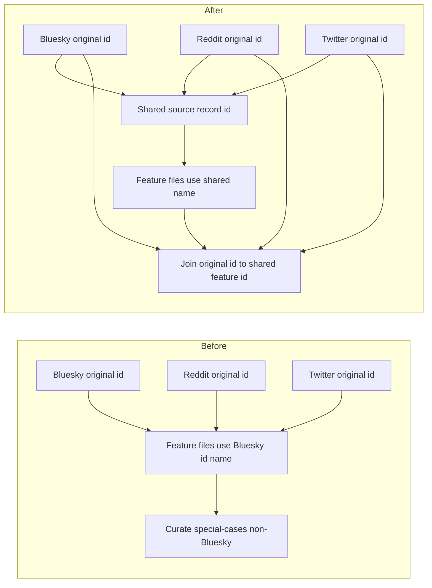

# Add a shared source record id through preprocess, feature files, and curate joins

## Remember
- Exact file paths always
- Exact commands with expected output
- DRY, YAGNI, TDD, frequent commits
- Delegated tasks must be impossible to misread.

## Overview

Raw ingest keeps each platform's original record id. Feature files today write that id under the Bluesky id column name for every platform, so curation has a special case for Reddit and Twitter joins. Preprocess will copy the original id onto one shared name. Feature files will write that shared name. Curation will join the original preprocessed id to that shared feature column.

## Happy flow

An operator runs preprocess, then feature generation, then curate. Every kept preprocessed row still has its original platform id, and it also has the shared source record id equal to that original id. Feature CSVs store the same value under the shared name. Curation joins those two columns the same way for Bluesky, Reddit, and Twitter.

## Approach

Add one preprocess helper next to the existing author-handle helper. Copy the platform's original record id onto the shared source record id, and keep the original column. Point the feature file id name at that shared column. Have curation always pass the original record id and the feature file id name, and drop the Bluesky-only default path.

## Decisions (resolved from review)

1. One helper in the existing preprocess runner. The copy source is the platform's original record id column. Do not add a second spec field for that source.
2. Do not rename original platform id columns on raw or preprocessed rows.
3. Do not rename the in-memory labeling task id field. Feature CSV models and labeling engines write the shared source record id, because that is the column name on disk.
4. Curation always passes both join column names. Do not keep a special case that only fires when the original id is not Bluesky's id.
5. Leave CHANGELOG, length and language gates, and ingest writers out of this PR.

## Steps

### Step 1: Add shared source record id through preprocess, feature files, and curate joins

Copy the original record id onto the shared column during preprocess, write that name in feature files, and join original preprocessed ids to that feature column. See [steps/step1.md](steps/step1.md).

## What "done" looks like

1. Preprocess writes a shared source record id equal to the original Bluesky, Reddit, and Twitter record ids, and it keeps those original columns.
2. Feature files use the shared source record id name instead of the Bluesky id name.
3. Curation joins original preprocessed ids to that feature column for every platform, with no non-Bluesky special case.
4. `PYTHONPATH=. uv run pytest tests/data_platform/preprocessing tests/data_platform/generate_features tests/data_platform/curate tests/data_platform/utils/test_platform_specific_columns.py tests/data_platform/test_models_exports.py -q` exits 0.
5. `PYTHONPATH=. uv run pytest tests/data_platform -q` exits 0 with no new failures. Unused tracing kwargs in feature CLI tests may be dropped if that is required for the issue command to exit 0.
6. Sibling ingest-contract work is not in this PR, including length and language policy.
