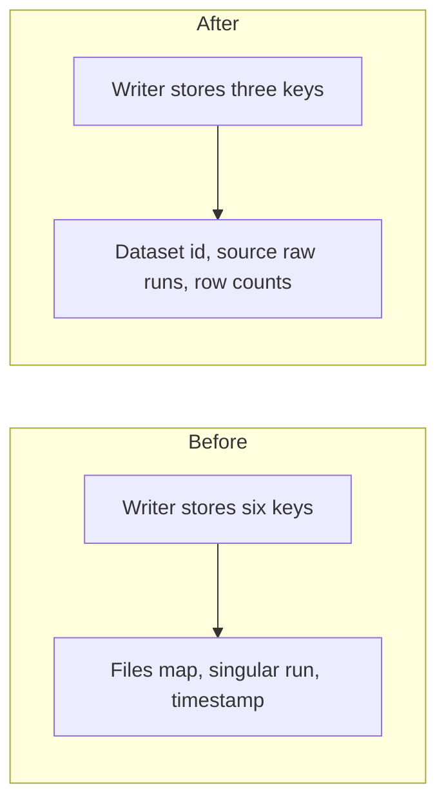

# Slim new preprocess metadata to provenance and row counts

## Remember
- Exact file paths always
- Exact commands with expected output
- DRY, YAGNI, TDD, frequent commits
- Delegated tasks must be impossible to misread.

## Overview

New preprocess metadata still stores a files map, a singular source-raw-run field, and a timestamp that already exists as the run directory name. The writer will stop writing those extra keys. A new preprocess run records only the dataset id, the list of raw run directories considered, and input and output row counts. Historical JSON on disk is left alone. Raw and curated metadata are not changed.

## Happy flow

An operator runs a platform preprocess CLI. The writer saves records as before, and it writes metadata with only the three keys. Tests and the stimuli runbook preprocess outputs list name those same keys.

## Approach

Change only the preprocess metadata mapping that the shared writer saves. Keep the source-raw-runs list as the package-relative directories from the previous pull request. Keep row counts as the existing input and output mapping. Do not add a compatibility reader, and do not rewrite JSON already on disk. Do not drop the raw sync timestamp or the curated files map.

The new key set is exactly dataset id, source raw runs, and row counts. There is no second writer path that still emits the dropped keys. The stimuli runbook preprocess outputs list is updated to those keys. The nested input and output counts stay under row counts, because the issue names that field as the row-count concern.

## Steps

### Step 1: Slim the preprocess writer, tests, and runbook list

Stop writing the files map, the singular source-raw-run field, and the preprocess timestamp. Assert the remaining key set in preprocess tests. Update the preprocess outputs list in the stimuli runbook so it matches.

## What "done" looks like

1. New preprocess metadata keys are only `dataset_id`, `source_raw_runs`, and `row_counts`.
2. `PYTHONPATH=. uv run pytest tests/data_platform/preprocessing tests/data_platform -q` exits 0.
3. The stimuli runbook preprocess outputs list matches those keys.
4. No dual-key writer remains.
5. Historical JSON on disk is not rewritten.
6. Sibling issues that drop raw `sync_timestamp` or the curated files map are not bundled.
