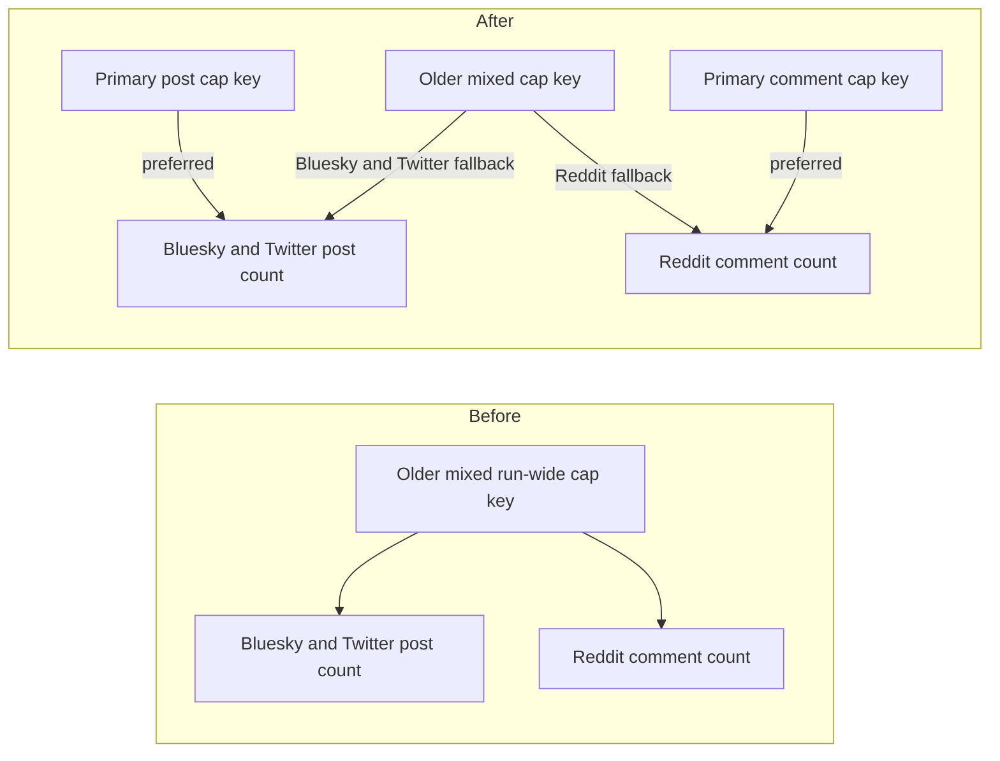

# Split the run-wide ingest cap into a post cap and a comment cap

## Remember
- Exact file paths always
- Exact commands with expected output
- DRY, YAGNI, TDD, frequent commits
- Delegated tasks must be impossible to misread.

## Overview

Bluesky and Twitter treat the run-wide ingest cap as a post limit. Reddit treats the same YAML key as a comment limit. Operators cannot tell which unit a config uses. This PR adds one primary key for posts and one primary key for comments, keeps the older mixed key working as a fallback with the same platform meaning it has today, and updates committed configs that still use the older key. The per-task fetch cap and the dedupe policy keys stay as they are.

## Happy flow

An operator sets a run-wide post cap on Bluesky or Twitter YAML, or a run-wide comment cap on Reddit YAML. Each sync command reads the matching primary key and stops the run when that count is reached. If only the older mixed key is set, Bluesky and Twitter still treat it as a post cap, and Reddit still treats it as a comment cap. Committed configs in the repo use the primary keys.

## Approach

Add two lookup helpers in the shared checkpoint module, one for posts and one for comments. Prefer the matching primary YAML key when it is present. When it is absent, read the older mixed key. Do not add a generic alias framework, a deprecation log, or a migration tool. Keep one shared stop helper that compares the run's counted records against the resolved integer, because Bluesky, Twitter, and Reddit all store the capped count in the same metadata field. Do not start capping Reddit posts. Update committed ingest YAML only. Leave existing checkpoint tests on the older key so those tests keep proving the fallback.

## Decisions (resolved from review)

1. Two public parse helpers, not one generic lookup with a key argument as the only API. Callers should say posts or comments in the name.
2. One shared stop helper, not two copies. The stop check is the same integer comparison for every platform.
3. Reddit post counts stay uncapped by this key. The older Reddit meaning is comments only.
4. Local remaining-budget parameter names on Bluesky fetch and Twitter clamp helpers stay as they are.

## Steps

### Step 1: Read a post cap or a comment cap, with the older mixed key as fallback

Add post and comment resolvers in the checkpoint module. Call the post resolver from Bluesky and Twitter fetch. Call the comment resolver from Reddit fetch. Rename the shared stop helper so it no longer says the mixed unit. Rename the older mixed key to the matching primary key in committed ingest YAML that already sets a run-wide cap. Prove lookup and the YAML rename with tests on the resolvers, the platform fetch paths, and the ingest YAML key file.

## What "done" looks like

1. Bluesky and Twitter fetch read the primary post cap key first. When that key is absent, they still read the older mixed key as a post cap. Reddit fetch reads the primary comment cap key first. When that key is absent, it still reads the older mixed key as a comment cap. An unset cap still means no run-wide stop.
2. Committed ingest YAML that used the older mixed key now uses the matching primary key. Numeric values stay the same. Files that never set a run-wide cap still omit it.
3. Existing Bluesky remaining-budget fixtures still use the older mixed key, so the fallback stays covered.
4. `PYTHONPATH=. uv run pytest tests/data_platform/ingestion/test_sync_checkpoint.py tests/data_platform/ingestion/test_sync_bluesky_checkpoint.py tests/data_platform/ingestion/test_sync_twitter_checkpoint.py tests/data_platform/ingestion/test_sync_reddit_checkpoint.py tests/data_platform/ingestion/test_ingest_yaml_keys.py -q` exits 0.
5. `PYTHONPATH=. uv run pytest tests/data_platform/ingestion -q` exits 0 with no new failures.
6. Sibling ingest-contract work is not in this PR, including a collapse of dedupe policy keys.
