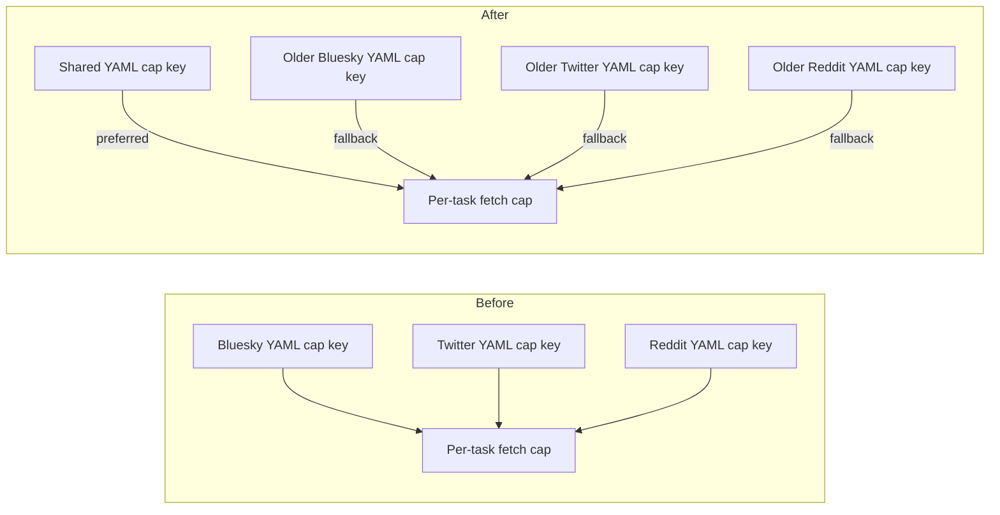

# Use one YAML key for the per-task fetch cap on every ingest platform

## Remember
- Exact file paths always
- Exact commands with expected output
- DRY, YAGNI, TDD, frequent commits
- Delegated tasks must be impossible to misread.

## Overview

Bluesky, Twitter, and Reddit ingest YAML each name the same knob with a different key: how many items one checkpoint task may fetch. Operators cannot copy a cap across platforms without renaming it. This PR adds one shared YAML key, keeps each older key working as a fallback so local configs still run, and updates committed configs that still use the older keys. The run-wide row cap and dedupe policy keys stay as they are.

## Happy flow

An operator sets the per-task fetch cap in ingest YAML under the shared key. Bluesky, Twitter, and Reddit sync each read that value and cap that checkpoint task. If only an older platform key is set, the command still uses that value. Committed configs in the repo use the shared key.

## Approach

Add one lookup helper in the shared checkpoint module. Prefer the shared YAML key when it is present. When it is absent, read the older key for that platform. Do not add a generic alias framework, a deprecation log, or a migration tool. Keep Twitter's extra clamp against the remaining run-wide row budget in the Twitter module. Update committed ingest YAML only. Leave existing checkpoint tests on the older keys so those tests keep proving the fallback.

## Steps

### Step 1: Read one shared per-task fetch cap, with older keys as fallback

Add a shared resolver in the checkpoint module. Call it from Bluesky, Twitter, and Reddit fetch. Rename the older cap key to the shared key in committed ingest YAML. Prove lookup and the YAML rename with tests on the resolver, the platform fetch paths, and the ingest YAML key file.

## What "done" looks like

1. Bluesky, Twitter, and Reddit fetch read the shared YAML key first. When that key is absent, each platform still reads its older key. Twitter still defaults to 25 when neither key is set, and still clamps against remaining run-wide rows.
2. Committed ingest YAML that used an older cap key now uses the shared key. Numeric values stay the same.
3. Existing Bluesky, Twitter, and Reddit checkpoint fixtures still use the older keys, so the fallback stays covered.
4. `PYTHONPATH=. uv run pytest tests/data_platform/ingestion/test_sync_checkpoint.py tests/data_platform/ingestion/test_sync_bluesky_checkpoint.py tests/data_platform/ingestion/test_sync_twitter_checkpoint.py tests/data_platform/ingestion/test_sync_reddit_checkpoint.py tests/data_platform/ingestion/test_ingest_yaml_keys.py -q` exits 0.
5. `PYTHONPATH=. uv run pytest tests/data_platform/ingestion -q` exits 0 with no new failures.
6. Sibling ingest-contract work is not in this PR, including a split of the run-wide row cap and a collapse of dedupe policy keys.
