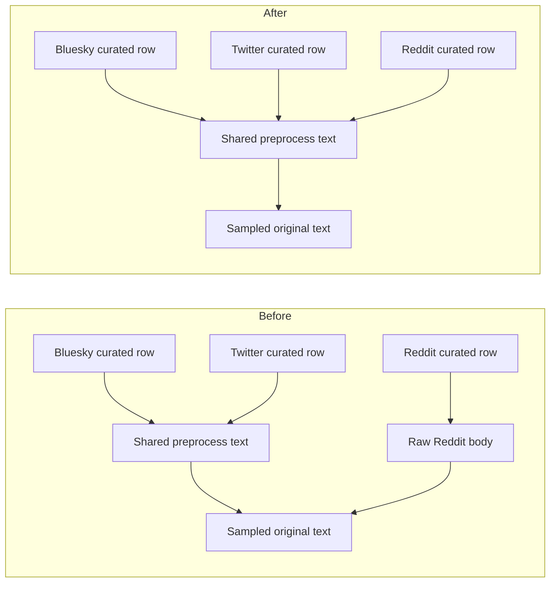

# Point stimuli sampling at preprocess text with no fallback

## Remember
- Exact file paths always
- Exact commands with expected output
- DRY, YAGNI, TDD, frequent commits
- Delegated tasks must be impossible to misread.

## Overview

Stimuli sampling already reads preprocess text for Bluesky and Twitter. For Reddit it still reads the raw comment body. Preprocess already copies that body onto the shared text column. This PR makes Reddit sampling read that same shared column, and it fails when the column is missing. It does not fall back to the raw body.

## Happy flow

An operator runs stimuli sampling on curated exports that have already gone through preprocess. Every platform, including Reddit, supplies original post text from the shared preprocess text column. A Reddit export that only has the raw body, and not that shared column, fails instead of silently using the body.

## Approach

Change only the Reddit branch of the existing sampling normalizer so it uses the same text column as the other platforms. Keep the current missing-column and null checks. Add unit tests for the happy Reddit path, the missing-text failure, and a smoke check that Bluesky and Twitter still read that same column. Do not change preprocess, ingest, or curated export writers.

## Decisions (resolved from review)

1. Change the Reddit text source in the existing normalizer. Do not add a helper, alias map, or body fallback.
2. Put tests in the experiments sampling test file named by the issue. Experiment folders usually skip unit tests, but this issue requires coverage for the sampling normalizer.
3. Leave preprocess, ingest, and the raw Reddit body column alone. Preprocess already copies body onto the shared text column.
4. Leave CHANGELOG, shared author fields, and source record ids out of this PR.

## Steps

### Step 1: Require preprocess text for Reddit stimuli sampling

Point the Reddit branch of the sampling normalizer at the shared preprocess text column. Fail when that column is missing, even if the raw body is present. Prove the new contract and the unchanged Bluesky and Twitter paths with tests.

## What "done" looks like

1. Reddit stimuli sampling reads the shared preprocess text column and writes it as original sampled text.
2. A Reddit frame that has the raw body and not the shared text column raises a missing-column error. There is no fallback to the body.
3. Bluesky and Twitter sampling still read the shared preprocess text column.
4. `PYTHONPATH=. uv run pytest tests/experiments/test_sample_data_to_mirror.py -q` exits 0.
5. `PYTHONPATH=. uv run pytest tests/data_platform -q` exits 0 with no new failures.
6. Sibling ingest-contract work is not in this PR, including shared author fields.
