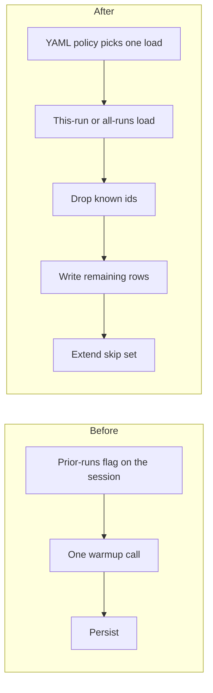

# Switch ingest to one skip-set load from YAML policy

## Remember
- Exact file paths always
- Exact commands with expected output
- DRY, YAGNI, TDD, frequent commits
- Delegated tasks must be impossible to misread.

## Overview

Bluesky, Twitter, and Reddit ingest already skip ids that were written before. Today each ingest session still passes a prior-runs flag and then runs one warmup call that can hide two disk scans. The change makes ingest pick exactly one skip-set load from the existing YAML policy, then exclude known ids, persist new rows, and extend the skip set. A skip set is the in-memory set of already-written record ids. Preprocess keeps using warmup.

## Happy flow

An operator resumes ingest for a dataset. The YAML policy chooses either this-run ids or all-run ids. Incoming rows whose ids are already in the skip set are dropped. Remaining rows are written to disk, and those ids are added to the skip set for later batches in the same session.

## Approach

Keep the existing skip-set session type. Do not add a helper that wraps the load choice. Repeat the same one-load branch at each ingest session setup. Change persist so it uses exclude then extend. Leave preprocess, YAML token strings, and the warmup method in place.

## Steps

### Step 1: Switch ingest persist and session setup to the explicit skip-set loads

Rewrite persist tests to load the skip set with the new methods. Change persist to exclude, write, then extend. Then switch Bluesky, Twitter, and Reddit ingest session setup so each session calls exactly one load from YAML policy and does not pass the prior-runs flag.

## What "done" looks like

1. Each Bluesky, Twitter, and Reddit ingest session is constructed without the prior-runs flag, and it calls exactly one of this-run load or all-runs load from YAML policy.
2. Persist drops known ids, writes remaining rows, and extends the skip set only when remaining rows are non-empty.
3. Persist tests load the skip set with the new methods. Warmup tests in the skip-set unit file stay and stay green.
4. `PYTHONPATH=. uv run pytest tests/data_platform/utils/test_storage.py tests/data_platform/utils/test_deduplication.py tests/data_platform/ingestion -q` exits 0.
5. `rg -n "include_prior_runs|\.warm\(" data_platform/ingestion` finds no matches. Preprocess still calls warmup.
