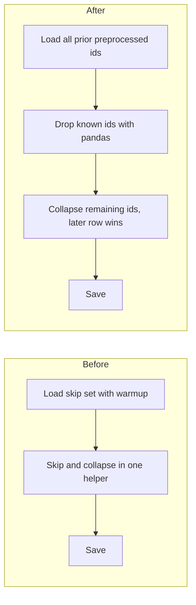

# Switch preprocess to skip known ids then collapse remaining ids

## Remember
- Exact file paths always
- Exact commands with expected output
- DRY, YAGNI, TDD, frequent commits
- Delegated tasks must be impossible to misread.

## Overview

Preprocess already drops ids that exist in earlier preprocessed runs, and it also collapses duplicate ids in the current batch. Skip and collapse share one helper, and the skip set is loaded by passing the preprocessed stage root as if it were a run directory. The change loads every prior preprocessed run before the new run directory is created, drops known ids with pandas, then collapses remaining ids so that the later raw row wins. The skip count is prior-run ids only.

## Happy flow

An operator re-runs preprocess on a dataset. Ids from earlier preprocessed runs are loaded first. Incoming rows with those ids are dropped. Remaining duplicate ids in the current batch collapse to one row, and then the existing transform, filter, and save path runs.

## Approach

Keep skip-set load on the existing session type, and do not add collapse to that session. Put collapse on the preprocess runner. Load the skip set before save creates the new run directory, so the empty new directory is not part of the all-runs scan. Do not convert the records table to a list of dicts for skip, and do not extend the skip set from preprocess. Ingest, runbooks, and deleting warmup stay out of this PR.

## Steps

### Step 1: Switch preprocess to skip then collapse

Add a named collapse helper on the preprocess runner. Load all prior preprocessed ids before save. Drop known ids with pandas. Call collapse so the later row wins. Delete the helper that combined skip and collapse. Change the skip-count print so it names prior preprocessed runs only.

## What "done" looks like

1. Preprocess never treats the preprocessed stage root as a run directory.
2. The helper that combined skip and collapse is gone.
3. The preprocessing package does not pass the prior-runs flag and does not call warmup.
4. Skip-count print names only ids already in a prior preprocessed run, and that count does not include rows removed by collapse.
5. Input row count still means length after skip and collapse, and before filters.
6. `PYTHONPATH=. uv run pytest tests/data_platform/preprocessing tests/data_platform/utils/test_deduplication.py -q` exits 0.
